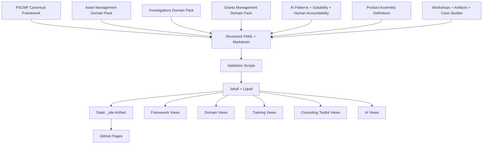

# Public Sector Capability Modernization Framework (PSCMF)
## Jekyll Reference Implementation Specification for GitHub Pages

**Version:** 0.1  
**Status:** Prototype / validation specification  
**Date:** 2026-08-11  
**Companion document:** *Public Sector Capability Modernization Framework — Design Specification for Reusable Training, Assessment, Consulting, Architecture, and AI Content*  
**Primary implementation audience:** Codex and developers implementing the first reference site  

---

## 1. Executive Summary

This document translates the platform-neutral PSCMF design into a concrete reference implementation using **Jekyll** as the static-site presentation layer and **GitHub Pages** as the hosting target.

The implementation is intended to validate that a single structured body of intellectual property can be reused across:

- multiple public-sector capability domains;
- Capability Fundamentals training;
- Technical Architecture sibling training;
- AI-enabled modernization content;
- maturity assessments;
- consulting workshops and methods;
- target-state and transformation artifacts;
- fictional case studies and worked examples.

The first implementation should validate three domains:

1. **Asset Management** — reference implementation;
2. **Investigations** — first cross-domain stress test;
3. **Grants Management** — second cross-domain stress test.

The site must demonstrate that the canonical PSCMF framework remains stable while domain packs provide the specific nouns, lifecycles, processes, risks, controls, data, applications, AI opportunities, architecture patterns, measures, maturity criteria, exercises, and examples needed to make each domain credible.

The central technical design principle is:

> **Jekyll is the presentation and assembly layer; Markdown and YAML are the durable content model.**

The implementation must avoid embedding domain knowledge directly into HTML templates. Templates should render structured content; domain-specific content should live in domain packs and reusable content objects.

The reference site should be useful in its own right as a public-facing knowledge product, but its more important role is to validate the content architecture before investing in a more application-like platform.

---

## 2. Relationship to the PSCMF Functional Design

The companion PSCMF design specification defines:

- the five conceptual layers;
- the fourteen-stage canonical transformation sequence;
- domain packs;
- delivery modes;
- maturity models;
- the AI **Where / When / How** lens;
- technical architecture as a sibling view;
- consulting methods and artifacts;
- content objects and inheritance rules;
- the three-domain validation strategy.

This document does **not** replace that design. It answers a narrower question:

> How should those concepts be represented, composed, rendered, validated, tested, and deployed in a Jekyll/GitHub Pages reference implementation?

When there is a conflict:

1. the functional/content intent of the PSCMF design specification takes precedence;
2. this specification controls the Jekyll implementation pattern;
3. implementation details that are not fundamental should remain easy to change.

---

## 3. Goals and Non-Goals

### 3.1 Goals

The reference implementation must:

1. represent the canonical fourteen-stage PSCMF framework once;
2. support domain-specific overlays without copying canonical content;
3. expose Asset Management, Investigations, and Grants Management through the same layouts;
4. embed AI opportunity, suitability, implementation, human-accountability, and control content throughout the site;
5. provide a dedicated AI view in addition to the embedded AI lens;
6. render training and consulting offerings from shared content references;
7. provide stable, human-readable URLs;
8. build locally and in GitHub Actions;
9. deploy as a static GitHub Pages artifact;
10. validate content references and required metadata before deployment;
11. remain accessible, responsive, and useful without client-side JavaScript;
12. keep the content portable to another renderer or application in the future.

### 3.2 Non-Goals for the MVP

The first implementation does not need to provide:

- authentication or authorization;
- a learning-management system;
- course completion tracking;
- client project workspaces;
- confidential client repositories;
- server-side search;
- a database;
- live AI model calls;
- automated scoring that makes or recommends agency eligibility, investigative, enforcement, funding, or other consequential decisions;
- complex diagram editors;
- online workshop collaboration;
- production-grade assessment data collection;
- slide or DOCX generation from the site;
- a headless CMS.

The MVP should prove **content reuse, domain specificity, product assembly, and AI integration**, not maximize features.

---

## 4. Current Platform Baseline and Implementation Assumptions

The implementation should use a custom **GitHub Actions** build and deployment workflow rather than relying on the classic GitHub Pages `github-pages` gem build path. GitHub currently recommends Actions for Jekyll Pages deployment, and Jekyll's own documentation notes that Actions allows control over the Jekyll version, gemset, themes, and plugins.

### 4.1 Reference Baseline

For the prototype, use:

- **Jekyll 4.4.1** as the reference Jekyll release;
- **Ruby 3.3** as the reference runtime;
- **Bundler** for dependency management;
- committed `Gemfile.lock` for reproducible custom builds;
- GitHub Actions for validation, build, artifact upload, and Pages deployment;
- no custom Jekyll plugin in the first implementation unless a concrete requirement cannot be satisfied with standard Jekyll/Liquid plus pre-build validation scripts.

Jekyll 4.4.x supports Ruby versions newer than the minimum required by the project; the upstream project recommends Ruby 3.2 or newer for fewer dependency issues. Ruby 3.3 is therefore an implementation choice, not a PSCMF architectural dependency.

### 4.2 Why Avoid the Classic `github-pages` Gem Path

The reference implementation needs:

- deterministic dependency management;
- full control over validation steps;
- freedom to add build-time tooling later;
- the ability to use a newer Jekyll version than the classic Pages dependency bundle;
- CI checks before deployment.

A custom Actions workflow provides those capabilities while still deploying the resulting static `_site` artifact to GitHub Pages.

### 4.3 Public Site Assumption

The GitHub Pages deployment must be treated as **publicly accessible content**. Do not place confidential client data, protected case information, proprietary assessment results, credentials, secrets, or internal-only facilitation notes in the public-site repository.

If an internal practitioner/consultant edition is later required, implement it as a separate content repository and/or separately authenticated hosting solution. Do not assume that a private GitHub repository makes a GitHub Pages site private.

---

## 5. Architecture Decisions

### ADR-001 — Jekyll Is a Renderer, Not the Domain Model

**Decision:** Keep durable PSCMF concepts in Markdown/YAML independent of layouts.

**Rationale:** Content should survive a future move to another static-site generator, documentation platform, API, or application.

### ADR-002 — Canonical Content and Domain Overlays Are Separate

**Decision:** Author the common PSCMF framework once and apply domain-specific overlays by reference.

**Rationale:** Avoids copy/paste divergence and provides a direct test of cross-domain reuse.

### ADR-003 — Long Narrative Content Uses Markdown; Structured Taxonomies Use YAML

**Decision:** Use Markdown collections for narrative concepts and YAML data files for structured catalogs, relationships, identifiers, scoring criteria, and lists.

**Rationale:** Large prose in YAML is difficult to review and edit; deeply structured tables and relationships are awkward in Markdown bodies.

### ADR-004 — Domain Pages Use Thin Manifests

**Decision:** Domain-stage pages contain only page metadata plus optional truly domain-specific narrative. The layout resolves canonical stage content, domain structured data, related AI use cases, workshops, artifacts, and case material.

**Rationale:** Stable URLs are useful, while duplicated common narrative is not.

### ADR-005 — AI Is Both Embedded and Navigable Independently

**Decision:** Every applicable stage page renders an AI lens, while `/ai/` and `/ai/patterns/` expose the same AI content as a standalone body of knowledge.

**Rationale:** AI should be part of capability modernization, not a detached topic; users also need a direct AI learning path.

### ADR-006 — No JavaScript Is Required for Core Content

**Decision:** The complete conceptual content must render server-side during the Jekyll build. JavaScript may enhance toggles, filtering, comparison, or local-only assessment interactions.

**Rationale:** Accessibility, portability, search indexing, and resilience.

### ADR-007 — GitHub Actions Owns Validation and Deployment

**Decision:** Pull requests must validate content and build the site. The default branch may deploy only after validation succeeds.

### ADR-008 — `_site` Is Generated and Never Committed

**Decision:** Commit source content, templates, validation scripts, and lockfiles; never commit Jekyll output.

### ADR-009 — MVP Avoids a Theme Dependency

**Decision:** Keep layouts, includes, and styles in the repository instead of basing the reference implementation on a third-party theme.

**Rationale:** The framework is a product prototype with distinctive information architecture. Full source visibility is more useful than theme convenience.

### ADR-010 — No Open-Source License Is Added Automatically

**Decision:** Codex must not add a license without an explicit ownership/licensing decision.

**Rationale:** The repository contains both software code and potentially valuable reusable consulting/training IP. Licensing should be intentional.

---

## 6. System Context



### 6.1 Runtime Characteristics

The deployed site is static:

- no server runtime;
- no persistent user data;
- no database;
- no secrets required in the browser;
- no backend API required;
- JavaScript enhancements operate only on already-published content.

---

## 7. Primary Site Information Architecture

The first-level site navigation should be deliberately small:

1. **Framework** — the PSCMF methodology and fourteen-stage sequence;
2. **Domains** — Asset Management, Investigations, Grants Management;
3. **Training** — Capability Fundamentals, Technical Architecture, AI-enabled modernization;
4. **Consulting** — assessments, workshops, target-state design, roadmaps, artifacts;
5. **AI** — Where / When / How, patterns, governance, domain use cases.

A secondary utility navigation may include:

- About;
- Glossary;
- Case Studies;
- Repository / source link;
- Search when implemented.

### 7.1 Framework Navigation

The fourteen stages should appear as a persistent sequence on framework and domain-stage pages:

1. Mission & Public Outcomes
2. Scope & Operating Context
3. Services & Value Streams
4. Performance & Service Expectations
5. Risk, Criticality & Controls
6. Business Capabilities
7. Processes, Roles & Decisions
8. Information & Data
9. Applications & Integration
10. Analytics, Decision Support & AI
11. Target Operating Model & Architecture
12. Initiative Prioritization
13. Transformation Roadmap
14. Governance & Continuous Improvement

The navigation should use stage numbers and short titles. The canonical `stages.yml` file controls the order; templates must not hardcode the sequence.

---

## 8. Proposed Repository Structure

```text
pscmf-site/
├── .github/
│   └── workflows/
│       ├── ci.yml
│       └── pages.yml
├── _config.yml
├── Gemfile
├── Gemfile.lock
├── README.md
├── CONTRIBUTING.md
├── .gitignore
│
├── _data/
│   ├── framework/
│   │   ├── layers.yml
│   │   ├── stages.yml
│   │   ├── delivery-modes.yml
│   │   ├── maturity.yml
│   │   └── ai/
│   │       ├── patterns.yml
│   │       ├── suitability.yml
│   │       ├── human-involvement.yml
│   │       └── governance.yml
│   │
│   ├── domains/
│   │   ├── asset-management/
│   │   │   ├── domain.yml
│   │   │   ├── lifecycle.yml
│   │   │   ├── capabilities.yml
│   │   │   ├── information.yml
│   │   │   ├── applications.yml
│   │   │   ├── risks-controls.yml
│   │   │   ├── measures.yml
│   │   │   ├── maturity.yml
│   │   │   └── ai-use-cases.yml
│   │   ├── investigations/
│   │   │   └── ...same structure...
│   │   └── grants-management/
│   │       └── ...same structure...
│   │
│   └── products/
│       ├── training/
│       │   ├── asset-management-fundamentals.yml
│       │   ├── asset-management-technical-architecture.yml
│       │   ├── investigations-fundamentals.yml
│       │   └── grants-management-fundamentals.yml
│       └── consulting/
│           ├── capability-maturity-assessment.yml
│           ├── ai-opportunity-readiness.yml
│           └── modernization-assessment.yml
│
├── _concepts/
│   ├── 01-mission-outcomes.md
│   ├── 02-operating-context.md
│   ├── 03-services-value-streams.md
│   └── ...
│
├── _domains/
│   ├── asset-management.md
│   ├── investigations.md
│   └── grants-management.md
│
├── _domain_stages/
│   ├── asset-management/
│   │   ├── 01-mission-outcomes.md
│   │   ├── 02-operating-context.md
│   │   └── ...14 files...
│   ├── investigations/
│   │   └── ...14 files...
│   └── grants-management/
│       └── ...14 files...
│
├── _ai_patterns/
│   ├── retrieval.md
│   ├── summarization.md
│   ├── classification.md
│   ├── extraction.md
│   ├── generation.md
│   ├── prediction.md
│   ├── anomaly-detection.md
│   ├── recommendation.md
│   ├── conversational-assistant.md
│   └── agentic-automation.md
│
├── _workshops/
│   ├── mission-outcomes.md
│   ├── capability-mapping.md
│   ├── risk-controls.md
│   ├── information-ownership.md
│   ├── ai-opportunity-discovery.md
│   ├── ai-suitability.md
│   ├── application-rationalization.md
│   ├── initiative-prioritization.md
│   └── roadmap.md
│
├── _artifacts/
│   ├── capability-model.md
│   ├── maturity-heatmap.md
│   ├── information-ownership-matrix.md
│   ├── ai-use-case-catalogue.md
│   ├── target-architecture.md
│   ├── initiative-catalogue.md
│   └── transformation-roadmap.md
│
├── _case_studies/
│   ├── riverbend-county.md
│   ├── investigations-validation-case.md
│   └── grants-validation-case.md
│
├── _products/
│   ├── training/
│   │   ├── asset-management-fundamentals.md
│   │   ├── asset-management-technical-architecture.md
│   │   ├── investigations-fundamentals.md
│   │   └── grants-management-fundamentals.md
│   └── consulting/
│       ├── capability-modernization-assessment.md
│       └── ai-opportunity-readiness.md
│
├── _layouts/
│   ├── default.html
│   ├── home.html
│   ├── framework.html
│   ├── concept.html
│   ├── domain.html
│   ├── domain-stage.html
│   ├── ai-pattern.html
│   ├── workshop.html
│   ├── artifact.html
│   ├── case-study.html
│   └── product.html
│
├── _includes/
│   ├── header.html
│   ├── footer.html
│   ├── breadcrumbs.html
│   ├── stage-nav.html
│   ├── domain-selector.html
│   ├── stage-summary.html
│   ├── domain-context.html
│   ├── ai-lens.html
│   ├── ai-use-case-card.html
│   ├── maturity-table.html
│   ├── capability-list.html
│   ├── artifact-card.html
│   ├── workshop-card.html
│   ├── case-example.html
│   ├── related-content.html
│   └── callout.html
│
├── assets/
│   ├── css/
│   │   └── main.scss
│   ├── js/
│   │   ├── site.js
│   │   └── ai-lens.js
│   └── images/
│       └── ...publishable diagrams/images only...
│
├── framework/
│   └── index.md
├── domains/
│   └── index.md
├── training/
│   └── index.md
├── consulting/
│   └── index.md
├── ai/
│   └── index.md
├── about.md
├── glossary.md
│
├── schemas/
│   ├── domain.schema.json
│   ├── capability.schema.json
│   ├── ai-use-case.schema.json
│   ├── product.schema.json
│   └── maturity.schema.json
│
├── scripts/
│   ├── validate_content.py
│   ├── coverage_report.py
│   ├── scaffold_domain.py
│   └── build.sh
│
└── tests/
    ├── test_content_integrity.py
    ├── test_domain_coverage.py
    └── test_product_references.py
```

### 8.1 Why This Structure

- `_data` contains structured taxonomies and catalogs.
- Collections contain reusable narrative content objects.
- `_domain_stages` contains thin page manifests and limited domain-stage narrative.
- `_products` contains thin routable manifests for structured training/consulting product definitions.
- layouts/includes contain no hard-coded domain assumptions.
- `schemas`, `scripts`, and `tests` make the content model executable and testable.
- top-level normal pages provide stable landing pages.

---

## 9. Jekyll Configuration

A reference `_config.yml` should resemble:

```yaml
title: Public Sector Capability Modernization Framework
short_title: PSCMF
description: >-
  A reusable framework for public-sector capability modernization,
  training, consulting, technical architecture, and responsible AI.

url: ""
baseurl: ""

markdown: kramdown
highlighter: rouge

sass:
  style: compressed

collections:
  concepts:
    output: true
    sort_by: order
    permalink: /framework/concepts/:name/
  domains:
    output: true
    permalink: /domains/:name/
  domain_stages:
    output: true
  ai_patterns:
    output: true
    permalink: /ai/patterns/:name/
  workshops:
    output: true
    permalink: /consulting/workshops/:name/
  artifacts:
    output: true
    permalink: /consulting/artifacts/:name/
  case_studies:
    output: true
    permalink: /case-studies/:name/
  products:
    output: true

exclude:
  - README.md
  - CONTRIBUTING.md
  - Gemfile
  - Gemfile.lock
  - scripts
  - schemas
  - tests
  - vendor

strict_front_matter: true
```

### 9.1 URL Handling Rule

All internal links and assets must use Jekyll's `relative_url` or `absolute_url` filters. Do not hardcode `/`-rooted paths that break when the site is published as a project site such as `https://org.github.io/pscmf-site/`.

Example:

```liquid
<a href="{{ '/domains/' | relative_url }}">Domains</a>
<link rel="stylesheet" href="{{ '/assets/css/main.css' | relative_url }}">
```

### 9.2 Production Base Path

The GitHub Actions workflow should obtain the Pages `base_path` from `actions/configure-pages` and pass it to the Jekyll build. This keeps the same source compatible with organization sites, project sites, and custom domains.

---

## 10. Canonical Framework Data Model

### 10.1 `stages.yml`

The canonical stages are an ordered array:

```yaml
- id: mission-outcomes
  number: 1
  short_title: Mission & Outcomes
  title: Mission & Public Outcomes
  layer: mission-outcomes
  core_question: >-
    Why does this capability exist and what public outcomes should it support?
  outputs:
    - vision
    - objectives
    - outcome-map
    - guiding-principles
  ai_prompt:
    where: Where could AI materially improve the public outcome or service?
    when: When would AI be appropriate given consequence, discretion, and data?
    how: How should AI be implemented with suitable human accountability?

- id: operating-context
  number: 2
  short_title: Operating Context
  title: Scope & Operating Context
  layer: mission-outcomes
  core_question: >-
    What is in scope and what environment constrains or shapes the capability?
  outputs:
    - scope
    - stakeholder-map
    - policy-context
```

All fourteen stages must be represented. IDs are immutable once published unless a migration is intentionally performed.

### 10.2 Stage Identity Rules

- `id` is the stable machine identifier and URL slug component.
- `number` controls display order.
- `title` is the full canonical title.
- `short_title` is used in compact navigation.
- `layer` must reference a valid framework layer.
- product and domain content must reference stages by `id`, never by numeric array position.

---

## 11. Canonical Concept Collection

Each canonical stage should have at least one narrative concept document in `_concepts`.

Example `_concepts/05-risk-controls.md`:

```markdown
---
layout: concept
id: risk-controls
stage_id: risk-controls
order: 5
title: Risk, Criticality & Controls
summary: >-
  Identify what can go wrong, understand likelihood and consequence,
  and define proportionate controls and decision practices.
questions:
  - What can go wrong?
  - How likely is it?
  - What are the consequences?
  - Which controls prevent, detect, correct, or govern the risk?
related_workshops:
  - risk-controls
related_artifacts:
  - maturity-heatmap
---

Risk management connects mission outcomes to operating decisions...
```

### 11.1 Canonical Content Rule

Canonical concepts should use capability-neutral language wherever possible. Domain nouns belong in domain overlays and examples.

A canonical concept may mention Asset Management, Investigations, or Grants only as examples, not as the definition of the concept.

---

## 12. Domain Pack Data Model

Every domain pack uses the same structural contract.

### 12.1 `domain.yml`

Example:

```yaml
id: asset-management
name: Asset Management
status: reference
summary: >-
  Manage physical assets across their lifecycle to sustain public services,
  manage risk, and make defensible investment decisions.
mission_statement: >-
  Enable reliable, safe, affordable, and sustainable public services through
  effective stewardship of physical assets.
primary_users:
  - asset managers
  - engineers
  - operations leaders
  - finance teams
  - planners
  - technology leaders
lifecycle_id: asset-lifecycle
validation_role: reference-implementation
case_study_ids:
  - riverbend-county
```

### 12.2 Required Domain Files

Every validation domain must provide:

- `domain.yml` — identity and purpose;
- `lifecycle.yml` — lifecycle/value-stream structure;
- `capabilities.yml` — domain capability model;
- `information.yml` — information domains and ownership concepts;
- `applications.yml` — common application categories and responsibilities;
- `risks-controls.yml` — representative risks and control patterns;
- `measures.yml` — representative performance measures;
- `maturity.yml` — domain-specific criteria/targets where needed;
- `ai-use-cases.yml` — candidate AI use cases linked to stages, capabilities, data, risks, and human-involvement modes.

### 12.3 Domain Specificity Standard

A domain pack is not considered valid if it merely renames generic stages. It should contain enough specific material that a knowledgeable practitioner can recognize:

- the domain lifecycle;
- major decisions;
- distinctive risks and controls;
- core information entities;
- common system categories;
- meaningful performance measures;
- credible AI opportunities and limits.

---

## 13. Domain-Stage Thin Manifests

Each domain gets fourteen thin stage pages. The page is an assembly manifest, not a duplicated lesson.

Example `_domain_stages/asset-management/05-risk-controls.md`:

```markdown
---
layout: domain-stage
id: asset-management-risk-controls
domain_id: asset-management
stage_id: risk-controls
order: 5
title: Risk, Criticality & Controls in Asset Management
permalink: /domains/asset-management/05-risk-controls/
---

Asset-management risk frequently connects physical asset condition and failure
modes to safety, service continuity, environmental impact, financial exposure,
and community consequences.
```

The optional body should contain only narrative that is genuinely specific to the domain. The layout provides all shared structure.

### 13.1 Stage Page Composition Order

A domain-stage page should render, in this order:

1. breadcrumbs;
2. domain identity and stage number/title;
3. canonical stage summary and core question;
4. domain-specific narrative/body;
5. domain examples/data relevant to the stage;
6. AI lens;
7. related architecture considerations where applicable;
8. related maturity criteria;
9. related workshop(s);
10. related artifact(s);
11. case-study application;
12. previous/next stage navigation.

This order should remain consistent across domains so users learn the site's grammar.

---

## 14. Domain Lifecycle Schema

Example `lifecycle.yml` for Investigations:

```yaml
id: investigation-lifecycle
name: Investigation Lifecycle
stages:
  - id: intake
    order: 1
    title: Intake
    description: Receive and record an allegation, referral, lead, or complaint.
  - id: triage
    order: 2
    title: Triage & Initial Assessment
  - id: plan
    order: 3
    title: Investigation Planning
  - id: investigate
    order: 4
    title: Investigative Activity
  - id: review
    order: 5
    title: Review & Quality Assurance
  - id: resolve
    order: 6
    title: Resolution / Referral
  - id: close
    order: 7
    title: Closure & Records Retention
```

The lifecycle is domain-specific and should not be confused with the canonical fourteen-stage **transformation** sequence. A domain's lifecycle describes the subject capability; the PSCMF stages describe how to understand and modernize it.

---

## 15. Business Capability Schema

Example `capabilities.yml`:

```yaml
- id: case-intake
  name: Case Intake
  level: 1
  description: Receive, validate, classify, and route incoming matters.
  lifecycle_stages:
    - intake
    - triage
  pscmf_stage_ids:
    - business-capabilities
    - processes-roles-decisions
  information_ids:
    - case
    - allegation
    - source
  application_categories:
    - case-management
  ai_use_case_ids:
    - classify-intake
    - summarize-initial-materials
```

### 15.1 Traceability Requirement

Where practical, the structured domain model should allow a user or future application to trace:

**Mission outcome → lifecycle → capability → process/decision → information → application → AI use case → initiative → measure**

The MVP need not expose a full graph visualization, but the identifiers must support one later.

---

## 16. AI Model

AI is represented through four related data sets:

1. **AI patterns** — reusable implementation pattern taxonomy;
2. **AI suitability criteria** — when AI should or should not be used;
3. **human-involvement modes** — accountability/oversight model;
4. **domain AI use cases** — specific opportunities linked to domain work.

### 16.1 Canonical AI Patterns

The reference taxonomy should include at least:

- retrieval / semantic search;
- summarization;
- classification;
- extraction;
- generation;
- prediction;
- anomaly detection;
- recommendation / decision support;
- conversational assistant;
- agentic workflow automation.

Each pattern must be a reusable collection document in `_ai_patterns` and a structured entry in `patterns.yml`.

### 16.2 AI Use Case Schema

Example:

```yaml
- id: summarize-investigation-file
  name: Summarize Investigation File
  domain_id: investigations
  lifecycle_stage_ids:
    - investigate
    - review
  pscmf_stage_ids:
    - processes-roles-decisions
    - information-data
    - analytics-decision-support-ai
  capability_ids:
    - investigation-management
    - quality-review
  problem: >-
    Investigators and reviewers spend substantial time locating and synthesizing
    facts across large case files.
  pattern_ids:
    - retrieval
    - summarization
  value_hypothesis:
    - reduce review time
    - improve consistency of factual orientation
  required_information:
    - case-record
    - evidence-metadata
    - investigative-notes
  suitability:
    consequence_of_error: high
    discretion: medium
    explainability: high
    data_readiness: medium
  human_involvement: human-review-required
  human_accountability: >-
    An authorized investigator or reviewer remains responsible for validating
    factual accuracy, context, and use of the summary.
  controls:
    - source-citation
    - access-control
    - prompt-output-logging-as-required
    - prohibited-final-finding-generation
  measures:
    - review-time
    - factual-error-rate
    - user-acceptance
  maturity: candidate
```

### 16.3 Human-Involvement Modes

At minimum:

| ID | Meaning |
|---|---|
| `human-authored-ai-assisted` | Human performs the task; AI provides optional assistance. |
| `human-review-required` | AI produces an output, but a human must review before use. |
| `human-approval-required` | AI may recommend or prepare an action; a human approves execution. |
| `bounded-automation` | AI automates a narrowly defined low-consequence task with monitoring and exception handling. |
| `prohibited-or-unsuitable` | AI use should not be pursued for the described activity under the defined conditions. |

The site should avoid language that implies AI replaces statutory, fiduciary, investigative, adjudicative, or other accountable human roles.

---

## 17. AI Lens Rendering

Every domain-stage page should render a consistent **Where / When / How** panel.

### 17.1 Where

Display AI use cases linked to the current `domain_id` and `stage_id`.

### 17.2 When

Display the suitability dimensions that matter for those use cases, including:

- public value;
- consequence of error;
- discretion/judgment;
- legal/policy constraints;
- privacy/security sensitivity;
- data readiness;
- explainability/auditability;
- frequency/volume;
- process maturity;
- adoption readiness.

### 17.3 How

Display:

- selected AI patterns;
- required information;
- system/architecture dependencies;
- human-involvement mode;
- required controls;
- measurement approach.

### 17.4 Progressive Enhancement

The complete AI panel must exist in the built HTML. JavaScript may provide an **AI Lens** toggle that collapses or expands the panel and remembers the preference in `localStorage`.

The toggle must:

- be a real `<button>`;
- expose `aria-expanded`;
- work with keyboard navigation;
- not make the AI content inaccessible if JavaScript fails.

---

## 18. Technical Architecture Sibling View

Technical Architecture is not a separate data universe. It is an alternate assembly of the same domain and framework content.

### 18.1 Architecture View Should Emphasize

- business capabilities and requirements;
- information domains and ownership;
- systems of record;
- application responsibilities;
- integration patterns;
- identity/security considerations;
- analytics platforms;
- AI platform dependencies;
- technical debt and lifecycle;
- target architecture;
- transition roadmap;
- architecture governance.

### 18.2 Architecture Product Definition

Example:

```yaml
id: asset-management-technical-architecture
product_type: training
domain_id: asset-management
title: Technical Architecture for Public Asset Management
audience:
  - enterprise architects
  - solution architects
  - data architects
  - technology leaders
modules:
  - id: architecture-fundamentals
    stage_ids:
      - mission-outcomes
      - business-capabilities
  - id: information-architecture
    stage_ids:
      - information-data
  - id: applications-integration
    stage_ids:
      - applications-integration
  - id: ai-enabled-architecture
    stage_ids:
      - analytics-decision-support-ai
  - id: target-state
    stage_ids:
      - target-operating-model-architecture
  - id: roadmap-governance
    stage_ids:
      - transformation-roadmap
      - governance-continuous-improvement
```

The product page should resolve the relevant canonical concepts, domain overlays, AI patterns, workshops, and artifacts by reference.

---

## 19. Training Product Assembly

Training offerings are structured manifests, not separate copied decks.

### 19.1 Product Schema

A training product should include:

```yaml
id: asset-management-fundamentals
product_type: training
format: short-course
domain_id: asset-management
title: Asset Management for the Public Sector
summary: >-
  A practical introduction to service-oriented, risk-based, lifecycle asset management.
audience:
  - public-sector managers
  - analysts
  - engineers
  - finance staff
learning_outcomes:
  - connect assets to public services and outcomes
  - assess basic risk and criticality
  - apply lifecycle thinking
  - prioritize competing investments
modules:
  - id: fundamentals
    title: Asset Management Fundamentals
    stage_ids:
      - mission-outcomes
      - operating-context
  - id: know-assets
    title: Know Your Assets
    stage_ids:
      - information-data
  - id: service-risk
    title: Service Levels & Risk
    stage_ids:
      - performance-service-expectations
      - risk-controls
  - id: lifecycle
    title: Lifecycle Planning
    stage_ids:
      - services-value-streams
      - processes-roles-decisions
  - id: prioritization
    title: Investment & Prioritization
    stage_ids:
      - initiative-prioritization
  - id: system
    title: Building an Asset Management System
    stage_ids:
      - target-operating-model-architecture
      - governance-continuous-improvement
related_workshop_ids:
  - risk-controls
  - initiative-prioritization
case_study_ids:
  - riverbend-county
```

### 19.2 Training Page Behavior

The rendered course page should show:

- course purpose;
- audience;
- learning outcomes;
- module sequence;
- linked domain concepts;
- exercises/workshops;
- case-study progression;
- embedded AI prompts relevant to each module;
- architecture sibling offering if available.

The page need not be an LMS lesson player.

### 19.3 Thin Product Page Manifest

Product YAML definitions require a routable Jekyll page. Use the `_products` collection as a set of thin manifests, following the same principle as domain-stage pages.

Example `_products/training/asset-management-fundamentals.md`:

```markdown
---
layout: product
product_id: asset-management-fundamentals
product_type: training
permalink: /training/asset-management-fundamentals/
---
```

The `product.html` layout resolves the structured definition dynamically:

```liquid


```

Consulting product manifests use the same pattern with a `/consulting/.../` permalink. The thin manifest creates the stable URL; substantive product content remains in `_data/products`.

---

## 20. Consulting Product Assembly

Consulting offerings reuse the same concepts through a different delivery lens.

Example `modernization-assessment.yml`:

```yaml
id: capability-modernization-assessment
product_type: consulting
title: Capability Modernization Assessment
applicable_domains:
  - asset-management
  - investigations
  - grants-management
phases:
  - id: discover
    stage_ids:
      - mission-outcomes
      - operating-context
      - services-value-streams
  - id: assess
    stage_ids:
      - performance-service-expectations
      - risk-controls
      - business-capabilities
      - processes-roles-decisions
      - information-data
      - applications-integration
  - id: design
    stage_ids:
      - analytics-decision-support-ai
      - target-operating-model-architecture
  - id: prioritize
    stage_ids:
      - initiative-prioritization
  - id: roadmap
    stage_ids:
      - transformation-roadmap
      - governance-continuous-improvement
workshop_ids:
  - capability-mapping
  - risk-controls
  - information-ownership
  - ai-opportunity-discovery
  - initiative-prioritization
artifact_ids:
  - maturity-heatmap
  - capability-model
  - information-ownership-matrix
  - ai-use-case-catalogue
  - target-architecture
  - transformation-roadmap
```

The consulting page should emphasize activities, questions, evidence, workshops, and outputs rather than learning outcomes.

---

## 21. Workshops as Reusable Content Objects

Workshop documents should be usable in training and consulting contexts.

Example:

```markdown
---
layout: workshop
id: ai-opportunity-discovery
title: AI Opportunity Discovery
stage_ids:
  - processes-roles-decisions
  - analytics-decision-support-ai
delivery_modes:
  - training
  - consulting
purpose: >-
  Identify meaningful points in a capability where AI may improve speed,
  quality, access, risk detection, or staff capacity.
inputs:
  - lifecycle or value-stream map
  - process pain points
  - workload information
outputs:
  - candidate AI use cases
  - initial value hypotheses
  - suitability questions
---

## Facilitation flow
...
```

A workshop can be rendered as a public method description. Detailed proprietary facilitator notes, if later needed, should live outside the public repository.

---

## 22. Artifacts as Reusable Content Objects

Artifact pages describe what a consulting/training output is, why it exists, and what it contains.

Example artifact metadata:

```yaml
id: information-ownership-matrix
title: Information Ownership Matrix
stage_ids:
  - information-data
delivery_modes:
  - training
  - consulting
sections:
  - information-domain
  - authoritative-source
  - business-owner
  - system-owner
  - consumers
  - quality-issues
  - integration-needs
```

In the MVP, artifact pages may show examples or blank structures. Actual downloadable templates are optional.

---

## 23. Maturity Model Implementation

### 23.1 Canonical Maturity Scale

The site should present a common five-level maturity vocabulary, while allowing dimensions and criteria to vary by domain.

Example:

```yaml
levels:
  - level: 1
    id: ad-hoc
    name: Ad Hoc
  - level: 2
    id: developing
    name: Developing
  - level: 3
    id: defined
    name: Defined
  - level: 4
    id: managed
    name: Managed
  - level: 5
    id: optimized
    name: Optimized
```

### 23.2 Domain Maturity Criteria

Example:

```yaml
dimensions:
  - id: asset-information
    name: Asset Information
    stage_id: information-data
    criteria:
      1: Asset information is fragmented and dependent on staff knowledge.
      2: Basic registers exist but ownership and quality are inconsistent.
      3: Standards, hierarchy, ownership, and required information are defined.
      4: Quality is measured and priority systems are integrated.
      5: Information requirements are continuously refined based on decisions and risk.
```

### 23.3 MVP Interaction

The MVP should render accessible maturity tables and heatmap examples. A client-side self-assessment that stores answers locally may be added later, but it must not imply that a generic score is a formal finding without evidence and facilitation.

---

## 24. Case Study Pattern

Case studies are a reusable narrative overlay.

### 24.1 Asset Management Reference Case

Use **Riverbend County** as the reference Asset Management case.

The case-study collection document should contain:

- organization context;
- mission pressures;
- current-state symptoms;
- staged revelations;
- data/system context;
- decision tensions;
- workshop prompts;
- example artifacts;
- AI opportunities and concerns;
- target-state outcome.

### 24.2 Stage-Specific Case Content

A case study should be able to expose snippets by `stage_id`.

Example front matter:

```yaml
id: riverbend-county
domain_id: asset-management
title: Riverbend County
stage_prompts:
  mission-outcomes: >-
    Council wants reliable services while controlling long-term infrastructure cost.
  information-data: >-
    Asset inventory, GIS, work history, condition, and financial data cannot be
    reliably connected.
  applications-integration: >-
    ERP, GIS, CMMS, spreadsheets, and document systems overlap.
```

For longer stage narratives, use sections in Markdown with stable anchor IDs or structured subordinate files later.

---

## 25. Liquid Composition Rules

Liquid templates should be intentionally simple and readable.

### 25.1 Resolve Canonical Stage

```liquid

```

### 25.2 Resolve Domain Data

```liquid



```

If hyphenated data-file keys create awkward Liquid access in implementation, the code may use a normalized data key, but the public `id` must remain the canonical slug. Do not create multiple competing identifiers without a documented mapping.

### 25.3 Resolve AI Use Cases for a Stage

Liquid's limited data manipulation means complex filtering should be kept modest. For the MVP, each AI use case includes `pscmf_stage_ids`; templates may loop and test membership:

```liquid

  
    
  

```

### 25.4 Avoid Business Logic in Templates

Templates may select, sort, and render content. They should not:

- infer risk scores;
- invent maturity criteria;
- calculate AI suitability from incomplete metadata;
- derive domain semantics from strings;
- silently fall back to another domain.

Complex validation belongs in Python scripts/tests. Domain logic belongs in data/content.

---

## 26. Layout Contracts

### 26.1 `default.html`

Provides:

- document shell;
- `<head>` metadata;
- skip link;
- site header/navigation;
- main content landmark;
- footer;
- CSS/JS assets.

### 26.2 `domain.html`

Must render:

- domain name and summary;
- mission/purpose;
- domain lifecycle;
- capability model overview;
- fourteen-stage modernization path;
- representative risks/controls;
- information/application overview;
- AI opportunity summary;
- training offerings;
- consulting offerings;
- case study links.

### 26.3 `domain-stage.html`

Must implement the composition order defined in Section 13.

### 26.4 `product.html`

Must render the same layout for training or consulting products but switch labels and sections based on `product_type`.

### 26.5 `ai-pattern.html`

Must render:

- definition;
- appropriate uses;
- limitations;
- common data needs;
- public-sector risk considerations;
- human involvement patterns;
- linked domain use cases.

---

## 27. Reusable Includes / Components

The following includes should be treated as stable component contracts:

| Include | Responsibility |
|---|---|
| `stage-nav.html` | Render fourteen-stage sequence from canonical data. |
| `domain-selector.html` | Link equivalent views across validation domains. |
| `stage-summary.html` | Render canonical stage title, question, outputs. |
| `domain-context.html` | Render domain-specific overlay content. |
| `ai-lens.html` | Render Where / When / How AI view. |
| `ai-use-case-card.html` | Render one structured AI use case. |
| `maturity-table.html` | Render domain maturity criteria accessibly. |
| `workshop-card.html` | Render workshop summary and links. |
| `artifact-card.html` | Render artifact summary and links. |
| `case-example.html` | Render stage-specific case snippet. |
| `related-content.html` | Render relationships to concepts, patterns, products. |
| `callout.html` | Render note, caution, example, or decision callout. |

Includes should receive explicit parameters where possible rather than assuming hidden page state.

---

## 28. URL and Permalink Strategy

URLs should be stable, readable, and domain-first.

### 28.1 Canonical URLs

```text
/framework/
/framework/concepts/risk-controls/

/domains/
/domains/asset-management/
/domains/asset-management/05-risk-controls/
/domains/investigations/05-risk-controls/
/domains/grants-management/05-risk-controls/

/training/
/training/asset-management-fundamentals/
/training/asset-management-technical-architecture/

/consulting/
/consulting/workshops/ai-opportunity-discovery/
/consulting/artifacts/target-architecture/

/ai/
/ai/patterns/retrieval/
/ai/patterns/summarization/

/case-studies/riverbend-county/
```

### 28.2 Stage Number in Domain URLs

Include the two-digit stage number in domain-stage URLs to make sequence visible and stable for human navigation. The canonical machine reference remains `stage_id`.

If a stage title changes, the stage ID should remain stable wherever practical.

---

## 29. Navigation Behavior

### 29.1 Desktop

Recommended page anatomy:

- global header;
- breadcrumbs;
- two-column layout for stage pages:
  - left/center: primary content;
  - right: stage sequence / related navigation;
- AI panel visually distinct but integrated;
- previous/next stage links at page bottom.

### 29.2 Mobile

- global navigation collapses;
- stage sequence becomes an accessible disclosure or select-like link list;
- no horizontal scrolling for tables unless the table truly requires it;
- cards stack vertically;
- AI lens remains readable without interaction.

### 29.3 Cross-Domain Comparison

Where the same stage exists in all validation domains, render links such as:

> Compare this stage: Asset Management · Investigations · Grants Management

A dedicated comparison page may be added in a later iteration.

---

## 30. Visual Design Direction

The reference implementation should look like a serious public-sector knowledge and consulting product, not a developer documentation theme.

### 30.1 Characteristics

- restrained and professional;
- strong typography and whitespace;
- clear hierarchy;
- accessible contrast;
- consistent card/panel language;
- subtle distinction among Framework, Domain, AI, Training, and Consulting content;
- no decorative complexity that overwhelms the information architecture.

### 30.2 Fonts

Use a system font stack for the MVP. Do not depend on third-party font CDNs.

Example:

```css
font-family: ui-sans-serif, system-ui, -apple-system, BlinkMacSystemFont,
  "Segoe UI", sans-serif;
```

### 30.3 Design Tokens

Define CSS custom properties for:

- background/surface;
- text/muted text;
- border;
- accent;
- AI accent;
- risk/caution;
- spacing scale;
- content width;
- sidebar width;
- border radius;
- focus outline.

Do not encode colors directly across component rules.

---

## 31. Accessibility Requirements

The MVP should target WCAG 2.2 AA practices even if no formal certification is performed.

At minimum:

- semantic heading order;
- one primary `<main>` landmark;
- skip-to-content link;
- keyboard-operable navigation and disclosures;
- visible focus indicators;
- meaningful link text;
- no color-only status communication;
- table headers with `<th>` and scope where appropriate;
- form controls have labels;
- sufficient contrast;
- reduced-motion respect for any transitions;
- diagrams/images require descriptive alt text or adjacent equivalent text;
- AI toggle uses correct button semantics and ARIA state;
- core content available without JavaScript.

Content validation should eventually flag images without `alt` metadata.

---

## 32. JavaScript Enhancement Strategy

JavaScript must be small, dependency-free, and optional for the MVP.

### 32.1 `ai-lens.js`

Responsibilities:

- expand/collapse AI lens sections;
- persist preference locally;
- synchronize `aria-expanded`;
- never fetch sensitive or dynamic content.

### 32.2 `site.js`

Possible responsibilities:

- mobile navigation disclosure;
- optional client-side filters;
- future search interaction.

### 32.3 No Front-End Framework

Do not introduce React, Vue, Svelte, or another SPA framework into the MVP. If future requirements genuinely require an application, reassess Jekyll rather than building an application framework inside a static site.

---

## 33. Search Strategy

Search is not required for the first validation, but the architecture should permit it.

Recommended later implementation:

1. generate a static JSON search index at build time;
2. include titles, summaries, domain, stage, type, tags, and URLs;
3. perform simple client-side search/filtering;
4. avoid third-party hosted search unless intentionally selected.

Do not block the three-domain validation on search.

---

## 34. Build and Local Development

### 34.1 `Gemfile`

Reference:

```ruby
source "https://rubygems.org"

gem "jekyll", "~> 4.4.1"
gem "webrick"

group :test do
  gem "html-proofer"
end
```

If `html-proofer` introduces unnecessary dependency friction during the initial scaffold, it may be deferred while preserving internal reference checks in Python.

### 34.2 Local Commands

```bash
bundle install
python3 scripts/validate_content.py
bundle exec jekyll serve --livereload
```

Production-like local build:

```bash
JEKYLL_ENV=production bundle exec jekyll build --trace
```

### 34.3 `scripts/build.sh`

```bash
#!/usr/bin/env bash
set -euo pipefail

python3 scripts/validate_content.py
bundle exec jekyll build --trace "$@"
```

The same script should be usable in CI to reduce divergence between local and hosted builds.

---

## 35. GitHub Actions CI

Use separate validation/build and deployment concerns.

### 35.1 Pull Request CI — `.github/workflows/ci.yml`

The CI workflow should run on pull requests and pushes to the default branch.

```yaml
name: CI

on:
  pull_request:
  push:
    branches: [main]

permissions:
  contents: read

jobs:
  validate-and-build:
    runs-on: ubuntu-latest
    steps:
      - name: Checkout
        uses: actions/checkout@v6

      - name: Set up Ruby
        uses: ruby/setup-ruby@v1
        with:
          ruby-version: "3.3"
          bundler-cache: true

      - name: Set up Python
        uses: actions/setup-python@v6
        with:
          python-version: "3.12"

      - name: Install Python validation dependencies
        run: pip install -r scripts/requirements.txt

      - name: Validate structured content
        run: python scripts/validate_content.py

      - name: Run tests
        run: python -m pytest

      - name: Build Jekyll site
        run: JEKYLL_ENV=production bundle exec jekyll build --trace
```

Action major versions are infrastructure constants and may evolve. Before implementation, Codex should verify the currently supported major versions from the official action repositories/docs. Do not silently downgrade dependencies to match an old example.

### 35.2 Pages Deployment — `.github/workflows/pages.yml`

Reference structure:

```yaml
name: Deploy GitHub Pages

on:
  push:
    branches: [main]
  workflow_dispatch:

permissions:
  contents: read
  pages: write
  id-token: write

concurrency:
  group: pages
  cancel-in-progress: false

jobs:
  build:
    runs-on: ubuntu-latest
    steps:
      - name: Checkout
        uses: actions/checkout@v6

      - name: Configure Pages
        id: pages
        uses: actions/configure-pages@v6

      - name: Set up Ruby
        uses: ruby/setup-ruby@v1
        with:
          ruby-version: "3.3"
          bundler-cache: true

      - name: Set up Python
        uses: actions/setup-python@v6
        with:
          python-version: "3.12"

      - name: Install Python validation dependencies
        run: pip install -r scripts/requirements.txt

      - name: Validate content
        run: python scripts/validate_content.py

      - name: Run tests
        run: python -m pytest

      - name: Build Jekyll
        env:
          JEKYLL_ENV: production
        run: >-
          bundle exec jekyll build --trace
          --baseurl "${{ steps.pages.outputs.base_path }}"

      - name: Upload Pages artifact
        uses: actions/upload-pages-artifact@v4
        with:
          path: ./_site

  deploy:
    environment:
      name: github-pages
      url: ${{ steps.deployment.outputs.page_url }}
    runs-on: ubuntu-latest
    needs: build
    steps:
      - name: Deploy to GitHub Pages
        id: deployment
        uses: actions/deploy-pages@v4
```

### 35.3 Why Validate Again in Deployment

Even if CI also runs on `main`, the deployment workflow should be self-contained so it never publishes an artifact that was not validated in the same run.

---

## 36. Structured Content Validation

Jekyll will happily render structurally inconsistent content unless validation occurs before the build. The reference implementation therefore treats content integrity as code quality.

### 36.1 Validation Categories

`scripts/validate_content.py` should check:

#### Identity

- all required objects have IDs;
- IDs match slug rules (`^[a-z0-9]+(?:-[a-z0-9]+)*$`);
- IDs are unique within their namespace;
- stage IDs reference canonical stages;
- domain IDs reference defined domains.

#### Required Domain Coverage

Each validation domain contains all required domain files and fourteen stage manifests.

#### References

- capability → lifecycle references exist;
- capability → information references exist;
- AI use case → capability references exist;
- AI use case → pattern references exist;
- product → stage/workshop/artifact/case references exist;
- case study → domain references exist.

#### AI Accountability

Every AI use case must specify:

- value/problem;
- at least one AI pattern;
- required information;
- human-involvement mode;
- explicit human-accountability statement;
- controls;
- measures or an explicit reason measures are deferred.

#### Public Publishing Hygiene

Flag or fail on:

- `visibility: internal` in public-site content;
- likely secrets/credential fields in YAML;
- client names marked confidential;
- unpublished draft content if a strict public build is selected.

#### Content Quality

Warn on:

- empty summaries;
- stage pages with no domain specificity;
- unlinked workshops/artifacts;
- AI use cases with no domain stage;
- canonical content that contains excessive domain-specific terminology.

### 36.2 JSON Schema

Use JSON Schema for shape validation where it helps, but retain Python semantic validation for cross-file relationships.

Recommended division:

- JSON Schema: required fields, types, enums, formats;
- Python: uniqueness, reference integrity, coverage, cross-object rules.

---

## 37. Domain Coverage Report

`scripts/coverage_report.py` should generate a machine-readable and human-readable report such as:

```text
Domain: asset-management
  Canonical stage pages:        14/14
  Lifecycle defined:            yes
  Capability model:             yes
  Information model:            yes
  Application model:            yes
  Risk/control catalog:         yes
  Measures:                     yes
  Maturity dimensions:          8
  AI use cases:                 12
  AI use cases w/accountability 12/12
  Training products:            2
  Case studies:                 1

Domain: investigations
  Canonical stage pages:        14/14
  ...
```

The validation exercise should compare domains by **coverage and specificity**, not by trying to make them contain identical numbers of use cases or capabilities.

---

## 38. Automated Tests

### 38.1 `test_content_integrity.py`

Tests:

- all canonical stage IDs unique;
- exactly fourteen canonical stages;
- stage numbers 1–14 with no duplicates/gaps;
- all domain IDs unique;
- no broken references.

### 38.2 `test_domain_coverage.py`

Tests:

- three validation domains present;
- all have fourteen stage manifests;
- all required domain data files exist;
- Asset Management is marked reference implementation;
- Investigations and Grants are marked validation/stress-test roles.

### 38.3 `test_product_references.py`

Tests:

- products reference existing domains and stages;
- training modules have titles and stage coverage;
- consulting phases have at least one stage;
- every public product URL resolves after build where feasible.

### 38.4 Build Smoke Tests

After Jekyll build, assert that representative pages exist:

```text
_site/index.html
_site/framework/index.html
_site/domains/asset-management/index.html
_site/domains/asset-management/05-risk-controls/index.html
_site/domains/investigations/05-risk-controls/index.html
_site/domains/grants-management/05-risk-controls/index.html
_site/ai/index.html
_site/training/asset-management-fundamentals/index.html
_site/consulting/capability-modernization-assessment/index.html
```

---

## 39. Content Authoring Conventions

### 39.1 File Naming

- lowercase kebab case;
- canonical stage documents prefixed with two-digit order where it helps humans;
- identifiers inside files remain unprefixed stable slugs.

### 39.2 Front Matter

All collection documents require front matter, even when the body is empty.

### 39.3 Markdown

- use heading levels semantically;
- avoid raw HTML unless needed for accessible components;
- use fenced code blocks for YAML/Liquid/examples;
- use callout includes for cautions and notes instead of ad hoc HTML.

### 39.4 Terminology

Use the canonical glossary for terms such as:

- capability;
- service;
- value stream;
- lifecycle;
- process;
- decision;
- information domain;
- system of record;
- AI pattern;
- AI use case;
- human involvement;
- maturity;
- target operating model;
- target architecture.

Domain packs may add domain-specific terms.

---

## 40. Privacy, Security, and Public-Sector Content Guardrails

### 40.1 No Client Confidential Information

The repository must contain fictionalized or explicitly publishable examples only.

### 40.2 No Secrets

No API keys, tokens, passwords, or private connection details should ever be needed for the static site.

### 40.3 AI Examples

AI examples should:

- emphasize decision support and bounded assistance;
- state human accountability;
- identify consequence of error;
- surface privacy/security and audit needs;
- distinguish low-risk workflow assistance from high-consequence decisions;
- avoid presenting generative output as authoritative evidence or a final agency determination.

### 40.4 Investigations Domain

Use fictional examples. Do not include operational tactics, sensitive case details, real subjects, restricted data, or content that would imply AI should independently determine guilt, enforcement, credibility, or legal findings.

### 40.5 Grants Domain

Examples may show review support, monitoring, summarization, anomaly detection, or compliance assistance, but human/legal/program accountability must remain explicit for eligibility, award, enforcement, and payment decisions.

---

## 41. Initial Validation Domain Requirements

### 41.1 Asset Management — Reference Implementation

Must demonstrate the richest first pass.

Minimum domain content:

- service-to-asset relationship;
- representative asset lifecycle;
- asset hierarchy/capability model;
- condition, criticality, service level, lifecycle, and investment concepts;
- information domains such as asset, location, condition, work, cost, documents;
- application categories such as EAM/CMMS, GIS, ERP, document management, analytics, IoT/telemetry;
- risk/control examples;
- 8–12 representative AI use cases;
- Riverbend County case study;
- Capability Fundamentals training product;
- Technical Architecture sibling product;
- modernization assessment consulting view.

### 41.2 Investigations — Stress Test 1

Must demonstrate that the framework handles:

- case-centric rather than asset-centric lifecycles;
- high sensitivity and auditability;
- evidence and records concerns;
- procedural controls;
- role separation and approvals;
- human judgment and higher consequence of error;
- restrained AI patterns with explicit review requirements.

Minimum content:

- investigation lifecycle;
- capability model;
- information domains: case, allegation, subject/entity, evidence, action/event, referral, decision, record;
- application categories: intake, case management, evidence/document management, identity/access, analytics;
- risk/control catalog;
- 6–10 representative AI use cases;
- fictional validation case;
- Fundamentals training product.

### 41.3 Grants Management — Stress Test 2

Must demonstrate that the framework handles:

- program and funding lifecycle;
- applicants/recipients;
- obligations, payments, reporting, monitoring;
- regulatory/compliance controls;
- outcome measurement;
- financial-system integration;
- AI opportunities spanning document-heavy review and risk monitoring.

Minimum content:

- grants lifecycle;
- capability model;
- information domains: program, opportunity, applicant, application, award, obligation, payment, report, performance, closeout;
- application categories: grants platform, finance/ERP, document management, identity, reporting/analytics;
- risk/control catalog;
- 6–10 representative AI use cases;
- fictional validation case;
- Fundamentals training product.

---

## 42. Validation Questions Across the Three Domains

After all three packs exist, explicitly answer:

1. Which canonical concepts were reused unchanged?
2. Which canonical concepts required wording changes to remain capability-neutral?
3. Which content objects were actually domain-specific?
4. Did any template contain a hidden Asset Management assumption?
5. Could all three domains use the same fourteen-stage layout?
6. Did the AI model accommodate low- and high-consequence use cases without becoming vague?
7. Could the Technical Architecture view be generated from the same domain information?
8. Could the consulting products use the same concepts without copying course text?
9. Which structured relationships were useful, and which created unnecessary authoring burden?
10. What should be refactored before adding a fourth domain?

A successful validation should lead to **simplification** where the model was over-engineered and **generalization** where Asset Management assumptions leaked into the core.

---

## 43. MVP Page Inventory

The first usable site should include at least:

### Site and Framework

- `/`
- `/framework/`
- 14 canonical concept pages
- `/domains/`
- `/training/`
- `/consulting/`
- `/ai/`
- `/about/` or `/about.html`
- `/glossary/` or `/glossary.html`

### Asset Management

- domain landing page;
- 14 domain-stage pages;
- Fundamentals course page;
- Technical Architecture course page;
- Riverbend case study;
- AI use-case cards distributed across applicable stages.

### Investigations

- domain landing page;
- 14 domain-stage pages;
- Fundamentals course page;
- fictional case;
- representative AI use cases.

### Grants Management

- domain landing page;
- 14 domain-stage pages;
- Fundamentals course page;
- fictional case;
- representative AI use cases.

### Shared Consulting / AI

- AI Opportunity Discovery workshop;
- AI Suitability workshop;
- Capability Mapping workshop;
- Risk & Controls workshop;
- Information Ownership workshop;
- Initiative Prioritization workshop;
- transformation roadmap artifact;
- maturity heatmap artifact;
- target architecture artifact;
- 10 AI pattern pages.

---

## 44. Phased Codex Build Order

Codex should implement in the following order and keep each phase buildable.

### Phase 1 — Scaffold and Build Pipeline

1. initialize repository structure;
2. create Gemfile and `_config.yml`;
3. create default layout, header, footer, CSS baseline;
4. add local build script;
5. add CI workflow;
6. add Pages deployment workflow;
7. confirm minimal site builds locally.

### Phase 2 — Canonical Framework

8. create `layers.yml` and all fourteen `stages.yml` entries;
9. create fourteen canonical concept documents;
10. build framework landing page and stage navigation;
11. add content validation for stage identity/order.

### Phase 3 — Domain Contract and Asset Management

12. create domain JSON schemas/data contract;
13. create Asset Management data pack;
14. create Asset Management domain landing page;
15. create fourteen thin stage manifests;
16. create Riverbend case study;
17. add domain-stage layout/includes;
18. add Asset Management Fundamentals product;
19. add Asset Management Technical Architecture product.

### Phase 4 — AI Model

20. create canonical AI pattern taxonomy and pattern pages;
21. create suitability/human-involvement data;
22. create Asset Management AI use cases;
23. implement AI lens include and optional JavaScript toggle;
24. enforce AI accountability validation rules.

### Phase 5 — Consulting Objects

25. create core workshop documents;
26. create artifact documents;
27. create thin `_products` manifests for training and consulting URLs;
28. create consulting product definitions and implement shared product rendering.

### Phase 6 — Investigations

29. scaffold domain from the same contract;
30. populate lifecycle/capability/information/application/risk/measure data;
31. create fourteen stage manifests;
32. add AI use cases and fictional case;
33. confirm no template changes are required for domain support.

### Phase 7 — Grants Management

34. repeat domain scaffold/population;
35. add AI use cases and fictional case;
36. confirm no template changes are required for domain support.

### Phase 8 — Refactor and Validate

37. run coverage report;
38. compare three domains;
39. remove duplicated common material;
40. move accidentally generic domain material into canonical concepts;
41. simplify data fields that are not providing value;
42. fix accessibility and responsive issues;
43. build/deploy preview;
44. document findings and proposed v0.2 changes.

---

## 45. Acceptance Criteria

The Jekyll reference implementation is considered successful when all of the following are true.

### 45.1 Architecture

- [ ] Jekyll 4.x site builds locally using Bundler.
- [ ] GitHub Actions validates and builds pull requests.
- [ ] Main branch deploys a static artifact to GitHub Pages.
- [ ] `_site` is not committed.
- [ ] Project-site `baseurl` is handled correctly.

### 45.2 Framework

- [ ] Exactly fourteen canonical stages exist.
- [ ] Stage navigation is data-driven.
- [ ] Canonical concepts are capability-neutral.

### 45.3 Domains

- [ ] Asset Management, Investigations, and Grants Management use the same domain contract.
- [ ] Each domain has fourteen stage pages using the same layout.
- [ ] Each domain has a recognizable lifecycle, capability model, data model, application landscape, risks/controls, measures, and AI use cases.
- [ ] Adding Investigations and Grants does not require copying or forking layouts.

### 45.4 Reuse

- [ ] Training products reference shared concepts rather than copying prose.
- [ ] Consulting products reference the same concepts, workshops, and artifacts.
- [ ] Technical Architecture is assembled from the same capability/data/application model.
- [ ] Case studies link to canonical stages.

### 45.5 AI

- [ ] AI appears throughout applicable domain-stage pages.
- [ ] Dedicated AI pages exist.
- [ ] Every AI use case has a human-involvement mode and accountability statement.
- [ ] AI use cases identify controls and measures.
- [ ] High-consequence examples do not imply autonomous final agency decisions.

### 45.6 Quality

- [ ] Structured references validate before build.
- [ ] Representative URLs are smoke-tested.
- [ ] Site is usable without JavaScript.
- [ ] Site is responsive.
- [ ] Keyboard navigation and visible focus work.
- [ ] No confidential/client content is present.

---

## 46. Definition of Done for a New Domain Pack

After the validation phase, a future domain such as Permitting & Licensing should be considered "added" when:

1. a `domain.yml` profile exists;
2. its lifecycle is defined;
3. its capability model is defined;
4. its information model is defined;
5. its application categories are defined;
6. representative risks/controls are defined;
7. representative measures are defined;
8. domain maturity criteria exist where the canonical model is insufficient;
9. representative AI use cases exist with accountability metadata;
10. fourteen thin stage pages exist;
11. at least one training product exists;
12. at least one consulting product can render against it;
13. validation passes;
14. the domain required **no fork of the core layouts**.

The last criterion is the most important technical test of framework reuse.

---

## 47. Example Domain-Stage Layout Skeleton

```liquid
---
layout: default
---







<article class="domain-stage">
  <header class="domain-stage__header">
    <p class="eyebrow">{{ domain.name }} · Stage {{ stage.number }}</p>
    <h1>{{ page.title | default: stage.title }}</h1>
    <p class="lede">{{ stage.core_question }}</p>
  </header>

  

  
    <section>
      {{ content }}
    </section>
  

  

  

  
</article>


```

This is illustrative. The actual implementation should use valid Liquid syntax supported by the selected Jekyll version and keep complex lookup logic in includes or prevalidated data.

---

## 48. Example `domain.html` Page Contract

A domain landing page should answer five questions quickly:

1. **What is this capability and why does it matter?**
2. **How does the capability work end to end?**
3. **What information and technology enable it?**
4. **Where can AI help, and where must caution remain?**
5. **How can someone learn, assess, or modernize it using PSCMF?**

Recommended sections:

```text
Hero / capability definition
↓
Mission and outcomes
↓
Domain lifecycle
↓
Capability map
↓
14-stage modernization path
↓
Information + applications
↓
AI opportunities
↓
Training products
↓
Consulting products
↓
Case study
```

---

## 49. Example AI Lens Component Contract

`_includes/ai-lens.html` should accept:

```text
domain_id
stage_id
show_suitability (optional, default true)
show_controls (optional, default true)
```

It should render:

```text
AI Lens

WHERE
Candidate domain use cases linked to this stage

WHEN
Suitability questions and material risk considerations

HOW
AI pattern + information + architecture + human role + controls + measures
```

If no domain AI use case exists for a stage, render a useful empty state such as:

> No domain-specific AI use case has been defined for this stage yet. Consider whether the work is sufficiently high-volume, information-intensive, or pattern-oriented to justify one, and evaluate consequence of error before adding it.

Do not invent a use case in the template.

---

## 50. Example Validation Pseudocode

```python
framework = load_yaml("_data/framework/stages.yml")
domains = load_domain_packs("_data/domains")
products = load_products("_data/products")

assert len(framework) == 14
assert stage_numbers(framework) == list(range(1, 15))
assert unique_ids(framework)

for domain in domains:
    validate_schema(domain.profile, "domain.schema.json")
    require_domain_files(domain)
    require_14_stage_manifests(domain.id)
    validate_capability_references(domain)
    validate_ai_use_cases(domain)

for product in products:
    validate_product_references(product, framework, domains)

fail_if_public_repository_contains_internal_content()
```

Validation messages should identify the file, object ID, field, and corrective action where possible.

---

## 51. Authoring Workflow

A typical content change should follow:

```text
Create branch
↓
Edit Markdown/YAML
↓
Run validation
↓
Run Jekyll locally
↓
Review affected domain/framework/product pages
↓
Open pull request
↓
CI validates + builds
↓
Review content and rendered preview/screenshot if available
↓
Merge
↓
Pages workflow validates + builds + deploys
```

### 51.1 Adding a New Domain

Use `scripts/scaffold_domain.py` to create:

- domain folder and required YAML files;
- fourteen thin stage manifests;
- starter case-study file;
- starter product manifest;
- validation placeholders.

The script should create structure, not substantive domain content.

---

## 52. README Requirements

The repository README should explain:

- what PSCMF is;
- why this repository exists;
- relationship to the platform-neutral design specification;
- how to run locally;
- how content is organized;
- how to add/edit a domain;
- how validation works;
- what must never be committed;
- licensing status;
- deployment model.

It should include a short architecture diagram and a link to this reference implementation specification.

---

## 53. Documentation / ADRs

Create `docs/adr/` with at least:

- `0001-jekyll-as-renderer.md`;
- `0002-canonical-content-domain-overlays.md`;
- `0003-github-actions-pages.md`;
- `0004-public-content-only.md`;
- `0005-ai-accountability-metadata.md`.

ADRs should be short and document decisions that future Codex sessions might otherwise accidentally reverse.

---

## 54. Deferred Decisions

Do not block the MVP on these choices:

- public brand name and visual identity;
- custom domain;
- site analytics;
- downloadable office-document templates;
- full-text search;
- interactive assessment scoring;
- printable course packets;
- downloadable course decks;
- private consultant edition;
- content localization;
- content API generation;
- graph visualization;
- automated diagram generation;
- integration with an LMS or CMS.

The content model should remain compatible with these future directions.

---

## 55. Risks and Mitigations

| Risk | Consequence | Mitigation |
|---|---|---|
| Asset Management assumptions leak into core | Other domains feel forced | Build Investigations and Grants early; refactor core after each. |
| YAML becomes too large/verbose | Content becomes hard to author | Keep prose in Markdown; split structured files by concern. |
| Liquid becomes application logic | Templates become fragile | Keep logic simple; move validation/normalization to scripts. |
| Too many cross-references | Authoring burden grows | Only retain relationships that support real views or validation. |
| AI becomes a bolt-on chapter | Framework loses differentiation | Render AI lens on every applicable domain stage. |
| AI examples overstate autonomy | Public-sector trust/risk issue | Require human-involvement and accountability metadata. |
| Public Pages site receives confidential material | Data exposure | Public-content-only rule, validation warnings, separate internal solution later. |
| Jekyll becomes limiting | Future features stall | Keep Markdown/YAML portable and isolate rendering concerns. |
| Theme/plugin dependency ages poorly | Build instability | Own MVP layouts/styles; minimize plugins. |
| Build configuration drifts | Deployment errors | Shared build script + CI + committed lockfile. |

---

## 56. Success Metrics for the Validation

The prototype should be evaluated with concrete evidence:

### Content Reuse

- percentage of canonical concepts reused unchanged across all three domains;
- number of duplicated prose blocks discovered and removed;
- number of template forks required (target: zero).

### Domain Credibility

- practitioner review: does each domain feel specific rather than generic?;
- lifecycle/capability/data/application completeness;
- identifiable domain-specific risks and controls.

### AI Integration

- percentage of AI use cases with complete accountability/control metadata (target: 100%);
- distribution of AI patterns across domains;
- evidence that unsuitable/high-consequence use cases can be represented without forcing an AI recommendation.

### Maintainability

- validation catches broken references before build;
- a canonical concept edit propagates to all relevant domain/product pages;
- a new domain can be scaffolded without changing templates.

---

## 57. External Technical References Verified for This Specification

The following official sources were checked on **2026-08-11** while preparing this implementation specification:

1. GitHub Docs — *About GitHub Pages and Jekyll*  
   https://docs.github.com/en/pages/setting-up-a-github-pages-site-with-jekyll/about-github-pages-and-jekyll

2. GitHub Docs — *Creating a GitHub Pages site with Jekyll*  
   https://docs.github.com/en/pages/setting-up-a-github-pages-site-with-jekyll/creating-a-github-pages-site-with-jekyll

3. GitHub Docs — *Using custom workflows with GitHub Pages*  
   https://docs.github.com/en/pages/getting-started-with-github-pages/using-custom-workflows-with-github-pages

4. GitHub Action — `actions/configure-pages`  
   https://github.com/actions/configure-pages

5. Jekyll Docs — *Collections*  
   https://jekyllrb.com/docs/collections/

6. Jekyll Docs — *Data Files*  
   https://jekyllrb.com/docs/datafiles/

7. Jekyll Docs — *Includes*  
   https://jekyllrb.com/docs/includes/

8. Jekyll Docs — *GitHub Actions*  
   https://jekyllrb.com/docs/continuous-integration/github-actions/

9. Jekyll — *4.4.1 Release / History*  
   https://jekyllrb.com/news/2025/01/29/jekyll-4-4-1-released/

Infrastructure action versions and hosted-platform details can change. Codex should re-check official GitHub/Jekyll sources when implementing or upgrading the pipeline; the content architecture in this specification should not depend on a particular action major version.

---

## 58. Immediate Codex Handoff Prompt

The following prompt can be given to Codex together with this specification and the companion PSCMF design document:

> Build a Jekyll 4.x reference implementation of the Public Sector Capability Modernization Framework using this specification as the technical contract and the PSCMF design document as the functional/content contract. Start with the repository scaffold, validation pipeline, canonical fourteen-stage framework, and Asset Management reference domain. Keep the site buildable after every phase. Do not duplicate canonical prose into domain pages. Store long narrative in Markdown and structured relationships in YAML. Implement domain-stage pages as thin manifests rendered through shared layouts. Add the AI Where/When/How lens with explicit human-involvement, accountability, controls, and measures. Use a custom GitHub Actions workflow to validate, build, and deploy a static artifact to GitHub Pages. Treat all published content as public. Do not add a license without explicit instruction. Do not implement a database, SPA framework, authentication, or live AI calls. After Asset Management is working, add Investigations and Grants Management without forking core layouts; use any required template changes as evidence that the core model needs refactoring. Add tests for stage coverage, reference integrity, AI accountability metadata, and representative built URLs. Document any deviations as ADRs.

---

## 59. Summary Architecture

The reference implementation should preserve this mental model:

```text
                    PUBLIC SECTOR CAPABILITY MODERNIZATION FRAMEWORK
                                      (canonical IP)
                                             │
                 ┌───────────────────────────┼───────────────────────────┐
                 │                           │                           │
                 ▼                           ▼                           ▼
          Asset Management             Investigations             Grants Management
            Domain Pack                 Domain Pack                 Domain Pack
                 │                           │                           │
                 └───────────────────────────┼───────────────────────────┘
                                             │
                    ┌────────────────────────┼────────────────────────┐
                    │                        │                        │
                    ▼                        ▼                        ▼
                 Training                Consulting          Technical Architecture
                    │                        │                        │
                    └────────────────────────┼────────────────────────┘
                                             │
                                      AI Lens Everywhere
                                   WHERE · WHEN · HOW
                                             │
                                             ▼
                                  Markdown + YAML Source
                                             │
                                      Validation Layer
                                             │
                                       Jekyll/Liquid
                                             │
                                  Static GitHub Pages Site
```

The strategic asset is **not the Jekyll site itself**. The strategic asset is the structured, reusable PSCMF body of IP. Jekyll is the first reference renderer that proves the model can produce coherent public-facing training, consulting, architecture, and AI views across materially different public-sector capabilities.

