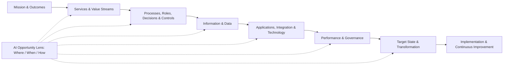

# Public Sector Capability Modernization Framework
## Design Specification for Reusable Training, Assessment, Consulting, Architecture, and AI Content

**Working name:** Public Sector Capability Modernization Framework (PSCMF)  
**Version:** 0.1 - Validation Design  
**Primary purpose:** Handoff specification for building and validating a reusable content system across 2-3 public-sector capability domains  
**Initial validation domains:** Asset Management, Investigations, Grants Management

---

## 1. Executive Summary

This document defines a reusable framework for designing public-sector training and consulting offerings across multiple agency capabilities. The framework is intended to avoid building separate, disconnected methodologies for Asset Management, Investigations, Grants Management, Permitting, Procurement, Inspections, Case Management, or future domains.

The core design principle is:

> **Build one capability-modernization framework, then specialize it through domain packs and delivery modes.**

The framework separates four concerns that are often mixed together:

1. **Core methodology** - the invariant way an agency capability is understood, assessed, designed, prioritized, and improved.
2. **Domain content** - the vocabulary, lifecycle, roles, risks, data, systems, metrics, examples, and patterns that differ for Asset Management, Investigations, Grants Management, and other capabilities.
3. **Delivery mode** - the way the same intellectual property is packaged for training, diagnostic assessment, consulting, architecture, executive workshops, or implementation support.
4. **AI overlay** - a cross-cutting method for identifying where AI can help, determining when it is appropriate, and defining how it should be implemented with suitable human oversight, data, architecture, governance, and measurement.

The objective of the first implementation is not to build a full learning-management or consulting platform. The objective is to create a **structured body of reusable content and a repeatable assembly model** that can be tested across three materially different domains.

A successful validation should demonstrate that:

- the same core framework can be reused without becoming vague or generic;
- each domain can feel specific and credible while inheriting most of the common structure;
- training and consulting artifacts can be generated from the same underlying content objects;
- technical architecture is a sibling view of the business capability rather than a disconnected technology course;
- AI is embedded consistently throughout the capability lifecycle and can also be packaged as a dedicated module or workstream;
- changes to common content can propagate across products without maintaining duplicate copies.

---

## 2. Product Vision

### 2.1 Vision Statement

Create a modular intellectual-property system for public-sector capability modernization that can support a portfolio of training and consulting offerings with a consistent structure, common language, and reusable artifacts.

### 2.2 Intended Users

The framework should support several user groups:

- public-sector executives and program leaders;
- functional/domain practitioners;
- architects, technologists, data leaders, and security professionals;
- consultants and facilitators;
- course designers and instructors;
- internal content developers;
- AI-assisted authoring tools such as Codex.

### 2.3 Intended Products

The same content base should be able to produce:

- Capability Fundamentals courses;
- Technical Architecture sibling courses;
- AI-enabled modernization modules;
- executive briefings and workshops;
- maturity assessments;
- discovery and interview guides;
- facilitated consulting workshops;
- current-state assessments;
- target operating models;
- target architecture designs;
- initiative portfolios and prioritization exercises;
- transformation roadmaps;
- implementation and governance playbooks;
- consultant enablement materials;
- fictional case studies and worked examples.

### 2.4 Non-Goals for the Initial Validation

The first prototype does **not** need to provide:

- a full LMS;
- client project management;
- automated legal or policy compliance conclusions;
- production AI agents that make agency decisions;
- fully branded slide or document generation;
- exhaustive coverage of every public-sector domain;
- a universal maturity model that pretends all agencies have identical target states.

The validation should focus on the **content model, inheritance model, assembly logic, and domain specificity**.

---

## 3. Design Principles

### 3.1 Capability First, Technology Second

Begin with mission, public outcomes, services, value streams, processes, decisions, risks, controls, and performance. Technology should be derived from capability needs rather than treated as the starting point.

### 3.2 One Framework, Multiple Domain Packs

The underlying transformation sequence should remain stable. Domain packs change the examples, nouns, lifecycle, risks, information, applications, controls, measures, and reference patterns.

### 3.3 One Body of IP, Multiple Delivery Modes

A concept should be authored once and reused as:

- teaching content;
- a diagnostic question;
- a workshop exercise;
- a maturity criterion;
- a consulting analysis lens;
- a deliverable component;
- a worked example.

### 3.4 Every Concept Should Be Actionable

Where practical, concepts should lead to an artifact. For example:

- service-level concepts -> service catalogue and measures;
- risk concepts -> risk and criticality model;
- data concepts -> information requirements and ownership matrix;
- architecture concepts -> current/target architecture;
- prioritization concepts -> scored initiative portfolio;
- governance concepts -> roles, decision rights, and review cadence.

### 3.5 AI Is a Cross-Cutting Lens, Not a Bolt-On Topic

Every stage should ask:

1. **Where** could AI add value?
2. **When** is AI appropriate or inappropriate?
3. **How** should the selected use case be implemented, governed, monitored, and measured?

A dedicated AI module may go deeper, but the AI lens should remain visible throughout the entire framework.

### 3.6 Human Accountability Is Explicit

AI may assist, recommend, summarize, classify, detect, predict, or automate defined tasks. The design should explicitly identify where human review, approval, override, escalation, and accountability remain required.

### 3.7 Maturity Is Contextual

Maturity models should describe increasing organizational capability, not imply that every agency must reach the highest score in every dimension. Target maturity should be selected based on mission, risk, scale, regulation, cost, and operating context.

### 3.8 Traceability Matters

The content model should support traceability from:

**Mission outcome -> capability -> process/decision -> information -> application/technology -> initiative -> roadmap -> measure**

This traceability is especially important when explaining why a technology or AI investment exists.

---

## 4. Conceptual Architecture of the Framework

The framework consists of five core layers and three cross-cutting overlays.

### 4.1 Core Layers

| Layer | Purpose | Representative Content |
|---|---|---|
| **1. Mission & Outcomes** | Establish why the capability exists and what public value it must produce. | Mission objectives, public outcomes, service expectations, stakeholders, policy context |
| **2. Business & Operating Model** | Describe how the capability works. | Services, value streams, lifecycle, processes, roles, decisions, risk, controls |
| **3. Information & Technology** | Define what enables the operating model. | Information domains, data ownership, applications, integrations, platforms, architecture |
| **4. Performance & Governance** | Define how the capability is measured, controlled, and improved. | KPIs, service levels, oversight, decision rights, controls, governance, maturity |
| **5. Transformation** | Define how the organization moves from current to target state. | Gaps, initiatives, prioritization, dependencies, roadmap, implementation, adoption |

### 4.2 Cross-Cutting Overlays

| Overlay | Core Question |
|---|---|
| **Technical Architecture** | What information, applications, integrations, platforms, and technical controls are required to enable the capability? |
| **AI Opportunity Lens** | Where can AI help, when is it appropriate, and how should it be implemented responsibly? |
| **Risk, Controls & Assurance** | What can go wrong, what controls are required, and how will decisions and outcomes be reviewed and evidenced? |

### 4.3 Framework Flow



---

## 5. Canonical Transformation Sequence

The canonical sequence is the primary organizing taxonomy for the content library. Courses and consulting products select from this sequence rather than inventing their own unrelated structures.

| # | Stage | Core Question | Typical Outputs |
|---|---|---|---|
| **1** | Mission & Public Outcomes | Why does this capability exist and what outcomes should it support? | Vision, objectives, outcome map, guiding principles |
| **2** | Scope & Operating Context | What is in scope and what environment constrains or shapes it? | Scope, stakeholder map, policy/context summary |
| **3** | Services & Value Streams | What services are provided and how does value move end to end? | Service catalogue, value-stream map, lifecycle |
| **4** | Performance & Service Expectations | How is successful performance defined? | Service levels, KPIs, outcome measures |
| **5** | Risk, Criticality & Controls | What can go wrong and how should risk be managed? | Risk model, control catalogue, criticality criteria |
| **6** | Business Capabilities | What must the organization be able to do well? | Capability model, heat map, capability gaps |
| **7** | Processes, Roles & Decisions | How is work executed and who is accountable? | Process maps, decision inventory, roles/RACI |
| **8** | Information & Data | What information is required and who owns it? | Information model, data requirements, ownership matrix |
| **9** | Applications & Integration | Which systems support the capability and how do they interact? | Application landscape, system-of-record matrix, integration map |
| **10** | Analytics, Decision Support & AI | How can data, analytics, and AI improve work and decisions? | Use-case catalogue, decision-support patterns, AI opportunity map |
| **11** | Target Operating Model & Architecture | What should the future capability and enabling environment look like? | Target operating model, target architecture, principles |
| **12** | Initiative Prioritization | What changes should be funded first? | Initiative catalogue, scoring, portfolio recommendations |
| **13** | Transformation Roadmap | In what order should change occur? | Dependencies, waves, 12-36 month roadmap |
| **14** | Governance & Continuous Improvement | How will the capability be sustained and improved? | Governance model, review cadence, metrics, improvement backlog |

### 5.1 Why This Sequence Is Canonical

The sequence deliberately starts with public value and operating needs, then moves toward information and technology. It ends with prioritization, implementation, and governance. It can therefore support both a business-facing course and a technical-architecture sibling course without creating two unrelated mental models.

---

## 6. Domain Pack Model

A **Domain Pack** specializes the canonical framework for a particular agency capability.

### 6.1 Domain Pack Contents

Each domain pack should contain:

1. domain definition and scope;
2. mission/outcome examples;
3. domain lifecycle or value stream;
4. capability model;
5. representative roles and stakeholders;
6. representative decisions;
7. risk and control catalogue;
8. information/domain model;
9. application and integration patterns;
10. performance measures;
11. AI use-case catalogue;
12. maturity criteria;
13. workshop questions and exercises;
14. fictional case study;
15. worked examples and sample artifacts;
16. domain-specific terminology/glossary;
17. references or agency-specific extension points.

### 6.2 Common vs. Domain-Specific Content

| Content Type | Common/Core | Domain-Specific |
|---|---:|---:|
| Transformation stages | High | Low |
| Facilitation method | High | Low |
| Maturity scoring mechanics | High | Medium |
| Prioritization mechanics | High | Low |
| Roadmap method | High | Low |
| Governance design method | High | Medium |
| Domain lifecycle | Low | High |
| Capability model | Medium | High |
| Roles and decisions | Medium | High |
| Risks and controls | Medium | High |
| Information model | Low | High |
| Applications and integration patterns | Medium | High |
| KPIs | Medium | High |
| AI use cases | Medium | High |
| Case-study facts | Low | High |

The implementation should favor **inheritance and composition** over copying. A domain pack should reference common content objects and override or extend them only where needed.

---

## 7. Initial Validation Domains

Three domains are recommended because they are structurally different enough to test whether the framework is genuinely reusable.

### 7.1 Asset Management

**Why it is useful for validation:** It is asset-centric, lifecycle-oriented, capital-intensive, spatially enabled, and strongly connected to maintenance and investment planning.

Representative lifecycle:

**Plan -> Acquire/Create -> Operate -> Inspect/Monitor -> Maintain -> Renew/Replace -> Dispose**

Representative capabilities:

- asset inventory and hierarchy management;
- inspection and condition assessment;
- work and maintenance management;
- service-level management;
- risk and criticality analysis;
- lifecycle planning;
- capital needs forecasting;
- investment prioritization;
- performance monitoring.

Representative information:

- asset;
- asset class/type;
- location;
- condition;
- inspection;
- work order;
- maintenance history;
- cost;
- risk;
- service level;
- project/investment.

Representative systems:

- EAM/CMMS;
- GIS;
- ERP/financial system;
- document/records management;
- telemetry/IoT/SCADA where applicable;
- analytics/data platform;
- mobile field applications.

### 7.2 Investigations

**Why it is useful for validation:** It is case-centric, sensitive, evidence-heavy, decision-heavy, and requires strong controls, records, privacy, auditability, and human judgment.

Representative lifecycle:

**Intake -> Triage -> Plan -> Investigate -> Analyze -> Review/Adjudicate -> Close -> Retain/Learn**

Representative capabilities:

- allegation/complaint intake;
- triage and prioritization;
- assignment and workload management;
- investigative planning;
- interview and evidence management;
- research and analysis;
- case collaboration;
- findings and review;
- reporting;
- quality assurance;
- records retention and disclosure support.

Representative information:

- case;
- allegation;
- person/organization/entity;
- event;
- evidence/item;
- interview;
- source;
- finding;
- action;
- relationship/link;
- timeline.

Representative systems:

- case management;
- evidence/document management;
- records management;
- identity/access management;
- search/research tools;
- analytics/link analysis;
- collaboration/workflow;
- correspondence tools.

### 7.3 Grants Management

**Why it is useful for validation:** It is program-centric, transaction-oriented, rules-driven, externally facing, financially integrated, and includes eligibility, monitoring, compliance, and performance.

Representative lifecycle:

**Program Design -> Notice/Solicitation -> Application -> Eligibility/Review -> Award -> Obligation/Payment -> Monitoring -> Reporting -> Closeout**

Representative capabilities:

- program design and configuration;
- applicant outreach and support;
- application intake;
- eligibility validation;
- evaluation and scoring;
- award management;
- financial integration;
- recipient monitoring;
- compliance and risk management;
- reporting;
- closeout;
- program evaluation.

Representative information:

- program;
- funding source;
- applicant;
- application;
- eligibility evidence;
- review/score;
- award;
- obligation;
- payment;
- recipient;
- performance measure;
- report;
- compliance issue.

Representative systems:

- grants management platform;
- CRM/portal;
- financial/ERP system;
- identity/access management;
- document/records management;
- payment systems;
- external registries/reference-data services;
- analytics/data platform.

---

## 8. Cross-Domain Comparison

| Framework Stage | Asset Management | Investigations | Grants Management |
|---|---|---|---|
| Mission & Outcomes | Reliable, safe, sustainable public infrastructure/services | Fair, timely, defensible investigative outcomes | Effective distribution and stewardship of public funds |
| Primary Unit of Work | Asset / asset portfolio | Case / allegation | Program / application / award |
| Lifecycle | Asset lifecycle | Case lifecycle | Grant lifecycle |
| Primary Risk | Failure, service disruption, safety, cost | Procedural error, evidence risk, privacy, unfairness, delay | Fraud, improper payment, noncompliance, poor program outcomes |
| Key Decisions | Maintain, repair, renew, replace, prioritize | Triage, scope, investigate, substantiate, escalate | Eligibility, score, award, monitor, remediate, close |
| Key Information | Asset, location, condition, work, cost | Case, allegation, entity, evidence, event, finding | Program, applicant, application, award, payment, performance |
| Enabling Systems | EAM, GIS, ERP, IoT, analytics | Case/evidence systems, records, analytics | Grants platform, ERP, portal, records, analytics |
| AI Themes | Predictive maintenance, inspection assistance, knowledge search | Triage assistance, case summarization, evidence organization, pattern detection | Application extraction, reviewer assistance, risk monitoring, report analysis |

---

## 9. Delivery Modes

The canonical framework is the content source. A **Delivery Product** selects stages, depth, activities, and artifacts based on the customer need.

### 9.1 Capability Fundamentals Course

Purpose: Teach how a domain works and how to make better management decisions within it.

Typical six-module structure:

| Module | Generic Structure |
|---|---|
| 1 | Capability Fundamentals and Public Outcomes |
| 2 | Domain, Lifecycle, Services, and Performance |
| 3 | Risk, Controls, Processes, and Decisions |
| 4 | Information, Data, and Enabling Technology |
| 5 | Decision Support, Investment/Prioritization, and AI |
| 6 | Target Operating Model, Governance, and Roadmap |

### 9.2 Technical Architecture Sibling Course

Purpose: Translate capability requirements into information, application, integration, platform, security, and governance decisions.

Typical six-module structure:

| Module | Technical Architecture Structure |
|---|---|
| 1 | Architecture Fundamentals and Capability Alignment |
| 2 | Information and Data Architecture |
| 3 | Business Capabilities, Requirements, Risk, and Controls |
| 4 | Application and Integration Architecture |
| 5 | Technology/AI Options and Solution Prioritization |
| 6 | Target Architecture, Transition Roadmap, and Governance |

### 9.3 Maturity Assessment

Purpose: Establish current state, desired target maturity, evidence, priority gaps, and improvement opportunities.

Outputs:

- maturity heat map;
- evidence register;
- strengths and gaps;
- current vs. target profile;
- prioritized improvement themes.

### 9.4 Consulting Transformation Engagement

Standard engagement pattern:

**Discover -> Assess -> Design -> Prioritize -> Roadmap -> Enable**

| Phase | Typical Activities | Outputs |
|---|---|---|
| Discover | Interviews, document review, inventories, workshops | Current-context fact base |
| Assess | Maturity, pain points, risk, architecture, data, governance | Current-state assessment |
| Design | Future capabilities, processes, operating model, data, architecture | Target-state design |
| Prioritize | Initiative definition, value/risk/feasibility scoring | Prioritized portfolio |
| Roadmap | Dependencies, sequencing, waves, ownership | Transformation roadmap |
| Enable | Governance, measures, knowledge transfer, implementation planning | Governance and enablement plan |

### 9.5 Executive Workshop

A shortened product can select only the stages required for alignment and decision-making, for example:

**Mission -> Performance/Risk -> Target State -> Priorities -> Roadmap**

### 9.6 Consultant Enablement

The same materials should teach consultants:

- the common methodology;
- the domain pack;
- facilitation patterns;
- maturity scoring;
- expected evidence;
- example outputs;
- common failure modes;
- how to adapt the method without breaking consistency.

---

## 10. Content Refactoring Pattern

Every major topic should be represented as a reusable **Content Unit** rather than a slide-specific paragraph.

### 10.1 Standard Content Unit

A content unit may contain:

- concept definition;
- why it matters;
- guiding principles;
- domain-specific interpretation;
- teaching narrative;
- diagnostic questions;
- evidence requests;
- workshop exercise;
- maturity criteria;
- AI lens questions;
- expected client artifacts;
- fictional case example;
- consultant notes;
- source/reference metadata.

### 10.2 Example: Asset Information / Information Management

**Core concept:** Decision-quality depends on fit-for-purpose information with clear ownership and authoritative sources.

**Training use:** Explain information requirements, ownership, quality, and systems of record.

**Diagnostic use:** Ask which data is required, where it resides, who owns it, how complete it is, and which decisions are affected by quality issues.

**Workshop use:** Map information domains to owners, systems of record, consumers, quality issues, and integration requirements.

**Maturity use:** Assess whether information is ad hoc, defined, governed, measured, and decision-driven.

**Consulting deliverable:** Information requirements, data ownership matrix, quality assessment, conceptual information architecture.

**AI overlay:** Identify whether data is adequate, permissible, accessible, and sufficiently governed for each AI use case.

This same pattern can be reused for Investigations information or Grants information by specializing the domain model.

---

## 11. Maturity Model Design

### 11.1 Common Five-Level Scale

| Level | Label | Generic Description |
|---|---|---|
| **1** | Ad Hoc | Practices are inconsistent, person-dependent, reactive, and weakly documented. |
| **2** | Developing | Basic practices exist, but coverage, ownership, consistency, and measurement are uneven. |
| **3** | Defined | Standard methods, responsibilities, information requirements, and controls are established. |
| **4** | Managed | Performance and quality are measured; practices are integrated across functions and systems. |
| **5** | Adaptive | The capability is continuously improved using evidence, advanced analytics, automation, and feedback. |

### 11.2 Common Maturity Dimensions

Potential cross-domain dimensions include:

- mission and strategic alignment;
- service/value-stream definition;
- process standardization;
- roles and accountability;
- risk and controls;
- information governance;
- data quality;
- application enablement;
- integration/interoperability;
- analytics and decision support;
- AI readiness and governance;
- performance management;
- governance;
- workforce/change readiness;
- continuous improvement.

Each domain may add specialized dimensions.

### 11.3 Evidence-Based Scoring

A score should not be supported only by stakeholder opinion. Each maturity criterion should identify suggested evidence such as:

- policy or procedure;
- system record;
- inventory;
- performance report;
- control evidence;
- meeting/governance artifacts;
- sample case/transaction;
- data-quality measurement;
- architecture documentation;
- interview corroboration.

---

## 12. AI Opportunity Lens

AI is both a cross-cutting overlay and a standalone module/workstream.

### 12.1 The Three Questions

#### WHERE can AI help?

Identify work that is:

- high-volume;
- repetitive;
- document-heavy;
- search-intensive;
- data-intensive;
- pattern-recognition intensive;
- prediction-oriented;
- synthesis-heavy;
- constrained by staff capacity;
- dependent on navigating large policy or knowledge collections.

#### WHEN should AI be used?

Evaluate suitability based on:

- public/business value;
- consequences of error;
- degree of human judgment or discretion;
- data readiness;
- privacy/security sensitivity;
- explainability/auditability requirements;
- process stability;
- frequency/volume;
- technical feasibility;
- expected adoption;
- reversibility/fallback options.

#### HOW should AI be used?

Select an implementation pattern and explicitly design:

- human role;
- source information;
- system integration;
- controls;
- evaluation approach;
- monitoring;
- records/audit requirements;
- fallback behavior;
- performance measures.

### 12.2 AI Pattern Catalogue

| Pattern | Description | Example Uses |
|---|---|---|
| Retrieval / Semantic Search | Find relevant material across large corpora. | Policies, prior cases, manuals, grant guidance |
| Summarization | Condense large bodies of text or history. | Case files, applications, inspection histories |
| Classification | Categorize items into defined classes. | Allegations, documents, service requests |
| Extraction | Convert unstructured content into structured fields. | Dates, entities, amounts, asset attributes |
| Generation | Draft content from approved inputs. | Correspondence, reports, notices, work descriptions |
| Prediction | Estimate a future state or probability. | Failure likelihood, workload, recipient risk |
| Anomaly Detection | Flag unusual patterns. | Transactions, maintenance patterns, compliance anomalies |
| Recommendation | Suggest next actions or priorities. | Triage, maintenance strategy, monitoring focus |
| Conversational Assistance | Help staff navigate knowledge and workflow. | Policy assistant, investigator assistant, grants helpdesk |
| Agentic Automation | Coordinate multiple defined steps or systems. | Intake routing, evidence preparation, monitoring workflows |

### 12.3 Human Involvement Modes

Every AI use case should declare one of the following modes:

| Mode | Meaning |
|---|---|
| **Inform** | AI retrieves or summarizes information; human decides and acts. |
| **Assist** | AI drafts, classifies, or recommends; human reviews before use. |
| **Approve-to-Act** | AI prepares an action; an authorized human must approve execution. |
| **Bounded Automation** | AI executes a low-risk, well-defined action within explicit rules, monitoring, and fallback controls. |
| **Prohibited / Human-Only** | The use case is intentionally excluded from AI automation due to risk, law, policy, ethics, or accountability. |

### 12.4 AI Use-Case Assessment

Each use case should be scored or characterized across:

- value;
- feasibility;
- data readiness;
- risk;
- human oversight requirement;
- explainability/auditability;
- integration complexity;
- adoption/change impact;
- scalability/reusability.

Recommended disposition values:

- **Do now**;
- **Pilot**;
- **Build foundations first**;
- **Monitor / revisit**;
- **Do not pursue**.

### 12.5 AI Governance Questions

The framework should consistently address:

- Who is accountable for the final decision or action?
- What human review is required?
- What information may the AI access?
- What data must not be exposed?
- What evidence of AI use should be retained?
- How will accuracy and other performance attributes be evaluated?
- How will bias, fairness, and disparate outcomes be examined where relevant?
- How will users challenge or override AI output?
- What happens when the AI or dependent service is unavailable?
- How will vendor/model changes be tested and governed?
- What monitoring thresholds trigger review or suspension?

---

## 13. AI Examples by Validation Domain

### 13.1 Asset Management

| Lifecycle Area | Candidate AI Uses | Typical Human Mode |
|---|---|---|
| Inventory | Extract asset attributes from documents or imagery | Assist |
| Inspection | Summarize observations; identify possible defects | Assist |
| Condition | Estimate deterioration or remaining-life indicators | Inform/Assist |
| Maintenance | Recommend preventive tasks or schedules | Assist |
| Work Management | Draft work descriptions and summarize technician notes | Assist |
| Risk | Estimate or explain risk drivers | Inform |
| Planning | Forecast renewal demand and scenario impacts | Inform |
| Capital Prioritization | Compare options against criteria | Assist |
| Knowledge | Search manuals, drawings, history, and policy | Inform |

### 13.2 Investigations

| Lifecycle Area | Candidate AI Uses | Typical Human Mode |
|---|---|---|
| Intake | Classify allegations and extract entities | Assist |
| Triage | Surface relevant factors and possible priority | Assist |
| Research | Search and synthesize approved information sources | Inform |
| Case Review | Summarize case history and evidence inventory | Inform |
| Evidence | Organize and describe evidence | Assist |
| Pattern Detection | Identify possible links or recurring themes | Inform |
| Interview Prep | Draft questions from approved case facts | Assist |
| Reporting | Draft factual summaries for investigator review | Assist |
| Quality Control | Flag missing required sections or inconsistencies | Assist |

Final investigative findings, credibility judgments, legal conclusions, disciplinary decisions, or similarly consequential determinations should be explicitly evaluated for human-only or high-oversight treatment.

### 13.3 Grants Management

| Lifecycle Area | Candidate AI Uses | Typical Human Mode |
|---|---|---|
| Applicant Support | Answer questions grounded in approved guidance | Inform |
| Application Intake | Extract structured fields and detect missing documents | Assist |
| Eligibility | Surface relevant criteria and supporting evidence | Assist |
| Review | Summarize proposals for reviewers | Inform |
| Award Preparation | Draft notices or internal summaries | Assist |
| Recipient Risk | Highlight risk indicators for staff review | Inform |
| Monitoring | Analyze progress reports and identify issues | Assist |
| Compliance | Flag missing or inconsistent documentation | Assist |
| Closeout | Summarize performance and unresolved items | Assist |

---

## 14. Technical Architecture Overlay

The technical architecture view should be derived from the business capability rather than treated as a separate framework.

### 14.1 Traceability Chain

**Public outcome -> Business capability -> Process/decision -> Information -> Application capability -> Integration -> Technology service -> Control -> Measure**

### 14.2 Architecture Domains

Each domain pack should be able to define content for:

- business capability architecture;
- information/data architecture;
- application architecture;
- integration/API/event architecture;
- analytics/AI architecture;
- identity and access;
- security/privacy controls;
- platform/infrastructure/cloud concerns;
- observability/monitoring;
- records and auditability;
- technology lifecycle and technical debt.

### 14.3 System-of-Record Method

For each information domain, identify:

- authoritative owner;
- authoritative system;
- systems that create/update data;
- systems that consume data;
- integration method;
- quality requirements;
- retention requirements;
- security classification/sensitivity;
- AI-access constraints.

### 14.4 Current-to-Target Pattern

Technical architecture deliverables should consistently follow:

**Current State -> Pain Points -> Principles -> Capability Requirements -> Target State -> Transition States -> Roadmap**

---

## 15. Consulting Methodology

### 15.1 Discover

Objectives:

- understand mission, outcomes, scope, stakeholders, and context;
- inventory major processes, decisions, information, systems, and pain points;
- identify key evidence sources.

Reusable tools:

- stakeholder interview guide;
- document request list;
- system inventory;
- data/information inventory;
- decision inventory;
- pain-point capture template.

### 15.2 Assess

Objectives:

- establish current maturity;
- identify strengths, gaps, risk, control issues, and technical debt;
- identify AI opportunities and readiness barriers.

Reusable tools:

- maturity model;
- evidence rubric;
- risk/control assessment;
- architecture assessment;
- AI opportunity/readiness assessment.

### 15.3 Design

Objectives:

- define target capabilities, processes, roles, information, governance, architecture, and AI patterns.

Reusable tools:

- target operating model canvas;
- capability model;
- process patterns;
- information model;
- target architecture patterns;
- AI human-oversight design;
- governance design.

### 15.4 Prioritize

Objectives:

- convert gaps and opportunities into initiatives;
- compare value, risk reduction, feasibility, dependency, and readiness.

Reusable tools:

- initiative template;
- scoring model;
- dependency map;
- portfolio matrix.

### 15.5 Roadmap

Objectives:

- sequence initiatives into implementable waves;
- distinguish foundations, pilots, scale-out, and institutionalization.

Typical roadmap categories:

- policy/governance;
- process;
- organization/workforce;
- data;
- applications/integration;
- analytics/AI;
- change/adoption;
- performance/measurement.

### 15.6 Enable

Objectives:

- transfer capability to the client;
- define governance and measurement;
- establish an improvement backlog.

Outputs:

- governance structure;
- RACI/decision rights;
- KPI set;
- review cadence;
- 90-day action plan;
- implementation playbook;
- training and enablement plan.

---

## 16. Relationship Between Training and Consulting Content

| Content Object | Training | Consulting | Deliverable | Consultant Enablement |
|---|---|---|---|---|
| Concept | Teach and explain | Establish common language | Recommendation rationale | Method reference |
| Case Example | Practice | Demonstrate method | Illustrative example | Worked example |
| Discussion Prompt | Participant discussion | Stakeholder interview | Finding support | Interview guide |
| Exercise | Practice skill | Facilitate workshop | Workshop evidence | Facilitation guide |
| Maturity Criterion | Self-assessment | Formal assessment | Maturity heat map | Scoring rubric |
| Template | Participant artifact | Data capture | Client-ready output | Standard template |
| Framework Diagram | Explain relationships | Structure discovery/design | Current/target diagram | Method map |
| Prioritization Model | Case exercise | Score real initiatives | Portfolio recommendation | Analysis tool |
| Roadmap Pattern | Course capstone | Transformation planning | Implementation roadmap | Roadmap method |
| Governance Pattern | Teach principles | Design governance | Governance model | Reference pattern |

The implementation should make these relationships explicit so that a single content object can be rendered differently by delivery mode.

---

## 17. Fictional Case Study Pattern

Each domain should include a fictional public-sector organization used consistently across training and consultant enablement.

### 17.1 Case Design Requirements

The case should include:

- agency/organization profile;
- mission context;
- operating pressures;
- incomplete or conflicting information;
- current systems;
- stakeholder perspectives;
- risk/control concerns;
- competing improvement initiatives;
- AI opportunities and concerns;
- enough quantitative information to support prioritization exercises.

### 17.2 Progressive Reveal

The case should reveal information by module/stage rather than expose the entire answer at once.

Example for Asset Management:

1. mission pressure and deferred investment;
2. fragmented asset inventory;
3. inconsistent service levels;
4. high-risk assets;
5. lifecycle and maintenance tradeoffs;
6. fragmented data/systems;
7. competing capital and technology initiatives;
8. target state and roadmap.

Equivalent progressive narratives should be created for Investigations and Grants Management.

---

## 18. Proposed Content Object Model

The prototype should store framework content as structured, human-readable files, preferably YAML or JSON plus Markdown for long-form narrative.

### 18.1 Core Entities

#### FrameworkStage

Represents one canonical transformation stage.

Key fields:

- `id`
- `sequence`
- `name`
- `purpose`
- `core_questions`
- `default_outputs`
- `ai_questions`
- `related_stages`

#### DomainPack

Represents one agency capability specialization.

Key fields:

- `id`
- `name`
- `definition`
- `scope`
- `lifecycle`
- `capabilities`
- `roles`
- `decisions`
- `risks`
- `controls`
- `information_domains`
- `application_patterns`
- `metrics`
- `ai_use_cases`
- `maturity_overrides`
- `case_study_id`

#### ContentUnit

Represents reusable intellectual property tied to a stage and optionally a domain.

Key fields:

- `id`
- `stage_id`
- `domain_id` (optional for common content)
- `title`
- `concept`
- `why_it_matters`
- `principles`
- `teaching_points`
- `diagnostic_questions`
- `evidence_requests`
- `workshop_exercise`
- `maturity_criteria`
- `ai_lens`
- `expected_artifacts`
- `case_example`
- `consultant_notes`
- `tags`

#### MaturityDimension

Key fields:

- `id`
- `name`
- `stage_id`
- `domain_id` (optional)
- `levels` (1-5)
- `evidence_examples`
- `target_guidance`

#### AIUseCase

Key fields:

- `id`
- `domain_id`
- `stage_id`
- `name`
- `problem_statement`
- `ai_pattern`
- `human_mode`
- `inputs`
- `outputs`
- `value_hypothesis`
- `risk_considerations`
- `data_requirements`
- `architecture_requirements`
- `controls`
- `evaluation_metrics`
- `disposition`

#### DeliveryProduct

Defines how content is assembled.

Key fields:

- `id`
- `name`
- `delivery_mode`
- `domain_id`
- `audience`
- `stage_selection`
- `module_structure`
- `depth`
- `included_content_types`
- `required_artifacts`

#### CaseStudy

Key fields:

- `id`
- `domain_id`
- `organization_profile`
- `facts`
- `stakeholders`
- `systems`
- `datasets`
- `scenarios`
- `progressive_reveals`
- `answer_guidance`

---

## 19. Example YAML Structures

### 19.1 Framework Stage

```yaml
id: information_data
sequence: 8
name: Information & Data
purpose: Define the information required to operate, govern, and improve the capability.
core_questions:
  - What information is required for key decisions and processes?
  - Who owns each information domain?
  - Which source is authoritative?
  - What quality, retention, security, and access requirements apply?
default_outputs:
  - information_requirements
  - data_ownership_matrix
  - conceptual_information_model
ai_questions:
  - Is the information sufficient and permissible for proposed AI uses?
  - What grounding or retrieval sources would an AI solution require?
  - What data-quality failures could produce unsafe or misleading output?
```

### 19.2 Domain Pack

```yaml
id: investigations
name: Investigations
primary_unit_of_work: case
lifecycle:
  - intake
  - triage
  - plan
  - investigate
  - analyze
  - review
  - close
  - retain_learn
capabilities:
  - allegation_intake
  - triage_prioritization
  - case_assignment
  - investigation_planning
  - evidence_management
  - interview_management
  - research_analysis
  - findings_review
  - reporting
  - quality_assurance
information_domains:
  - case
  - allegation
  - entity
  - event
  - evidence
  - interview
  - source
  - finding
  - action
  - relationship
```

### 19.3 AI Use Case

```yaml
id: investigations_case_summary
name: Case-file summarization
stage_id: analytics_ai
domain_id: investigations
problem_statement: Investigators spend significant time reviewing lengthy case histories before interviews or review meetings.
ai_pattern: summarization
human_mode: inform
inputs:
  - approved_case_documents
  - case_metadata
outputs:
  - attributed_case_summary
  - timeline
  - unresolved_questions
value_hypothesis:
  - reduce_review_time
  - improve_consistency_of_preparation
risk_considerations:
  - omission_of_material_fact
  - hallucinated_fact
  - exposure_of_sensitive_information
controls:
  - source_attribution
  - authorized_sources_only
  - human_verification_before_use
  - audit_log
evaluation_metrics:
  - factual_accuracy
  - material_omission_rate
  - investigator_time_saved
  - user_acceptance
```

### 19.4 Delivery Product

```yaml
id: investigations_fundamentals_course
name: Investigations Management Fundamentals
delivery_mode: training
domain_id: investigations
audience:
  - program_managers
  - investigators
  - analysts
modules:
  - id: m1
    stages: [mission_outcomes, scope_context]
  - id: m2
    stages: [services_value_streams, performance]
  - id: m3
    stages: [risk_controls, capabilities, processes_roles_decisions]
  - id: m4
    stages: [information_data, applications_integration]
  - id: m5
    stages: [analytics_ai, initiative_prioritization]
  - id: m6
    stages: [target_state, roadmap, governance]
```

---

## 20. Proposed Repository Structure for Codex

A simple file-based repository is preferred for the prototype because it is transparent, versionable, easy to review, and compatible with code generation.

```text
pscmf/
├── README.md
├── framework/
│   ├── framework.yaml
│   ├── stages/
│   │   ├── 01_mission_outcomes.yaml
│   │   ├── 02_scope_context.yaml
│   │   ├── ...
│   │   └── 14_governance_improvement.yaml
│   ├── maturity/
│   │   ├── common_scale.yaml
│   │   └── common_dimensions.yaml
│   ├── ai/
│   │   ├── ai_patterns.yaml
│   │   ├── human_modes.yaml
│   │   ├── suitability_criteria.yaml
│   │   └── governance_questions.yaml
│   └── consulting/
│       ├── discover.yaml
│       ├── assess.yaml
│       ├── design.yaml
│       ├── prioritize.yaml
│       ├── roadmap.yaml
│       └── enable.yaml
├── domains/
│   ├── asset_management/
│   │   ├── domain.yaml
│   │   ├── lifecycle.yaml
│   │   ├── capabilities.yaml
│   │   ├── information.yaml
│   │   ├── applications.yaml
│   │   ├── risks_controls.yaml
│   │   ├── metrics.yaml
│   │   ├── maturity.yaml
│   │   ├── ai_use_cases.yaml
│   │   ├── content_units/
│   │   └── case_study/
│   ├── investigations/
│   │   └── ...
│   └── grants_management/
│       └── ...
├── products/
│   ├── templates/
│   │   ├── fundamentals_course.yaml
│   │   ├── technical_architecture_course.yaml
│   │   ├── maturity_assessment.yaml
│   │   ├── consulting_engagement.yaml
│   │   └── executive_workshop.yaml
│   └── generated/
├── schemas/
│   ├── framework_stage.schema.json
│   ├── domain_pack.schema.json
│   ├── content_unit.schema.json
│   ├── maturity_dimension.schema.json
│   ├── ai_use_case.schema.json
│   ├── delivery_product.schema.json
│   └── case_study.schema.json
├── scripts/
│   ├── validate_content.py
│   ├── assemble_product.py
│   ├── render_markdown.py
│   └── report_coverage.py
└── tests/
    ├── test_schema_validation.py
    ├── test_inheritance.py
    ├── test_product_assembly.py
    └── test_domain_coverage.py
```

---

## 21. Inheritance and Composition Rules

### 21.1 Rule 1: Common Content Is the Default

If a content unit is capability-neutral, store it under `framework/` and reference it from domain products.

### 21.2 Rule 2: Domains Extend, Do Not Copy

A domain should define only:

- additional content;
- specialized language;
- overrides where the common statement is materially inaccurate;
- domain examples;
- domain artifacts and patterns.

### 21.3 Rule 3: Delivery Products Select and Transform

A course, assessment, or consulting engagement should select content units and apply a rendering profile rather than maintain a separate copy of the content.

Example:

- training renderer uses `teaching_points`, `exercise`, and `case_example`;
- assessment renderer uses `diagnostic_questions`, `evidence_requests`, and `maturity_criteria`;
- consulting renderer uses `workshop_exercise`, `expected_artifacts`, and `consultant_notes`.

### 21.4 Rule 4: Domain-Specific Terminology Is Explicit

Do not hide domain terminology in prose. Store important terms in structured fields so they can be reused in glossaries, diagrams, examples, and validation checks.

### 21.5 Rule 5: AI Must Be Discoverable Everywhere

Each stage and content unit should expose an `ai_lens` or explicit statement that no material AI opportunity is currently defined. This prevents AI from disappearing when content is assembled into different products.

---

## 22. Assembly Logic

At a high level, product assembly should work as follows:

1. Select a `DeliveryProduct` template.
2. Select a `DomainPack`.
3. Load required canonical stages.
4. Load common content units for each stage.
5. Load domain extensions/overrides.
6. Resolve maturity criteria.
7. Resolve AI lens content and AI use cases.
8. Resolve case-study segments.
9. Apply delivery-mode filtering.
10. Generate an intermediate content manifest.
11. Render to Markdown initially; later renderers may support DOCX/PPTX/HTML.
12. Produce a coverage report identifying missing content.

Pseudo-code:

```python
def assemble_product(product_id, domain_id):
    product = load_product(product_id)
    domain = load_domain(domain_id)

    manifest = []
    for module in product.modules:
        for stage_id in module.stages:
            stage = load_stage(stage_id)
            common_units = load_common_units(stage_id)
            domain_units = load_domain_units(domain_id, stage_id)
            resolved_units = merge(common_units, domain_units)

            manifest.append({
                "module": module.id,
                "stage": stage,
                "content": filter_for_delivery_mode(resolved_units, product.delivery_mode),
                "ai": resolve_ai_content(domain_id, stage_id),
                "case": resolve_case_segment(domain_id, stage_id),
            })

    validate_manifest(manifest)
    return manifest
```

---

## 23. Coverage and Quality Rules

The prototype should be able to report whether a domain pack is sufficiently complete.

### 23.1 Minimum Domain Coverage

A validation-ready domain should have:

- lifecycle defined;
- at least 8 representative capabilities;
- at least 8 information domains;
- representative roles;
- at least 8 risks/controls;
- representative application landscape;
- at least 8 performance measures;
- at least 8 AI use cases spanning multiple AI patterns;
- maturity criteria for the core dimensions;
- one fictional case study with progressive reveals;
- one fundamentals-course assembly;
- one technical-architecture-course assembly;
- one assessment/consulting assembly.

The exact counts are validation targets rather than long-term hard constraints.

### 23.2 Cross-Domain Quality Tests

A domain pack fails validation if:

- it simply renames Asset Management nouns without changing the operating logic;
- its lifecycle is not credible for the domain;
- risks and controls are generic and not domain-specific;
- information entities do not reflect the domain's real unit of work;
- AI use cases are generic chatbot ideas without linkage to specific work or decisions;
- the technical architecture cannot be traced to business capabilities and information needs;
- the training course and consulting assessment require duplicate content to stay consistent.

---

## 24. MVP Validation Plan

### 24.1 Phase 1 - Build the Core Framework

Implement:

- 14 canonical stages;
- common five-level maturity model;
- common consulting lifecycle;
- common AI patterns, human modes, suitability criteria, and governance questions;
- schemas for core entities;
- validation script;
- Markdown rendering.

### 24.2 Phase 2 - Build Asset Management as the Reference Domain

Asset Management should be the most complete initial domain because the conceptual content has already been substantially developed.

Create:

- domain model;
- lifecycle;
- capability map;
- information model;
- systems/integration pattern;
- risk/control catalogue;
- metrics;
- AI use cases;
- maturity criteria;
- Riverbend-style case study;
- Fundamentals course;
- Technical Architecture course;
- maturity/consulting assessment.

Use this domain to stabilize the schemas and assembly process.

### 24.3 Phase 3 - Build Investigations as the Stress Test

Investigations should test whether the framework works for a sensitive, case-centric, judgment-heavy domain.

Focus validation on:

- evidence and record sensitivity;
- human decision authority;
- privacy/security;
- auditability;
- case lifecycle;
- AI boundaries and oversight.

If the implementation requires widespread changes to the core model, determine whether those changes are true cross-domain improvements or accidental Investigations-specific coupling.

### 24.4 Phase 4 - Build Grants Management as the Second Stress Test

Grants Management should test an externally facing, program/transaction-centric, financially integrated domain.

Focus validation on:

- program configuration;
- applicant/recipient lifecycle;
- eligibility and review;
- financial integration;
- compliance/monitoring;
- performance reporting;
- AI assistance across document-heavy workflows.

### 24.5 Phase 5 - Compare and Refactor

After three domains exist, perform a formal comparison:

- What content is truly common?
- What was duplicated?
- Which fields were unused?
- Which domain needs forced awkward mappings?
- Which stages should be split or combined?
- Which AI fields are insufficient?
- Can the same product template assemble useful outputs for all three domains?
- Can a common maturity heat-map format represent all three without losing meaning?

Refactor only after this comparison.

---

## 25. Recommended Build Order for Codex

1. Create repository and schemas.
2. Encode the 14 canonical stages.
3. Encode AI pattern catalogue, human modes, suitability criteria, and governance questions.
4. Encode common maturity scale and baseline dimensions.
5. Build validation utilities.
6. Build Asset Management domain pack.
7. Build Markdown assembler for a Fundamentals course.
8. Add Technical Architecture delivery template.
9. Add maturity-assessment/consulting delivery template.
10. Build Asset Management case study and progressive reveals.
11. Build Investigations domain pack and run coverage tests.
12. Refactor core/domain boundaries.
13. Build Grants Management domain pack and run coverage tests.
14. Produce cross-domain comparison report.
15. Only then consider richer output generation such as PPTX/DOCX/HTML.

This sequence intentionally delays sophisticated rendering until the content model is proven.

---

## 26. Acceptance Criteria for the Validation

The initial design can be considered validated when all of the following are true:

### Reuse

- At least three domain packs can use the same canonical framework.
- The majority of methodology content is referenced rather than copied.
- Course and consulting products can be generated from shared content units.

### Specificity

- Each domain has a distinct lifecycle, capability model, information model, risk/control set, metrics, architecture patterns, and AI use cases.
- A domain practitioner would recognize the material as belonging to their field rather than as a generic management framework.

### AI Integration

- Every stage has an AI lens or an intentional not-applicable statement.
- Each domain has a prioritized AI use-case catalogue.
- Each AI use case identifies human involvement, risk considerations, data needs, controls, and evaluation metrics.

### Architecture Traceability

- Technical architecture outputs can be traced back to business capabilities and information requirements.
- AI architecture requirements can be traced to specific use cases.

### Consulting Utility

- The model can generate interview questions, workshop structures, maturity criteria, and expected artifacts.
- A consultant can use the generated material to conduct a credible initial discovery/assessment.

### Training Utility

- The model can generate a coherent six-module Fundamentals course and sibling Technical Architecture course for each domain.
- Each course includes concepts, exercises, and case-study progression.

### Maintainability

- Updating a common concept does not require editing multiple domain/course copies.
- Validation identifies missing references, duplicate IDs, unsupported stage mappings, and incomplete domain coverage.

---

## 27. Suggested Prototype Outputs

For each of the three validation domains, generate the following artifacts from structured content:

1. `domain_overview.md`
2. `capability_model.md`
3. `lifecycle.md`
4. `information_model.md`
5. `risk_controls.md`
6. `ai_use_case_catalogue.md`
7. `fundamentals_course_outline.md`
8. `technical_architecture_course_outline.md`
9. `maturity_assessment.md`
10. `consulting_workshop_plan.md`
11. `target_state_artifact_checklist.md`
12. `case_study.md`

Also generate a cross-domain report:

- `cross_domain_reuse_report.md`
- common content percentage/coverage;
- missing content;
- override counts;
- AI-use-case distribution;
- stage coverage;
- duplicated text warnings.

---

## 28. Design Decisions to Preserve During Implementation

The following decisions are central to the design and should not be lost during prototyping:

1. **The framework is not Asset Management-specific.** Asset Management is the reference implementation, not the parent model.
2. **Courses are products built from the framework.** They are not the primary taxonomy of the repository.
3. **Consulting is also a product built from the framework.** Diagnostic questions and deliverables should reuse the same content objects as training.
4. **Technical Architecture is a sibling view.** It derives from business capabilities, information needs, and decisions.
5. **AI is embedded and standalone.** It must appear throughout the framework and also support a deeper dedicated module/workstream.
6. **Domain packs specialize operating reality.** They must provide domain-specific lifecycle, capabilities, decisions, risks, information, systems, metrics, and AI use cases.
7. **Human accountability is modeled.** AI use cases must state the human involvement mode and controls.
8. **Maturity scoring is evidence-based and contextual.** Level 5 is not automatically the desired target.
9. **Structured content precedes polished rendering.** Prove the model before building sophisticated presentation/document generation.
10. **Traceability is a feature.** Recommendations and technology choices should be explainable back to mission and capability needs.

---

## 29. Future Extensions

Once the three-domain validation is successful, candidate domain packs could include:

- Permitting & Licensing;
- Inspections;
- Procurement;
- Case Management;
- Benefits Administration;
- Regulatory Compliance;
- Emergency Management;
- Financial Management;
- Workforce Management;
- Customer/Constituent Service;
- Records Management;
- Fleet Management;
- Facilities Management.

Potential future product capabilities include:

- slide-deck generation;
- facilitator-guide generation;
- participant workbook generation;
- assessment survey generation;
- maturity heat-map visualization;
- roadmap visualization;
- domain comparison;
- client-specific overlay packs;
- configurable agency policies and controls;
- knowledge-source citations;
- versioning and provenance;
- AI-assisted drafting with human review workflows.

---

## 30. Immediate Handoff Prompt for Codex

The following can be used as the starting implementation instruction:

> Build a file-based prototype of the Public Sector Capability Modernization Framework described in this design. Use YAML or JSON for structured content and Markdown for narrative output. Implement the canonical framework, schemas, inheritance/composition rules, AI overlay, maturity model, and product assembly logic before focusing on presentation formatting. Treat Asset Management as the reference domain, Investigations as the first stress test, and Grants Management as the second stress test. Generate Fundamentals Course, Technical Architecture Course, Maturity Assessment, Consulting Workshop Plan, AI Use-Case Catalogue, and Case Study outputs for each domain. Add schema validation and coverage reporting so missing domain content and accidental duplication are visible. Preserve traceability from mission outcomes through capabilities, information, applications/technology, AI use cases, initiatives, roadmaps, and measures.

---

## 31. Summary Model

The complete design can be summarized as:

```text
PUBLIC SECTOR CAPABILITY MODERNIZATION FRAMEWORK

Core Method
  Mission & Outcomes
    -> Services / Value Streams
    -> Risk / Controls / Performance
    -> Capabilities / Processes / Roles / Decisions
    -> Information / Data
    -> Applications / Integration / Technology
    -> Analytics / AI
    -> Target Operating Model & Architecture
    -> Prioritization
    -> Roadmap
    -> Governance & Continuous Improvement

Domain Packs
  Asset Management
  Investigations
  Grants Management
  ...future domains

Cross-Cutting AI Lens
  WHERE can AI add value?
  WHEN is AI appropriate?
  HOW should it be implemented, governed, and measured?

Delivery Products
  Fundamentals Training
  Technical Architecture Training
  Executive Workshops
  Maturity Assessments
  Consulting Transformation Engagements
  Implementation / Governance Support
  Consultant Enablement

Reusable Content Objects
  Concepts
  Questions
  Evidence Requests
  Exercises
  Maturity Criteria
  Templates
  Case Examples
  AI Use Cases
  Architecture Patterns
  Deliverable Components
```

The central architectural idea is simple: **one structured body of intellectual property should support many domains and many forms of delivery without duplicating the underlying methodology.** The first three domains exist to prove that this architecture is genuinely reusable, specific, and maintainable before the portfolio expands.
