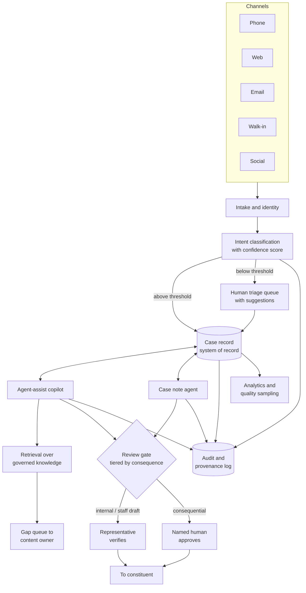

Most contact centre diagrams put the channels on the left, a box marked "AI" in the middle, and a
happy constituent on the right. The useful version is arranged differently: **the case record is the
centre of the picture, and every AI component is something that reads from it or writes to it under
supervision.**

That's not a drawing preference. Put AI around the edges of six systems that don't talk to each
other and what you get is a faster version of the problem you bought it to fix.

## What you need in place before any of this works

Worth reading first, because this is the page where a lot of programmes realise they're a year or
two earlier in the story than they thought.

| What you need | Why nothing works without it |
|---|---|
| **One case record** covering every channel and department | Everything on this page reads or writes it. If phone, web, and email each keep their own list, you're building this five times and still can't see one person's history |
| **A list of the problems people have**, not a list of your departments | Something has to sort a request *into* the right category, and if your categories are department names it will sort them wrong. This is usually the biggest job on the list |
| **Guidance with a named owner and a last-checked date** on every item | Point retrieval at documents nobody owns and you spread wrong answers faster than before — see [grounded knowledge retrieval](/patterns/grounded-knowledge-retrieval/) |
| **One person accountable for the case record** | Not a technical thing at all. It's where organizations stall for years, and it has to be settled before anyone buys software |
| **Permission to record calls, and a rule for how long transcripts are kept** | Transcripts are a new kind of record. Most organizations have no retention rule for them and find out during the first records request |

An organization missing the first or the last should stop reading and go do that instead.

## The shape of it

Two things in that diagram do more work than they appear to: the **review gate**, which is the only
path to the constituent, and the **gap queue**, which is the only component that makes the system
better over time rather than merely faster.

## Components, and what each is responsible for

| Piece | What it does | Worth knowing |
|---|---|---|
| Intake and identity | Works out who's contacting you and attaches it to one case, whichever channel they used | How strictly you verify identity varies a lot between a federal agency and a county |
| Sorting the request | Reads the request, decides what it's about, and says how sure it is | Somebody has to own the "how sure is sure enough" setting. Don't leave it on whatever the vendor shipped |
| Human triage queue | Where the ones it isn't sure about go, with its best guesses attached | So a person spends their time on genuinely unclear requests instead of obvious filing |
| Case record | The official record of the request, its history, and how it ended | Everything else on this page is an accessory to this |
| [Agent-assist copilot](/ai-agents/agent-assist-copilot/) | Finds and drafts the answer for the representative, with sources shown | Never talks to the public itself |
| Retrieval over your guidance | Pulls back the relevant passages, with their source and last-checked date | Says "I don't know" rather than inventing something |
| Unanswered-question queue | Sends questions your guidance couldn't answer to whoever owns that guidance | Needs a real person with time to act on it, or it's decoration |
| [Case note agent](/ai-agents/case-note-agent/) | Drafts the case note from the conversation | Never saves it without the representative agreeing |
| Review gate | The checkpoint everything passes through before it reaches a member of the public | This is where all the control lives |
| Audit log | What was looked up, what was drafted, who approved it | Permanently marks anything a machine wrote |
| Analytics | Resolution rates, why people call back, quality across *all* contacts | Broken out by language and channel, not just totals |

## The review gate is the whole design

If you take one thing away: **there is exactly one route from any AI component to a member of the
public, and it runs through a checkpoint.** What decides whether something needs a human signature
isn't how confident the system is — it's what happens to the person if it's wrong.

Which things need which level of checking is set out in
[AI disclosure and human review](/governance/ai-disclosure-and-human-review/), so it isn't repeated
here. What this design adds is that the checkpoint is **built in, not written down**. A policy saying
"staff should check anything important" survives about three weeks of a busy queue. A system that
physically won't send until someone has approved it survives indefinitely.

That leads to three build decisions:

- **Nothing sends to the public on its own.** Not the copilot, not the note agent, not the sorter.
  There's one exit, and it's supervised.
- **"Send automatically" is switched on per category, never globally.** If there's a single switch
  that turns it on for everything, sooner or later somebody flips it.
- **Anything a machine wrote stays labelled as such in the record.** An unlabelled AI summary becomes
  indistinguishable from a person's own account after one handover — which matters a great deal if
  the case later turns into a complaint, an appeal, or a records request.

## Where builds like this come unstuck

**Bolted onto six separate intake systems.** Phone, web, email, walk-in, and social each keep their
own list, AI goes on one of them, and the savings case quietly assumed all six.

**Retrieval pointed at a shared drive.** It will confidently quote a draft that was never adopted,
someone's personal notes, and a policy replaced twice since. Tidying up what it's allowed to read
*is* the project. The AI part is comparatively easy.

**The unanswered-question queue goes to a mailbox.** So the gaps pile up unread, your guidance never
improves, and people start complaining that the system says "I don't know" too often — when that was
the one part working correctly.

**Confusing "the system is sure" with "it doesn't matter if it's wrong."** A system can be extremely
confident about an appeal deadline and still cost someone their appeal. Decide what needs signing off
based on the worst outcome, not the confidence score.

**Cutting call-time targets by exactly the time you just saved.** Representatives stop engaging,
checking degrades into clicking "accept," and the human review that made the whole thing safe becomes
a formality. Nobody announces this; it just happens.

**Keeping transcripts with no rule about how long.** You find out during the first records request
that asks for them.

## Decide these before you build anything

- [ ] One named person accountable for the case record — settled before any purchasing
- [ ] Your categories rewritten around the problems people have, with plain definitions
- [ ] Every piece of guidance has an owner and a last-checked date; out-of-date material removed
- [ ] Someone owns the "how sure is sure enough" setting and understands what moving it does
- [ ] Every AI use in the channel assigned a level of human checking
- [ ] A named person receiving the unanswered questions, with time to act on them
- [ ] Recording consent and transcript retention agreed with records and privacy
- [ ] A plan to check quality by language and channel, not just overall
- [ ] A route for requests that belong to a different organization entirely
- [ ] Agreement, in writing, that time saved isn't immediately taken back as a target
