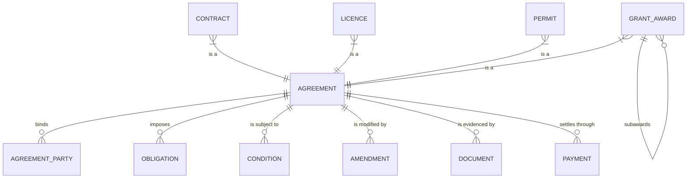

An arrangement in which one or more parties take on obligations toward another, subject to
conditions, for a period, with consequences for non-performance.

Government makes four kinds constantly and almost always models them as four unrelated things.
Modelling the supertype once is the highest-leverage decision in the
[core model](/data-models/core-public-sector-model/).

## Why one entity

Consider the questions an organization routinely cannot answer:

- What is our total relationship with this organization? *(They hold a contract, two permits, and a grant.)*
- Is anyone we are about to award to currently in breach of something else?
- What expires in the next ninety days?
- Which of our obligations to other parties are we ourselves failing?

Each requires a union across four systems with four data models and four different notions of
"active." With a shared supertype, each is a single query.



Note the recursive relationship on grant award. A state receives a federal award and subawards
to counties; the subaward inherits conditions from its parent. Self-reference on the subtype
handles what would otherwise be a separate and much messier model.

## Shared attributes

| Attribute | Notes |
|---|---|
| Agreement identifier | Stable, externally quotable |
| Agreement type | Contract · Grant Award · Licence · Permit |
| Parties and their roles | At least two; role distinguishes obligor from obligee |
| Subject | What it is about — a service, an activity, a location, a program |
| Effective date, expiry date | Expiry may be absent for perpetual instruments |
| Status | See lifecycle below |
| Value | Amount and direction. Direction is a discriminator, not a sign convention |
| Conditions | What must remain true for it to stay valid |
| Obligations | What each party must do, by when |
| Governing authority | The statute, regulation, or code it is issued under |
| Amendments | Ordered, each with its own effective date |
| Related location | Where applicable — permits and licences are frequently site-bound |
| Compliance state | Separate from status: an active agreement can be in breach |
| Retention class | Frequently long, and driven by the subtype |

**Compliance state is deliberately separate from status.** An agreement can be active *and* in
breach. Collapsing the two — very common — makes it impossible to see that an in-force contract
is not being performed, which is precisely the condition anyone would want visibility of.

## Lifecycle

```
Draft → Pending → Active → { Expired | Terminated | Closed }
                     ↓
                 Suspended → Active
```

Subtypes add their own states — a permit may be `Issued` pending inspection, a grant award
`Closeout in progress` — but every subtype maps onto this spine, which is what makes portfolio
reporting possible.

Transitions carry the business rules and the audit obligations. Model them explicitly rather
than allowing arbitrary status updates; "who moved this to Active and on what basis" is an
audit question with a short answer only if the transition was modelled.

## What the subtypes add

**Contract** — solicitation reference, evaluation record, deliverables and acceptance criteria,
invoicing schedule, retainage, performance security, protest history.

**Grant Award** — funding source and appropriation, matching requirement, allowable-cost
conditions, performance reporting schedule, subaward relationships, risk assessment, closeout
and audit status.

**Licence** — holder qualifications, examination or education evidence, continuing-education
state, disciplinary history, reciprocity with other jurisdictions, renewal cycle.

**Permit** — site and parcel, scope of authorized work, required inspections and their outcomes,
associated plan documents, occupancy or completion certification.

## Where it goes wrong

- **Four systems, four truths.** The most common state. Nobody owns the union, so nobody asks
  the cross-cutting questions.
- **Value as a signed number.** Direction of money is a property of the agreement type, not an
  arithmetic sign; conflating them breaks reporting the first time a contract has a credit.
- **Amendments as overwrites.** Losing the amendment history destroys the ability to answer what
  the terms were on a given date, which is the question litigation and audit both ask.
- **Parties as free text.** An agreement with a vendor name string rather than a
  [Party](/data-entities/) reference cannot be rolled up, and cannot be checked against
  debarment.
- **Expiry without notification.** Modelling the date without an obligation to act on it is why
  organizations discover lapses from the other party.

## AI relevance

The obvious application is extraction — pulling terms, dates, obligations, and conditions from
agreement documents into structured fields. It is a good fit: high volume, tedious, and
verifiable against a source document.

Two cautions. Extracted obligations that nobody verified become the basis for compliance
decisions, so provenance marking is essential. And obligation language is dense with
conditionality — "unless," "except where," "provided that" — which is exactly what extraction
tends to flatten. The same failure described in
[plain-language rewrite](/ai-opportunities/plain-language-rewrite/) applies here with more
direct financial consequence.
