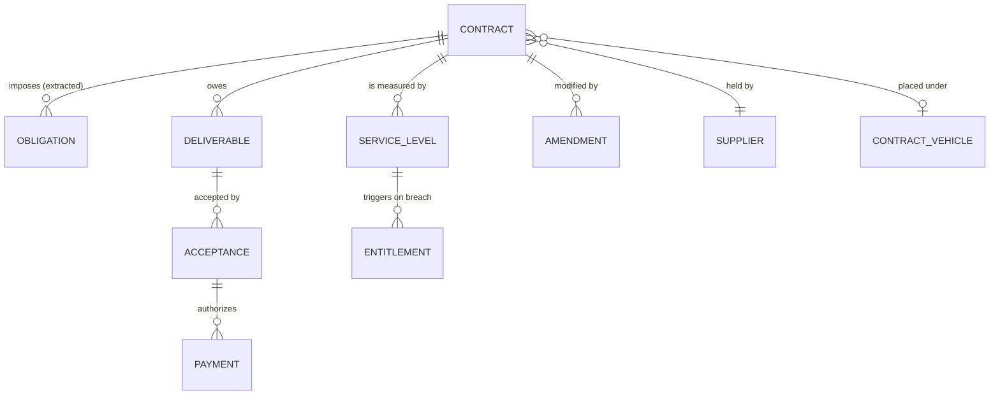

A binding arrangement to obtain goods or services in exchange for payment, with deliverables,
performance standards, and a term.

Inherits from [Agreement](/data-entities/agreement/): parties, term, conditions, obligations,
amendments, status lifecycle, compliance state. Compare
[Grant Award](/data-entities/grant-award/), the sibling subtype — the shapes are close enough that
an organization with one should reuse it for the other.

## The defining problem

**The obligations that matter operationally are prose.**

A contract's service levels, reporting requirements, review meetings, price adjustment mechanisms,
notice periods, and termination rights are distributed across a main document, several schedules,
and any amendments. Modelled as an attachment on a record, they are invisible to every calendar,
queue, and dashboard in the organization.

This is why [contract handover](/processes/contract-handover-and-performance/) is the pivotal
process, and why [Obligation](/data-models/procurement-data-model/) is a first-class entity rather
than a field. Extraction into a tracked register is the single change that makes the rest of
contract administration possible.



## Attributes beyond Agreement

| Attribute | Notes |
|---|---|
| Contract identifier | Locally assigned, quotable, stable across amendments |
| Solicitation reference | Links to the competition that produced it, and therefore to the evaluation record |
| Contract vehicle | Where placed under a cooperative, framework, or schedule |
| Contract type | Fixed price, time and materials, cost reimbursement, indefinite delivery — determines the risk allocation and the invoice verification approach |
| Not-to-exceed value | Distinct from committed and from spent |
| Committed, invoiced, paid | Three more numbers, none of which is the value |
| Deliverables with acceptance criteria | The criteria are the gate; without them acceptance is opinion |
| Service levels with measurement method | Including who measures. A service level the supplier self-reports is a different control |
| Entitlements on breach | Credits, remedies, step-in rights — with the trigger condition stated |
| Price adjustment mechanism | Indexation, benchmarking, or fixed. Frequently forgotten until the supplier invokes it |
| Notice periods | For termination, renewal, and non-renewal. Missing one converts a decision into a default |
| Renewal structure | Options, extensions, and the decision date derived from required lead time |
| Named contract manager | Required. A contract without one is unmanaged by definition |
| Retainage | Held amounts and release conditions |
| Insurance and bonding | With expiry dates that need watching |

**Value, committed, invoiced, and paid are four different numbers** — the same discipline as
[Grant Award](/data-entities/grant-award/). Systems holding one and labelling it "amount" cannot
answer what is committed or what remains.

**The renewal decision date is derived, not entered.** Expiry minus the lead time needed to
compete. Storing only the expiry date is how organizations arrive at a renewal with no options.

## Lifecycle

```
Draft → Awarded → Active → { Expired | Terminated } → In closeout → Closed
                     ↓
                 Suspended → Active
```

**Expired and Closed are different**, and the gap between them is where final acceptance,
retainage release, records retention, and lessons capture live. A model that treats expiry as
closure has a closeout backlog it cannot see — the same defect described for
[Grant Award](/data-entities/grant-award/).

## Where it goes wrong

- **Obligations left as an attachment.** The root cause of most contract administration failure.
- **Renewal date without lead time.** Stored expiry, no derived decision date, so extension by
  default is structurally guaranteed.
- **One value field.** Committed versus invoiced versus paid unanswerable.
- **Amendments as overwrites.** Losing the ability to state what the terms were on a given date —
  which is the question a dispute asks.
- **Service levels without a measurement owner.** Supplier-reported performance recorded as fact.
- **Acceptance criteria absent.** Deliverables accepted on impression, so rejection cannot be
  defended.
- **No named manager.** The contract is administered by whoever notices, which is nobody.
- **Contract not linked to its solicitation**, so the evaluation record — the protest defence —
  is disconnected from the thing it produced.

## AI relevance

Extracting obligations, service levels, key dates, and notice periods into structured, trackable
form is the highest-value application in this part of the library. It is a good fit: high volume,
tedious, and verifiable against a document that remains available. See
[obligation extraction](/ai-opportunities/obligation-extraction/).

The cautions carry over from [Agreement](/data-entities/agreement/) and apply with force. Contract
language is dense with conditionality — "unless," "except where," "provided that" — and flattening
a condition changes what a party is required to do. Extracted obligations become the basis for
payment decisions, credit claims, and dispute positions, so **provenance marking is mandatory**:
a later reader must know whether an obligation was read by a person or inferred by a system.
