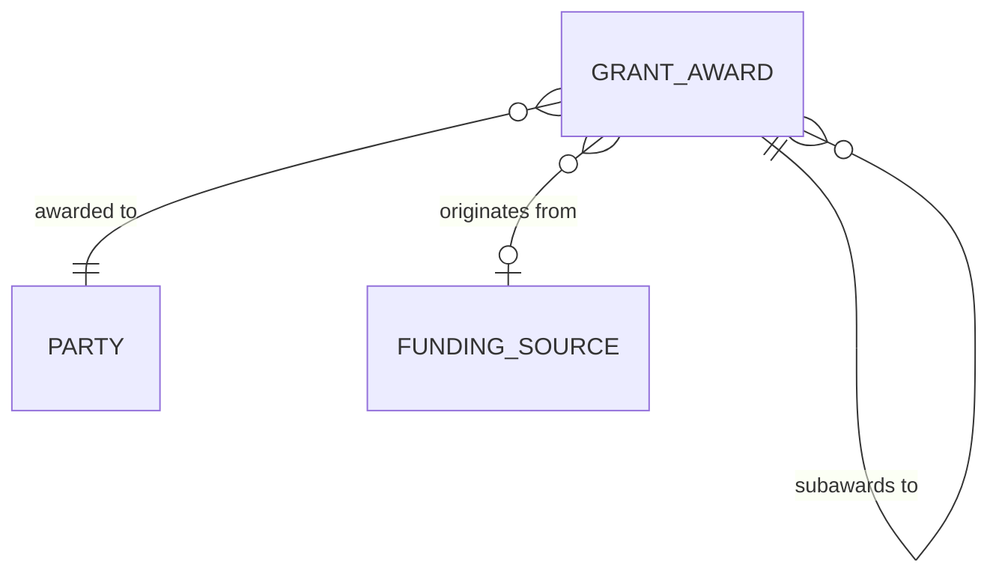

The binding award of funds to an organization for a public purpose, subject to conditions, for a
period of performance, with reporting and accountability obligations attached.

Inherits everything from [Agreement](/data-entities/agreement/): parties, term, conditions,
obligations, amendments, status lifecycle, compliance state. Adds what grants specifically need.

## The self-reference



A subaward **is** a Grant Award. Its parent is the award that funds it. Federal awards to a state,
the state's subawards to counties, and a county's subawards to non-profits form one chain in one
entity.

This matters for a specific, recurring, hard question: **which conditions on the money we passed
down came from the money we received?** A pass-through entity must flow down applicable
requirements and remains accountable for them. With the parent link, that is a traversal. Without
it, it is institutional memory.

Most organizations run "awards in" and "awards out" as separate systems with separate models, and
cannot answer it at all.

## Attributes beyond Agreement

| Attribute | Notes |
|---|---|
| Award identifier | Funder-assigned and locally assigned; both are needed and they are not the same |
| Parent award | Null for a direct award; populated for a subaward. The pass-through link |
| Originating funding source | Traced to the ultimate source through the chain, not just the immediate parent |
| Program / CFDA-style identifier | Identifies the assistance program, which drives applicable requirements |
| Period of performance | Distinct from the budget period, which may be shorter and recur |
| Award amount, obligated, disbursed, expended | Four different numbers. Conflating them is the most common reporting error in the domain |
| Cost share / match requirement | With type — cash or in-kind — and source |
| Indirect cost rate and basis | Negotiated, de minimis, or capped by the funder |
| Payment method | Reimbursement, advance, or milestone. Determines recipient cash-flow burden |
| Reporting schedule | Financial and programmatic, which frequently differ in period and cadence |
| Flow-down conditions | Which parent conditions apply to this award |
| Closeout state | Separate from status; an award can be past its period and not closed |
| Retention clock start | Runs from closeout, not from award or period end |

**Amount, obligated, disbursed, and expended are four separate quantities.** Award is the ceiling;
obligated is committed; disbursed is money moved; expended is money actually spent by the
recipient. Systems that hold one number and label it "amount" cannot answer what is committed,
what is at risk, or what remains.

## Lifecycle

```
Pending → Active → Period ended → In closeout → Closed
             ↓
        Suspended → Active
             ↓
        Terminated
```

Two states are commonly missing and both cause real problems.

**Period ended** is distinct from closed. Between them sits final expenditure, reconciliation, and
unspent-balance resolution — often months, sometimes years. An organization whose model jumps
straight to Closed has a closeout backlog it cannot see.

**Suspended** — funds withheld pending remediation — must be reversible and must be distinguishable
from termination. It is the escalation step in
[monitoring](/processes/subrecipient-risk-and-monitoring/) that gives a finding consequence
short of ending the relationship.

## What to get right

- **Model awards in and awards out as one structure.** Connecting them keeps flow-down traceable
  and lets the organization state its total position in either direction.
- **Separate committed, disbursed, and expended into distinct fields**, so each is independently
  answerable and both cash management and closeout stay accurate.
- **Give subaward a parent link**, not a flat list against a program, so conditions don't need
  re-deriving by hand each cycle.
- **Give closeout its own state**, distinct from a status flip, so the backlog is visible without
  waiting for someone to run a report.
- **Start the retention clock at closeout**, not at award, so records aren't disposed of while
  still required.
- **Model match as three states — pledged, realized, evidenced —** not a single number, so the
  evidence exists when it is requested.

## AI relevance

Extracting conditions, obligations, reporting dates, and flow-down requirements from award
documents into structured fields is a strong fit — high volume, tedious, and verifiable against a
source document that stays available.

Two cautions carry over from [Agreement](/data-entities/agreement/) with more force here.
Obligation language is dense with conditionality, and flattening a condition changes what the
recipient is required to do. And extracted terms become the basis for compliance decisions and
monitoring, so **provenance marking is not optional** — a later reader must know whether a
condition was read by a person or inferred by a system.
