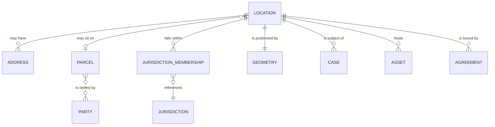

More government data resolves to a location than to any other key except party. Almost every
service request, permit, inspection, asset, tax bill, and emergency response is about somewhere.

And almost every jurisdiction models it wrong, in the same way: as an address string on the
record that needs it.

## Four things, not one

The core error is treating these as synonyms. They are related but independent, they change at
different rates, and they are owned by different people.

| | What it is | Authoritative owner | Changes when |
|---|---|---|---|
| **Address** | A postal or civic identifier for a delivery point | Addressing authority, often the county or city | A street is renamed, a building is subdivided |
| **Parcel** | A legally defined unit of real property | Assessor or land records office | Land is split, merged, or re-surveyed |
| **Jurisdiction** | A governing or service boundary | Each governing body, plus the state | Annexation, redistricting, district changes |
| **Geometry** | A point, line, or polygon in a coordinate system | GIS function | Survey correction, re-digitization |

A single service request may need all four: the address the caller gave, the parcel it sits on
to find the owner, the jurisdictions that determine who responds and who bills, and the geometry
to route a crew.

**Jurisdiction membership is many-to-many and time-bounded.** One point sits inside a city, a
county, a school district, a fire district, a water district, a council ward, and a census tract
simultaneously — and which ones changed last year matters for anything retrospective.

## Attributes

| Attribute | Notes |
|---|---|
| Location identifier | Internal, stable, survives address changes |
| Address components | Structured, never a single string. Number, prefix, street, type, suffix, unit, city, state, postal code |
| Address status | Active, retired, provisional, non-addressable |
| Parcel identifier | The assessor's parcel number, in its published format |
| Geometry | Point and, where known, polygon, with coordinate reference system stated |
| Geocode confidence | How the coordinate was derived and how much to trust it |
| Jurisdiction memberships | With effective dates |
| Location type | Addressed structure, vacant parcel, intersection, right-of-way segment, landmark, mile marker |
| Access notes | Gate codes, hazards, animal warnings — operational, sensitive, and frequently the most valuable field to a field crew |

**Not everything has an address.** A pothole is at an intersection or a mile marker. A water main
break is on a segment. A wildfire is a polygon. Models that require an address force staff to
invent one, and "123 Main St (approx)" is how location data quality dies.

## Where it goes wrong

- **Address as a string on every record.** No two spellings match, so nothing aggregates. The
  single most common and most expensive modelling error in local government.
- **Geocoding on read instead of on write.** The coordinate changes silently as the geocoder is
  updated, so last year's map cannot be reproduced.
- **Jurisdiction derived on the fly, never stored.** After an annexation, historical records
  report against today's boundaries, which quietly falsifies every trend.
- **Parcel treated as identity.** Parcels split and merge; a parcel number is a version, not a
  permanent key.
- **Confidence discarded.** A rooftop-accurate geocode and a city-centroid fallback stored in the
  same two columns, indistinguishable — so a crew is dispatched to the middle of town.
- **Access notes as free text in a case.** The information that keeps a field worker safe, buried
  in the notes of a case closed three years ago.

## Level variance

- **Federal.** Works mostly with aggregated geography — census units, congressional districts,
  designated disaster areas. Rarely holds authoritative address or parcel data, and depends on
  local sources for it.
- **State.** Increasingly runs statewide address and boundary aggregation, particularly for
  emergency dispatch and elections. The reconciliation layer between local sources.
- **County / municipal.** **Owns the authoritative data.** Parcels usually sit with the county
  assessor; addressing with the county or city. This is the level where the truth actually
  lives, and where the resourcing to maintain it is thinnest.

That inversion — the authoritative source is the least resourced level — is the defining
structural problem of public-sector location data.

## AI relevance

Address parsing and matching is a long-solved problem with mature deterministic tooling, and is
usually the right choice: it is explainable, reproducible, and auditable. Reach for a model only
where deterministic matching genuinely fails — free-text descriptions of place ("behind the
school on Elm," "the third pole past the bridge"), which is common in service requests and
almost impossible to handle otherwise.

Treat any inferred location as a **candidate with a confidence score**, never a resolved one.
Dispatching a crew, issuing a citation, or assessing a tax against an inferred address has
direct consequences for whoever is actually at that address.
