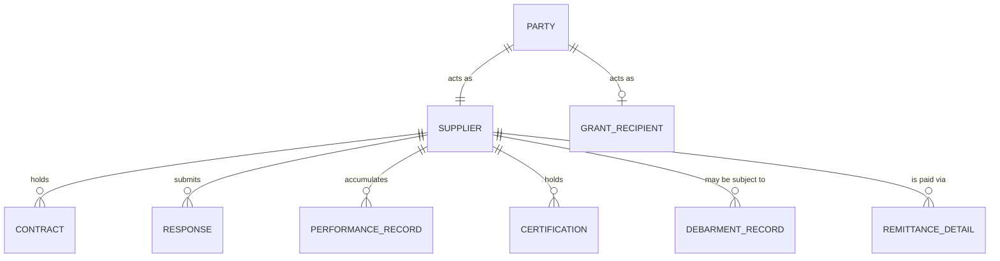

An organization the government buys from, in the supplier **role**. Not a separate kind of thing
from a [Party](/data-models/core-public-sector-model/) — the same organization may simultaneously
be a supplier, a grant recipient, a permit holder, and a taxpayer.

Modelling supplier as its own root entity rather than as a role on Party is the first mistake, and
it makes the rest of them possible.

## Attributes

| Attribute | Notes |
|---|---|
| Party reference | The organization. Supplier is a role, not an identity |
| Legal name and trading names | Both. Trading names are how duplicates enter |
| Tax and legal identifiers | The reliable join key when name matching fails |
| Registration status and date | Including which registrations, since several may be required |
| Eligibility state | Not debarred, not suspended, registrations current |
| Certifications | Small, minority-owned, veteran-owned, disadvantaged — each with an expiry |
| Categories supplied | For market research and opportunity notification |
| Remittance details | **With change history and verification state** |
| Performance history | Across contracts and departments |
| Related parties | Parent, subsidiary, common ownership — for concentration and conflict analysis |
| Contact roles | Distinct from remittance contacts, deliberately |

## Three problems this entity exists to solve

### Duplicates make spend unanswerable

"Acme Corp," "Acme Corporation," "ACME Corp." — three records, three spend totals, no way to
answer what the organization spends with one company or how concentrated its supply base is.

The same identity resolution problem as constituents and as
[Location](/data-entities/location/), and the same fix: a resolved master record with tax and
legal identifiers as the reliable join, name matching as a candidate generator rather than as an
answer.

### Eligibility is checked once and then assumed

Debarment screening at registration and never again. A supplier excluded two years later continues
to be paid, because nothing re-checks.

Eligibility is a **state that changes**, not an onboarding step. It needs re-verification on a
cycle and before award, with the check recorded — see
[supplier eligibility and payment integrity](/governance/supplier-eligibility-and-payment-integrity/).

### Remittance change is a live fraud vector

An email arrives, apparently from a known supplier, advising new bank details. Payment is
redirected. **This is among the most common and most successful frauds against public
organizations**, and it succeeds because remittance detail is treated as an editable field rather
than as a controlled change.

The model has to support the control: change history, out-of-band verification state, who
requested, who verified, and a record that a verification actually occurred through a channel the
requester did not supply.

## What else to get right

- **Model Supplier as a Party role**, not a root entity, so the same organization's grant, permit,
  and contract relationships connect.
- **Attach performance history to the supplier**, not just the contract, so the next evaluation
  panel can see it — visibility here is what keeps a supplier that failed one department from
  winning from another.
- **Track certification expiry**, so diverse-supplier reporting reflects active certifications
  rather than overstating participation with lapsed ones.
- **Model related parties.** Building the ownership graph is what makes concentration risk and
  conflicts of interest visible.
- **Keep registration burden proportionate.** A lighter onboarding process is what lets the small
  and local suppliers a diversity programme is meant to reach actually participate — a
  data-capture decision with a real policy consequence.

## AI relevance

**Entity resolution and duplicate detection** is the obvious application and a reasonable one,
with an important caveat: propose merges, do not perform them. An incorrect merge of two genuinely
distinct suppliers corrupts spend history, payment routing, and performance records
simultaneously, and it is difficult to unwind.

Deterministic matching on tax and legal identifiers should be exhausted first — it is explainable,
auditable, and defensible. Fuzzy matching is a candidate generator for human confirmation.

**Not appropriate:** automated eligibility or debarment determination. An exclusion decision
affecting an organization's ability to receive public money needs a person who can explain it, for
the same reason merit scoring does.
