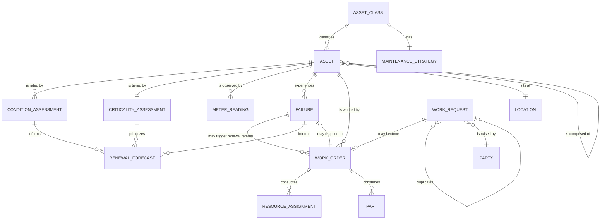

**Extends the [core public-sector model](/data-models/core-public-sector-model/).** Party,
Location, Document, Payment, and Audit Event come from the core unchanged.
[Asset](/data-entities/asset/) is promoted from a core entity definition into a full one here,
because this is the domain that actually needs its attributes.

## The join that decides everything

**Work attaches to the asset, not to the address.**

That single decision determines whether this domain has a history or a pile of closed jobs. A work
order recorded against "corner of Main and 3rd" tells you a repair happened. A work order recorded
against a valve identifier tells you *that valve* has been repaired four times in three years,
which is a renewal case.

Most work management systems permit both and default to the easier one, so the join is optional at
the point of capture and therefore absent from most of the data. Every downstream capability —
[failure analysis](/processes/failure-analysis-and-renewal-referral/), condition validation,
renewal forecasting, cost per asset — is impossible without it.

## Entity relationships

## Four modelling decisions worth arguing about

### Condition Assessment is an entity, not a field on the asset

A rating needs a **date, a method, and an assessor** to be usable, and it needs history so the
trend can be seen. Stored as a field, the previous rating is overwritten and deterioration becomes
invisible — which is the difference between knowing an asset is in poor condition and knowing it
got there in eighteen months.

It is also what makes the validation in
[failure analysis](/processes/failure-analysis-and-renewal-referral/) possible: comparing failures
against the rating the asset held *at the time*.

### Criticality is separate from condition, and from cost

Three different questions that systems routinely conflate:

| | Question | Drives |
|---|---|---|
| **Condition** | What state is it in? | When it needs work |
| **Criticality** | What happens if it fails? | How closely it is watched |
| **Replacement cost** | What would it cost to replace? | The renewal budget |

A cheap valve in poor condition whose failure floods a district is high criticality, poor condition,
low cost — and any model that proxies criticality by cost will rank it last. This is the same
error, in a different domain, as
[risk assessment attaching to the award rather than the party](/data-models/grants-data-model/).

### Work Request is separate from Work Order

Eleven residents reporting one pothole produce eleven Work Requests and **one** Work Order.
Collapsing them forces a choice between eleven duplicate jobs and ten people who never hear what
happened. Keeping them distinct with a duplicate link means one crew visit and eleven
notifications.

The same separation carries the referral case: a request about an asset the organization does not
own reaches a terminal state without ever becoming a work order.

### Maintenance Strategy attaches to the Asset Class

Strategy is a decision about a *kind* of asset — this class of pump, this class of valve — informed
by failure behaviour across all of them. Attached to the individual asset it becomes unmaintainable
at scale and cannot learn from class-level evidence.

Individual assets override the class strategy where criticality or environment justifies it, and
the override carries a reason.

## Standard mappings

Indicative and needing verification per implementation:

| Entity | Maps toward |
|---|---|
| Asset, Asset Class | Public-sector asset management practice standards for infrastructure portfolios |
| Asset, Location | Local authoritative parcel and network geometry — see [geospatial](/capabilities/geospatial-information-management/) |
| Work Request | Open311 GeoReport v2, for the public-reported subset |
| Asset (financial view) | Governmental accounting capital asset classes and depreciation schedules |
| Failure | Cause taxonomies published for the relevant asset class — water, pavement, fleet |

**The Open311 mapping matters more than it looks.** Public-reported work requests and constituent
service requests are frequently the same records arriving through different doors, and mapping both
to one standard is what stops a jurisdiction operating two parallel queues for the same pothole —
see [service catalogue and intake](/capabilities/service-catalogue-and-intake/).

## The entities


