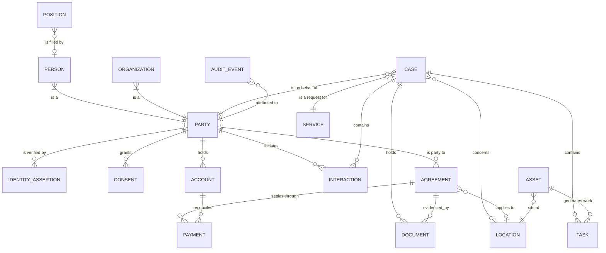

Capabilities written independently produce twelve incompatible definitions of "Person" and
eight different "Case." This model exists to be extended, not paraphrased: a capability-specific
data model should **specialize** these entities and add its own attributes, never redefine them.

Seventeen entities cover the overwhelming majority of what government stores. The value is less
in the list than in three modelling decisions.

## Three decisions that do most of the work

### 1. Agreement is one entity

A contract, a grant award, a licence, and a permit are the same shape: parties, a term,
obligations, conditions, a status lifecycle, and consequences for breach. Nearly every
jurisdiction models them as four unrelated things in four systems, and pays for it four times —
in integration, in reporting, and in the inability to answer "what is this organization's total
relationship with us?"

| | Contract | Grant Award | Licence | Permit |
|---|---|---|---|---|
| Who is obligated | Mostly the vendor | Mostly the recipient | Mostly the holder | Mostly the holder |
| Money direction | Out, for goods received | Out, for a public purpose | In, as a fee | In, as a fee |
| Renewal | Extension or recompete | New award cycle | Periodic renewal | Usually expires |
| Typical trigger to end | Delivery complete | Closeout | Non-renewal or revocation | Work complete or expiry |
| **Shared** | **Parties · term · conditions · obligations · status lifecycle · amendments · compliance monitoring · breach handling** | | | |

The differences are real and belong in the subtypes. The commonality is larger than the
differences, and modelling it once is the single highest-leverage decision in this model.

### 2. Party is abstract; Person and Organization are not

Government transacts with both, and most capabilities need to treat them uniformly for contact,
identity, and correspondence — while holding radically different attributes. A sole trader is
frequently both at once.

The failure mode this prevents: a system that models "Customer" as a person, then discovers that
a business needs a licence, and adds a `business_name` field to the person table. Every
jurisdiction has one of these.

### 3. Position is separate from Employee

A position is funded, classified, and budgeted whether or not anyone occupies it. Vacancy,
reclassification, and workforce planning are all attributes of the position, not the person. This
is standard in HR systems and routinely lost in downstream reporting.

## Entity relationship overview

Subtypes are omitted from the diagram for legibility — `AGREEMENT` stands for Contract, Grant
Award, Licence, and Permit throughout.

## The entities



Entities with a page have been written up; the rest are defined above and nothing more yet.

## Modelling conventions

**Identity resolution is a first-class problem, not a data-quality task.** The same person
appears as a caller, an applicant, a permit holder, and a taxpayer. Whether those resolve to one
Party determines whether the organization can answer almost any interesting question. Most
jurisdictions cannot.

**Status is a lifecycle, not a field.** Every entity with a status needs its permitted
transitions modelled, because the transitions are where the business rules and the audit
obligations live.

**Location is a resolution problem.** An address is not a parcel is not a jurisdiction is not a
point. Government work routinely requires all four for the same request, and the mapping between
them is authoritative data owned by somebody specific.

**Retention attaches to the record, not the system.** Classification and disposition state belong
on Document and Case, or they get lost the first time data is migrated — which is the most common
way retention obligations are silently broken.

## External standard mappings

Where a public standard already defines an entity, map to it rather than inventing a parallel
vocabulary. Mappings are indicative and need verification per implementation:

| Entity | Maps toward |
|---|---|
| Person, Organization | NIEM core person and organization types |
| Case, Service | Open311 GeoReport v2 service request and service definition, for the request types it covers |
| Location | NIEM location; local authoritative parcel and address datasets |
| Organization | Legal Entity Identifier, where a global identifier is warranted |
| Document | Records schedule classifications published by the relevant archive |

## Scope

This is the **shared core**. It deliberately excludes capability-specific entities — there is no
Inspection, Solicitation, or Benefit here, because those belong to capability models that extend
this one. If an entity is needed by three or more capabilities, it is a candidate to move up.

### Promotion candidate: the competitive award shape

Building the [grants](/data-models/grants-data-model/) and
[procurement](/data-models/procurement-data-model/) models surfaced a structural duplication worth
recording here rather than in either of them:

| Grants | Procurement | Shared shape |
|---|---|---|
| Funding Opportunity | Solicitation | A published competitive opportunity with criteria and a deadline |
| Application | Response | A submission from an organization against that opportunity |
| Review | Evaluation | One assessor's independent scoring against published criteria |
| Grant Award | Contract | An Agreement binding the parties |
| Recipient | Supplier | A Party in a role, with eligibility and performance history |

The governance duplicates too — compare
[merit review integrity](/governance/merit-review-integrity/) with
[competition and evaluation integrity](/governance/competition-and-evaluation-integrity/).

**Two capabilities is not yet three**, so this stays a watch item rather than a promotion. If
licensing or a third domain needs the same shape, promote **Opportunity**, **Response**, and
**Evaluation** into this model and let the capability models specialize them.

The usable consequence today is smaller and immediate: an organization building either capability
should look hard at what it already has for the other, because the answer is usually most of it.
