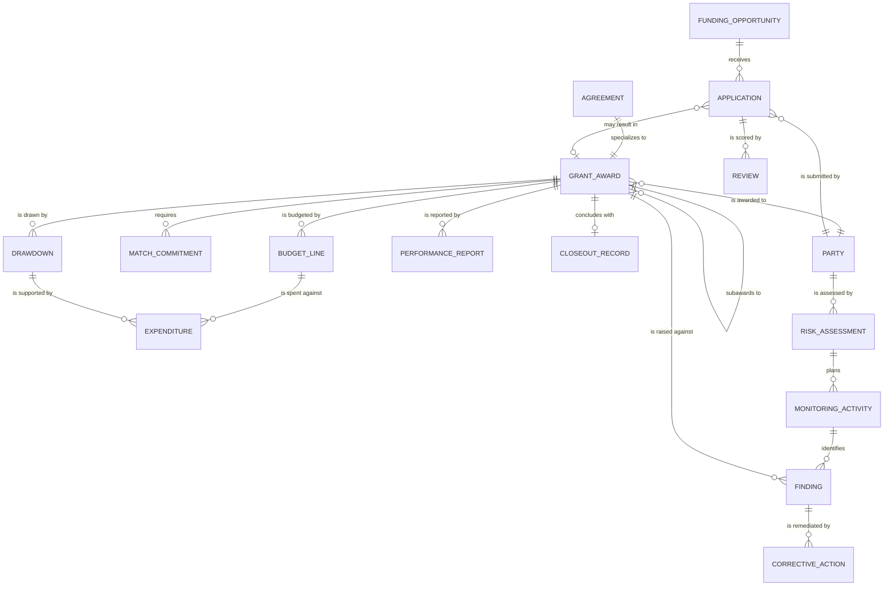

**This model extends the [core public-sector model](/data-models/core-public-sector-model/); it
does not restate it.** Party, Organization, Document, Payment, Location, and Audit Event come from
the core unchanged. What is added here is what grants actually need beyond them.

## The structural decision

**Grant Award is an [Agreement](/data-entities/agreement/) subtype, and a subaward is a Grant
Award whose funding source is another Grant Award.**

That single self-reference is what makes the federal → state → local pass-through chain
representable. A state's subaward to a county is not a different entity; it is an award whose
parent is the state's own federal award, inheriting conditions that must flow down.

Organizations that model "awards we receive" and "awards we make" as separate systems — which is
most of them — cannot answer the question the whole compliance regime depends on: *which of the
conditions on money we passed down came from the money we received?*

## Three modelling decisions worth arguing about

### Risk assessment attaches to the Party, not the Award

A recipient's risk is a property of the **organization**, informed by its history across every
award from every program in the funder. Attaching risk to the award — which most systems do — is
why a program officer cannot see that the same non-profit had a finding in a different department
last year.

This is the change that makes [risk-based monitoring](/patterns/risk-based-monitoring/) possible,
and it is a data-model decision rather than a monitoring one.

### Finding is separate from Corrective Action, and both have verification state

Collapsing them produces the most common failure in oversight: a finding "closed" because a plan
was received, not because remediation was evidenced. Keeping them distinct, each with its own
state, is what makes [repeat finding rate](/kpis/repeat-finding-rate/) computable and honest.

### Match Commitment is an entity, not a field

Match is pledged, then realized, then evidenced — three states, frequently in-kind, frequently
from a different fund. Modelled as an amount on the award, it becomes invisible until an auditor
asks for evidence of contributions nobody tracked.

## Standard mappings

Indicative and needing verification per implementation:

| Entity | Maps toward |
|---|---|
| Grant Award, Subaward | Federal financial assistance award data standards |
| Party (recipient) | Entity identifiers used in federal award reporting; Legal Entity Identifier where a global identifier is warranted |
| Expenditure, Budget Line | The funder's prescribed cost categories, mapped from the local chart of accounts |
| Finding | Single audit finding reference structures |

The recurring integration problem is the last one: recipients maintain one chart of accounts and
report into several funder-specific category schemes. Modelling the mapping explicitly — rather
than re-deriving it each reporting period — is what makes
[code once, report many](/processes/drawdown-reporting-and-closeout/) achievable.

## The entities


