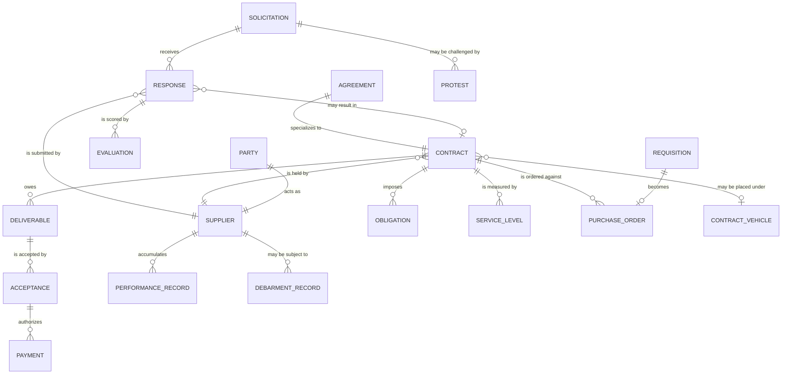

**Extends the [core public-sector model](/data-models/core-public-sector-model/).** Party,
Organization, Document, Payment, Location, and Audit Event come from the core unchanged.
[Contract](/data-entities/contract/) specializes [Agreement](/data-entities/agreement/), exactly
as [Grant Award](/data-entities/grant-award/) does.

## The parallel with grants

Building this model immediately after the
[grants model](/data-models/grants-data-model/) surfaced something worth stating plainly: **these
are the same process with different vocabulary.**

| Procurement | Grants | Shared shape |
|---|---|---|
| Solicitation | Funding Opportunity | A published competitive opportunity with criteria and a deadline |
| Response | Application | A submission from an organization against that opportunity |
| Evaluation | Review | One assessor's independent scoring against published criteria |
| Contract | Grant Award | An Agreement binding the parties |
| Supplier | Recipient | A Party in a role, with eligibility and performance history |
| Performance Record | Monitoring Finding | A dated assessment of how the party actually performed |
| Debarment Record | Debarment Record | Literally the same thing |

The governance concerns are the same too: conflict of interest, published criteria, recorded
rationale for departing from scores, substantive debriefs — compare
[merit review integrity](/governance/merit-review-integrity/) with
[competition and evaluation integrity](/governance/competition-and-evaluation-integrity/) and note
how much is duplicated.

**This is a candidate for promotion to the core model.** The core states the rule: an entity
needed by three or more capabilities should move up. Competitive award is currently used by two —
so the recommendation is to watch it. If licensing or a third domain needs the same shape, promote
**Opportunity**, **Response**, and **Evaluation** to the core and let procurement and grants
specialize them.

The practical consequence today is smaller and still useful: an organization building either
capability should look at what it already has for the other, because the answer is usually "most
of it."

## Entity relationships

## Three modelling decisions

### Acceptance authorizes Payment

Modelled as an explicit relationship, not a workflow convention. If payment can be raised without
a linked acceptance record, it will be — that is the path of least resistance under load, and it
is the most common control failure in contract administration.

Making acceptance a **prerequisite in the model** is what turns "payment follows acceptance" from
a policy into a fact.

### Obligation is a first-class entity

Service levels, reporting requirements, review meetings, notice periods, and price mechanisms are
commitments with owners and dates. Left as prose inside the agreement document they are invisible
to every queue and calendar in the organization — which is exactly why
[contract handover](/processes/contract-handover-and-performance/) fails.

Extracting them into tracked Obligations is the mechanism behind
[obligation tracking](/patterns/obligation-tracking/), and it applies equally to grant conditions,
licence conditions, and permit conditions.

### Performance Record attaches to the Supplier, not the Contract

Same reasoning as risk attaching to the Party in the
[grants model](/data-models/grants-data-model/). A supplier's history is a property of the
organization, across contracts and across departments. Attached to the contract, it is invisible
to the next evaluation panel — which is how a supplier that performed badly for one department
wins an award from another.

## The entities


