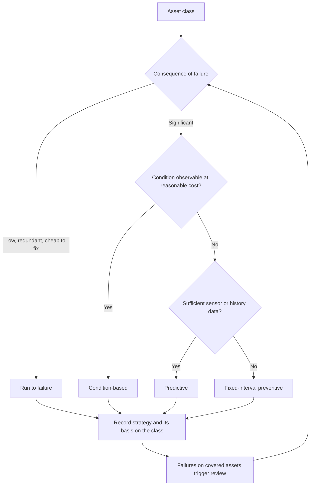

## Problem

Maintenance capacity is fixed and the estate is not shrinking. Uniform preventive intervals —
almost always annual, inherited from a system default or a previous supervisor — **over-maintain
assets that do not matter and under-maintain assets that do**, while consuming all available
capacity in the process.

The failure is not the interval. It is applying one interval to a population with wildly different
consequences of failure.

## Solution

Choose a maintenance strategy **per asset class**, from two inputs:

1. **Consequence of failure** — what happens to the service, to safety, and to cost
2. **Observability** — whether condition can be seen at reasonable cost

**Run to failure is a legitimate strategy and the one most often omitted.** For assets that are
cheap, redundant, and inconsequential, preventive maintenance is a net loss — and choosing it
deliberately releases capacity for the assets where it matters.

## Why this is not risk-based monitoring

[Risk-based monitoring](/patterns/risk-based-monitoring/) allocates finite **oversight** capacity —
who gets watched, how closely. This pattern selects an **intervention regime** — what is done to an
asset and on what trigger.

They share an insight, which is why they look similar: uniform treatment of a non-uniform
population wastes capacity and produces uniform shallowness. They differ in the decision. Oversight
concerns another party's compliance; maintenance strategy concerns the organization's own physical
intervention, and its options include doing nothing on purpose.

Both are specializations of the same principle. Whether that principle deserves promotion to a
parent pattern is a question for the third instance, not the second — the same rule the
[core data model](/data-models/core-public-sector-model/) applies to entities.

## Why level 2 and not higher

**This pattern needs almost nothing.** Criticality tiering can be done in a workshop with the
people who know which failures hurt, recorded in a spreadsheet, and applied to a work management
system that only supports fixed intervals — by setting different intervals per class.

Condition-based and predictive strategies need more. But the decision to stop maintaining
low-consequence assets annually, and to redirect that capacity, is available to a jurisdiction with
a spreadsheet and an afternoon. **The step from uniform to tiered is where almost all the value
is**, and it is the same argument as
[obligation tracking](/patterns/obligation-tracking/) being pitched at level 2.

## Prerequisites

| Level | What is needed |
|---|---|
| **2** | An asset list, and consequence-of-failure judgment from people who know the estate |
| **3** | An asset register with classes, and condition assessment for the classes where it is worth it |
| **4** | Meter readings or sensor data, and enough failure history to model — see [failure prediction](/ai-opportunities/failure-prediction-from-work-history/) |

## How it goes wrong

**Criticality proxied by replacement cost.** The most common error, and it inverts the answer for
exactly the assets the pattern exists to protect — a cheap valve whose failure floods a district.

**Tiering done once.** Criticality changes when the service changes, when redundancy is removed, or
when a downstream dependency appears. A tier set at implementation and never revisited is a
snapshot presented as a policy.

**Run-to-failure applied without saying so.** Organizations already ration preventive maintenance
implicitly, under pressure, at seven in the morning. Doing it explicitly produces the same
rationing with a defensible basis — the difference is entirely in whether it can be explained
afterwards.

**No feedback from failures.** Failures on assets under a preventive strategy are the evidence that
the strategy or the interval is wrong, and
[failure analysis](/processes/failure-analysis-and-renewal-referral/) is the loop that closes it.
Without it the tiering is a one-time guess.

**Predictive attempted first.** A model over a register nobody trusts produces confident wrong
answers. Register, then condition, then prediction.
