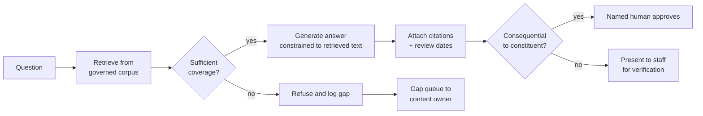

## Problem

Staff and constituents need a correct, current, consistent answer to a question, in seconds.
The authoritative content exists but is spread across policy documents, knowledge articles,
and published guidance, in a form nobody can read at the moment of contact.

## Context

Applies where the corpus is **governed** — owned, reviewed, and scoped. That precondition is
the whole pattern. Applied to an ungoverned corpus it produces confident answers derived from
unowned content of unknown age, at scale, which is materially worse than the search box it replaced.

This is why the pattern carries a **minimum maturity level of 3**. Level 3 is where content
ownership and review cycles exist. See the
[maturity rubric](/maturity-rubrics/constituent-service/), dimension "Knowledge."

## Recommended approach

The two branches that most implementations omit are the ones that matter: the **refusal path**
and the **gap queue**.

## Logical components

| Component | Responsibility |
|---|---|
| Governed corpus | Content with owner, review date, and scope on every item |
| Ingestion | Chunking that preserves the conditional structure of policy text |
| Retrieval | Returns candidate passages with provenance and review date attached |
| Coverage check | Decides whether retrieved material actually supports an answer |
| Generation | Produces an answer constrained to retrieved text, never beyond it |
| Citation binding | Binds each claim to the passage that supports it |
| Refusal handler | Declines, and emits a gap event |
| Gap queue | Routes uncovered questions to the content owner |
| Review gate | Applies the tiering from [AI disclosure and human review](/governance/ai-disclosure-and-human-review/) |
| Audit log | What was asked, retrieved, generated, and approved |

## Preconditions

- Every corpus item has a named owner and a review date. Non-negotiable.
- Content scope is explicit — what a document does and does not cover.
- Superseded content is removed or marked, not merely dated. Retrieval cannot tell that an
  old document was replaced by a newer one unless something says so.
- A defined recipient for gap events. A queue nobody reads makes the refusal path pointless.

## Benefits

- Consistent answers across staff and channels.
- Citations make verification faster than searching, which is the actual productivity gain —
  not the generation itself.
- The gap queue creates a signal the organization has never had: what people ask that the
  corpus cannot answer.
- Review dates surfaced at the point of use put pressure on content maintenance where it belongs.

## Tradeoffs

- **Refusal rate versus coverage.** A well-tuned system refuses more than stakeholders expect.
  Set that expectation before launch or it will be read as failure.
- **Chunking damages conditional text.** Public-sector guidance is dense with "unless,"
  "except where," and "if you are." Chunk boundaries that split a condition from its
  qualification produce answers that are correct in isolation and wrong in application. This
  is the most common accuracy failure in this domain.
- **Citation ≠ correctness.** A cited answer can still be misapplied. Citations enable
  verification; they do not replace it.
- **Governance cost is ongoing.** The corpus decays continuously and the pattern makes that
  decay operationally visible, which is a benefit that arrives as a workload.

## What to get right

- **Curate the corpus, don't point retrieval at everything.** Grounding in a shared drive
  retrieves superseded drafts, personal notes, and a 2019 policy that was replaced twice — scope
  it to what is actually current.
- **Answer from the corpus, or say so.** Falling back to model knowledge when retrieval finds
  nothing turns a visible gap into an invisible error; surfacing the gap keeps the signal intact.
- **Bind citations to specific claims.** Links displayed but not tied to a claim let nobody verify
  anything while everybody assumes someone did — bind them so verification is possible.
- **Keep the human tier for worst case, not typical case.** Consequence tiering should be set by
  what could go wrong, not by what usually happens.
- **Reach level 3 before deploying.** Inconsistency at level 2 is a maturity gap, not a model
  problem — close the gap first.

## Variations

- **Staff-assist only** — output never reaches the constituent unmediated. The correct
  starting point for almost every organization.
- **Constituent self-service, informational tier** — with disclosure and a route to a human.
- **Hybrid with structured lookup** — status and account questions answered from the case
  record rather than the corpus, which is more reliable and often what people are actually asking.

## Implementation checklist

- [ ] Corpus inventoried; every item has an owner and a review date
- [ ] Superseded content removed or marked
- [ ] Chunking validated against conditional guidance, not just average documents
- [ ] Coverage threshold set, and refusal tested as a first-class outcome
- [ ] Gap queue routed to a named recipient with capacity to act
- [ ] Citations bound to claims and visible to the person verifying
- [ ] Consequence tiering applied and human approval enforced for the top tier
- [ ] Sampling plan segmented by language and channel
- [ ] Audit log retained per records schedule
