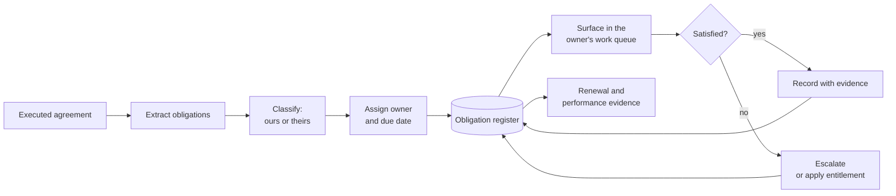

## Problem

Agreements impose commitments on both parties — service levels, reporting deadlines, review
meetings, notice periods, price adjustment mechanisms, insurance renewals, closeout requirements.

They are written as prose, distributed across a main document, schedules, and amendments. **They
exist nowhere that anyone looks during normal work.** Nobody re-reads a contract monthly, so
obligations are discovered when the other party invokes one, or when something has already gone
wrong.

## Context

Applies to any [Agreement](/data-entities/agreement/) subtype — contracts, grant awards, licences,
permits, interagency agreements. The pattern is identical across all of them, which is a large part
of its value: one register, one mechanism, four capabilities.

**Minimum maturity level 2**, which is unusually low for this library and deliberate. This does not
require integration, a data platform, or AI. A spreadsheet with owners and dates beats a PDF, and
the step from nothing to something is where nearly all the value is.

## Recommended approach

Four things, and skipping any one of them collapses the pattern:

1. **Extract at execution**, not when a question arises. Handover is the natural trigger.
2. **Classify direction.** Obligations *we* owe drive our work queue. Obligations *they* owe drive
   monitoring and entitlements. Registers that mix them serve neither purpose.
3. **Assign an owner and a date.** An obligation without both is a note.
4. **Surface it where the owner already works.** A register nobody opens is the PDF problem with
   extra steps.

## Logical components

Obligation register with direction, owner, due date, recurrence, and satisfaction state ·
extraction at execution · source citation back to the clause · queue integration · evidence
capture on satisfaction · entitlement linkage where breach triggers a remedy · reporting for
renewal and performance review

## What to extract

| Type | Examples | Direction |
|---|---|---|
| Performance standards | Availability, response time, quality thresholds | Theirs |
| Reporting | Periodic reports, notifications, certifications | Usually theirs |
| Governance | Review meetings, escalation contacts, steering cadence | Both |
| Financial | Invoicing schedule, price adjustment, retainage release | Both |
| Compliance | Insurance, bonding, certifications, background checks, with expiry | Theirs |
| Notice | Termination, renewal, non-renewal windows | **Ours, and time-critical** |
| Conditions | Flow-down requirements, allowable cost rules, use restrictions | Theirs |

**Notice periods are the ones that hurt.** They are ours, they are time-critical, missing one
converts a decision into a default — and they are the least likely to be extracted because they
sit in boilerplate nobody reads. See [renewal lead time](/kpis/renewal-lead-time/).

## Benefits

- Obligations become visible to people who are not reading the contract
- Entitlements get claimed, because triggers are tracked — see
  [service credit realization](/kpis/service-credit-realization/)
- Renewal decisions have evidence
- Handover to a new manager takes minutes, not a week of document reading
- Disputes are argued from a contemporaneous record

## Tradeoffs

- **Extraction is real work**, roughly an afternoon per substantial agreement done well. The
  business case is the entitlements recovered plus the renewals not defaulted.
- **The register drifts if amendments are not applied.** An out-of-date register is worse than
  none, because it is trusted.
- **Over-extraction produces noise.** Not every sentence is a trackable obligation; a register of
  four hundred items per contract will be ignored.
- **Owners leave.** Obligations need reassignment on staff change, or the register quietly becomes
  a list of orphans.

## Anti-patterns

- **Extract once, never maintain.** Amendments change obligations; a register that does not track
  them misleads with authority.
- **A register nobody sees.** Held in a system the owner does not open daily.
- **Obligations without direction.** Cannot drive either a work queue or a monitoring plan.
- **No source citation.** An obligation you cannot trace back to its clause cannot be enforced or
  defended.
- **Automated extraction accepted unverified.** Conditionality gets flattened, and the flattened
  version becomes the operational truth — see
  [obligation extraction](/ai-opportunities/obligation-extraction/).

## Implementation checklist

- [ ] Register structure defined with direction, owner, due date, recurrence, source clause
- [ ] Extraction triggered at execution, as a gate on the agreement going active
- [ ] Notice periods and renewal decision dates specifically captured
- [ ] Owners named individually, with a reassignment process
- [ ] Obligations surfaced in the queue the owner already uses
- [ ] Evidence captured on satisfaction, not just a tick
- [ ] Entitlements linked to the service levels that trigger them
- [ ] Amendment process updates the register as a required step
- [ ] Extraction provenance marked where machine-assisted
- [ ] Register feeds renewal and performance review automatically
