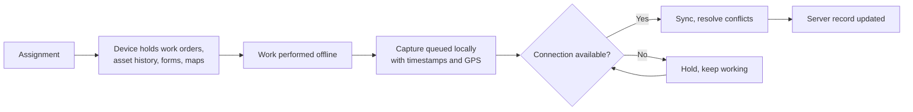

## Problem

Field data capture is the largest single source of lost information in the physical domain, and
the standard explanation — crews will not use the tools — is usually wrong. **The tools fail where
the work is.**

Public sector field work happens in basements, vaults, tunnels, rural stretches, inside buildings
with thick walls, and during the outages the crew was dispatched to fix. Anything requiring a live
connection stops working at exactly those moments, so crews carry paper, and the record is
reconstructed at the depot hours later from memory.

The consequence chain is direct: no actuals means no
[planning estimates](/processes/work-order-planning-and-scheduling/); no findings means no
[failure analysis](/processes/failure-analysis-and-renewal-referral/); no condition observed means
no [assessment currency](/kpis/condition-assessment-currency/).

## Solution

**Design for no connection as the normal case, not the degraded one.**

Four properties make it work:

**The device holds what the crew needs before they leave.** Work orders, asset history, prior
findings, parts lists, maps, and forms — downloaded on assignment, not fetched on arrival. This is
also what makes asset history usable in the field, which is what changes a crew's view of capture
from tax to benefit.

**Capture never blocks on the network.** Photographs, readings, findings, and signatures queue
locally with their own timestamps and coordinates. The crew never sees a spinner.

**Sync is explicit and visible.** The crew can see what is queued and what has landed. Silent
background sync that fails silently is worse than paper, because nobody knows the record is
missing.

**Conflicts resolve on a stated rule**, not last-write-wins. Two crews touching one asset is
uncommon; a dispatcher updating a work order while a crew completes it is not.

## Why level 2

**This is a design constraint, not a technology tier.** It requires choosing tools that work
offline and rejecting ones that do not — a procurement and architecture decision available to any
jurisdiction, and one that costs nothing extra at the point of selection.

It is placed at level 2 because it is the enabler for everything above it. An organization at level
2 with offline capture accumulates usable history; an organization at level 3 without it does not,
and every analytical capability built on top will underperform for reasons that get attributed to
the wrong cause.

## Prerequisites

- Work orders carrying an asset identifier, so history can be pre-loaded
- Device management sufficient to keep field devices current
- A capture form short enough to complete on site — the pattern fails if the burden is too high, regardless of connectivity
- Sync conflict rules agreed before deployment, not after the first collision

## Where it applies beyond maintenance

The same constraint governs any work performed away from a desk:

| Capability | Field reality |
|---|---|
| [Inspections](/capabilities/inspections/) | Basements, crawl spaces, industrial sites |
| [Utility operations](/capabilities/utility-operations/) | Vaults, plant, remote pump stations |
| [Emergency response](/capabilities/emergency-response-coordination/) | Precisely when infrastructure is down |
| [Law enforcement field operations](/capabilities/law-enforcement-field-operations/) | Rural coverage gaps, buildings, incidents |
| [Referral and coordination](/capabilities/referral-and-cross-agency-coordination/) | Home visits, shelters, encampments |

## How it goes wrong

**"Offline mode" bolted on.** A web application with a cache is not offline-first; it fails in
novel ways at the boundary and crews learn not to trust it, which is harder to reverse than never
having deployed it.

**Sync failures that are silent.** Data queued, never landed, and nobody notices until a record is
needed. Sync state must be visible to the crew and monitored centrally.

**Pre-loading everything.** Downloading the entire asset register to every device is slow, fragile,
and usually unnecessary. Scope the download to the assignment and its geography.

**Photographs without compression policy.** A day of high-resolution images over a marginal
connection fails, and the crew disables photo capture.

**A device per department.** The offline design is correct and the crew still carries three,
because water, streets, and facilities each procured their own — which is an
[application portfolio](/capabilities/application-and-integration-management/) problem the pattern
cannot solve on its own.

**Capture burden ignored.** Offline is necessary and not sufficient. If completing the form takes
fifteen minutes, it will be completed at the depot from memory whether or not the device worked on
site.
