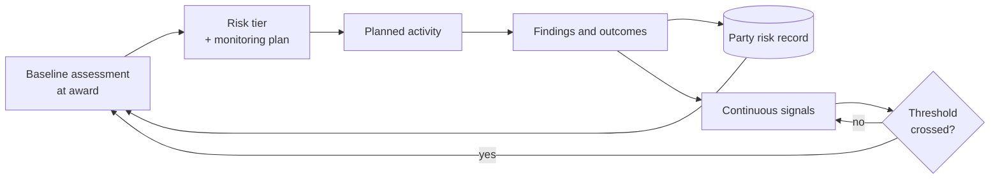

## Problem

Oversight capacity is fixed. The population to be overseen grows. Uniform monitoring therefore
becomes uniformly shallow — which produces high coverage statistics, low assurance, and a burden
on low-risk parties that is entirely wasted.

Applies well beyond grants: contract administration, inspections, licensing compliance, and
internal audit have the same shape.

## Context

Requires the ability to see a party's history **across programmes and departments** — which is why
this pattern carries a **minimum maturity level of 3.** At level 2 each programme holds its own
records, so "risk" can only be assessed from what this programme knows, which is usually the award
amount and a form the recipient filled in about themselves.

## Recommended approach

Three moving parts, and the third is the one usually missing.

1. **Baseline assessment** at award, from prior experience, audit history, personnel and system
   changes, award characteristics, and — critically — history from other programmes.
2. **A monitoring plan proportionate to tier**, published so the party knows what tier they are in
   and why. Publication also disciplines the assessor.
3. **Continuous signals that reassess between scheduled reviews.** Without this it is
   *tiered* monitoring, not *risk-based* monitoring: a judgement made once at award and never
   revisited, which is how a recipient whose finance director left in month three is still rated
   low risk in month eleven.

## Signals worth watching

| Signal | Suggests |
|---|---|
| Drawdown flat then large at period end | Spending not tracked, or work not happening |
| Reports late or revised after submission | Capacity strain in the finance function |
| Key personnel departure | Loss of the person who knew the requirements |
| Audit finding anywhere in the funder | Systemic issue, not a programme-specific one |
| First award above a size threshold | Capacity step-change the recipient has not made |
| Figures inconsistent across reports | Reconciliation not happening |
| Sudden scope or budget amendment request | Original plan not viable |

## Logical components

Party risk record spanning programmes · assessment engine with documented factors and weights ·
monitoring plan generator · signal collection from operational systems · threshold and escalation
rules · finding and corrective action tracking with verification · published tier matrix

## Benefits

- Oversight effort lands where consequence is highest
- Low-risk parties carry proportionate burden, which keeps small organizations able to participate
- Problems surface during the period, while correction is still possible
- The assessment is defensible, because factors and weights are documented

## Tradeoffs

- **Uniform is easier to defend.** "We treated everyone the same" survives challenge without
  argument. Risk-based requires the assessment to be documented and sound, and someone has to
  stand behind it.
- **Signals lag.** By the time drawdown irregularity is visible, some of the period has passed.
- **Tiering can entrench.** A party rated high risk gets more scrutiny, which finds more issues,
  which confirms the rating. Build in a route down, with defined criteria.
- **Requires cross-programme data** the organization may not have — which is a real prerequisite,
  not a nice-to-have.

## What to get right

- **Reassess risk on a cadence, not just once.** Tiering without reassessment is the most common
  gap, and a schedule for revisiting it is the fix.
- **Attach risk to the party, not just the award**, so history stays visible.
- **Judge risk on its own signals, not size.** Large awards are not automatically high risk, and
  small recipients are not automatically low risk — frequently the reverse.
- **Frame tiering as support, not penalty.** When high risk feels punitive rather than supportive,
  parties conceal signals instead of disclosing them; framing it as support keeps disclosure open.
- **Keep tier assignment a human judgement.** Risk tier determines how intensively an
  organization is scrutinized; a model may surface signals and rank attention, but the tier
  assignment itself is a judgement a human owns — see
  [subrecipient monitoring](/governance/subrecipient-monitoring/).

## Implementation checklist

- [ ] Party identity resolved across programmes and departments
- [ ] Risk factors and weights documented and published
- [ ] Tier matrix published so parties know their tier and why
- [ ] Monitoring plan generated from tier, not from calendar
- [ ] Signals identified with sources and thresholds
- [ ] Reassessment triggers defined, including a route to a lower tier
- [ ] Findings linked to party, not only to award
- [ ] Corrective action verification required before closure
- [ ] Escalation path defined before it is needed
- [ ] Coverage measured [weighted by tier](/kpis/subrecipient-monitoring-coverage/), not raw
