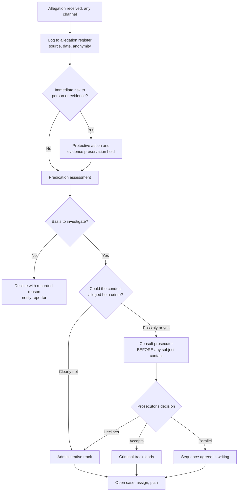

## Trigger and outcome

**Trigger.** An allegation arrives — hotline, web form, walk-in, anonymous letter, referral from
audit, a supervisor's report, a data-matching hit, or a media enquiry.

**Outcome.** The matter is declined with a recorded reason, or opened with **predication
recorded and a track determined** — administrative, criminal, or parallel with a sequence agreed
with the prosecutor — before any interview of a person to whom rights attach.

## Why this process exists

Because two decisions made in the first days govern everything afterwards, and one of them
cannot be revisited.

**A public employee compelled to answer questions under threat of discipline receives immunity
from those statements being used in a criminal prosecution.** The practical consequence is that
**conducting the administrative interview first can destroy the criminal case** — and the error
is typically made in good faith by someone who was never told the matter might be criminal.

There is no private-sector equivalent. An organization importing a corporate misconduct process
imports a process that gets this wrong by default.

## Current state: how this typically runs today

An allegation reaches a supervisor or HR. It is assessed as a personnel matter, because that is
what it looks like. Someone speaks to the subject in week one to "get their side," without a
rights advisement, without representation offered, and without anyone having asked whether the
conduct alleged is also a crime.

If it later becomes apparent that it is, the matter is referred to a prosecutor who declines
it — sometimes explaining why, sometimes not. The organization concludes that prosecutors are
not interested in these cases, and the belief becomes institutional.

In parallel: matters are opened on receipt without any predication test, because declining feels
like ignoring a complaint. Capacity goes to matters with no basis, and the ones that matter
drift.

### Why it works that way

- **The allegation does not arrive labelled.** Time theft, a falsified record, and a misused
  card all look like personnel matters and all can be crimes.
- **HR's instinct is speed**, and it is a correct instinct for most of what HR handles.
- **Nobody owns the track question** in an organization without a dedicated investigative
  function — which is most counties and municipalities.
- **Prosecutor consultation feels like escalation.** It reads as accusing a colleague of a crime
  rather than as a procedural step, so it gets deferred until there is "enough."
- **Declining a complaint looks like a cover-up**, so predication tests go unwritten.

## Process flow

The gate at **H** is the whole process. Everything before it is administration; everything after
it is determined by it.

## Business rules

- Every allegation is logged on receipt, including those assessed as unfounded on their face,
  and including anonymous ones.
- **No contact with the subject before the track is determined.** This binds HR, supervisors,
  and management equally, and is the rule most often broken by people who never saw it.
- Predication is recorded in writing before a matter is opened — the basis, not merely the
  decision.
- Where the conduct alleged could constitute a crime, the prosecutor is consulted **before**
  subject contact, not when the administrative investigation has finished.
- A parallel track requires a written, agreed sequence. "Parallel" without a sequence is an
  administrative investigation with a criminal case attached to it.
- Declination is a recorded outcome with a reason, communicated to the reporter where a channel
  exists.
- Reporter identity is compartmented at intake, not protected by convention afterwards.
- Matters alleging reprisal are opened as their own matter, not appended to the original.
- The investigative file is created separate from the personnel file at the point of opening.

## Where time and rework are lost

- Prosecutor consultation deferred until the administrative work is done, at which point the
  option is gone
- Matters opened without predication, consuming capacity that the substantiated ones needed
- Evidence lost to normal retention because no preservation hold was placed at intake
- Reporter identity reconstructed from the allegation's content, ending future reporting
- Re-interviewing witnesses because the first round was conducted on the wrong track

## Recommended future state

**One intake path, and it is not HR's inbox.** Every channel writes to one allegation register.
HR remains a valid entry point; it stops being a processing path.

**Predication as a written test, applied before opening.** Two or three questions, recorded. It
protects the reporter as much as the subject — a declined matter with a recorded basis is
defensible; an ignored one is not.

**Track determination as a named step with a named owner.** In an organization with no
investigative function this is the single highest-value control available, and it costs nothing
but a decision about who holds it.

**A standing prosecutor relationship, not a case-by-case referral.** The consultation is cheap
and fast when it is routine, and it is neither when it is exceptional. Where a jurisdiction has
no such relationship, establishing one is a better first project than any system.

**Preservation holds placed at intake**, before anyone knows whether the matter will proceed.
Retention schedules do not pause for investigations that have not been opened yet.

## Level variance

- **Federal.** Statutorily independent inspectors general with subpoena authority and, in many
  offices, law enforcement powers — so track determination frequently happens inside one
  organization that holds both capabilities, with established prosecutor relationships.
- **State.** Inspectors general or equivalent in some states, Medicaid fraud control units with
  law enforcement authority, and program integrity units inside benefit agencies. Authority
  varies substantially and is frequently narrower than the federal model.
- **County / municipal.** **Usually no dedicated investigative function at all**, so the track
  decision has no owner and is made by default rather than by anyone. The doctrine applies with
  full force regardless — which means the risk is highest exactly where the expertise is
  lowest. This is the level where writing the rule down changes the most.
- **Tribal.** Jurisdictional questions between tribal, state, and federal authority must be
  resolved case by case, and resolved *before* the interview rather than after.
