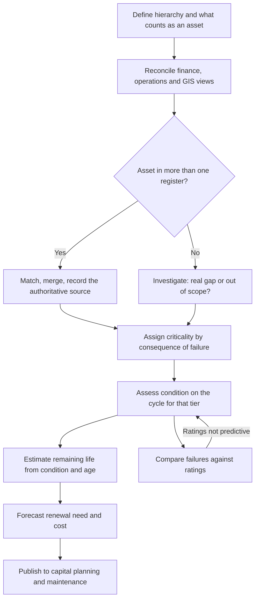

## Trigger and outcome

**Trigger.** A scheduled assessment cycle, a new asset entering service, a reorganization of the
register, or — most commonly — a funding request that cannot be justified without condition data.

**Outcome.** A register in which every asset has an owner, a location, a criticality tier, a
condition rating with a date, and a remaining-life estimate — reconciled across the financial,
operational, and spatial views.

## Why this process exists

Every consequential decision in this domain is downstream of it.
[Capital planning](/capabilities/capital-planning-and-programming/) ranks projects on condition.
[Maintenance](/capabilities/maintenance-management/) sets preventive intervals on criticality.
Financial statements depreciate on the same assets. Where the process does not run, all three
proceed on assertion.

## Current state: how this typically runs today

There are three registers and nobody owns the difference. Finance holds capitalized assets above a
threshold, valued and depreciated, with no condition. Operations holds what it maintains, including
items far below the threshold, with condition in the heads of the crews. GIS holds what has
geometry, which is mostly linear networks and rarely buildings or equipment.

Condition was assessed once, during an asset management implementation or a consultant study three
to eight years ago. The ratings are still in the system and are still being used. Nobody has
recorded a rating since.

Criticality, where it exists, was set from replacement cost, because that number was available and
consequence-of-failure analysis was not. Buried assets have an install date only where a record
survived, and material is frequently inferred from the decade.

New assets from construction are added when someone notices — typically at the first failure, or
at the annual audit.

### Why it works that way

- **Assessment costs money and produces no visible service.** It is the first thing cut and the
  last thing restored.
- **Nobody owns the reconciliation.** It sits between finance, operations, and GIS, and each has a
  complete answer for its own purpose.
- **Buried assets genuinely cannot be observed** without excavation or inspection technology that
  small systems cannot fund.
- **Handover is a construction milestone, not a data obligation** — see
  [project delivery](/capabilities/project-delivery-and-construction-management/).

## Process flow

## Business rules

- Asset hierarchy defined for maintenance usefulness first; the financial view is derived from it, not the reverse.
- Every asset has exactly one authoritative source system, recorded on the asset.
- Criticality assigned from consequence of failure, never from replacement cost.
- Condition ratings carry an assessment date and the method used; a rating without both is treated as absent.
- Assessment cycle set by criticality tier, not uniformly.
- Remaining life updated from observed condition, not only decremented by time.
- Assets entering service are registered at handover, before the warranty period starts.
- Disposals recorded at disposal.
- Rating method reviewed against actual failures at least annually.

## Where time and rework are lost

- Reconciling three registers by hand each time a number is needed for a report
- Field assessment of assets whose location in the register is wrong
- Re-surveying because the previous survey's method was not recorded and is not comparable
- Rebuilding handover data from as-builts years after the contractor has gone

## Recommended future state

**Reconcile once, then maintain.** The expensive step is the initial match across three registers;
after that the cost is incremental, and the discipline is that new assets enter through one route.

**Tier the assessment cycle.** Critical assets assessed frequently by inspection; low-consequence
assets assessed by exception or by age. Uniform cycles over-assess the trivial and under-assess the
critical, which is the same misallocation
[risk-based monitoring](/patterns/risk-based-monitoring/) addresses in oversight.

**Make imagery-derived condition the default for linear and surface assets.** Pavement, roofs,
signs, and vegetation can be assessed continuously from vehicle-mounted or aerial imagery at a
fraction of the cost of a periodic survey — see
[condition assessment from imagery](/ai-integrations/condition-assessment-from-imagery/). It does
not replace inspection for buried or mechanical assets.

**Close the loop from failures back to ratings.** Assets rated good that fail are the evidence that
the method is not predictive, and that comparison is the only validation the ratings ever get.

## Level variance

- **Federal.** Very large portfolios with formal inventory requirements and substantial excess property.
- **State.** Highway and bridge inventories under federally mandated inspection and condition reporting — the most mature condition data in government by a wide margin, and worth reusing as a model.
- **County.** Bridges under the same federal inspection regime, with far less capacity to act on the findings.
- **Municipal.** **Buried water and sewer infrastructure is the largest hidden exposure** — condition inferable only, install dates frequently unknown, and failure the most disruptive event a small jurisdiction faces.
