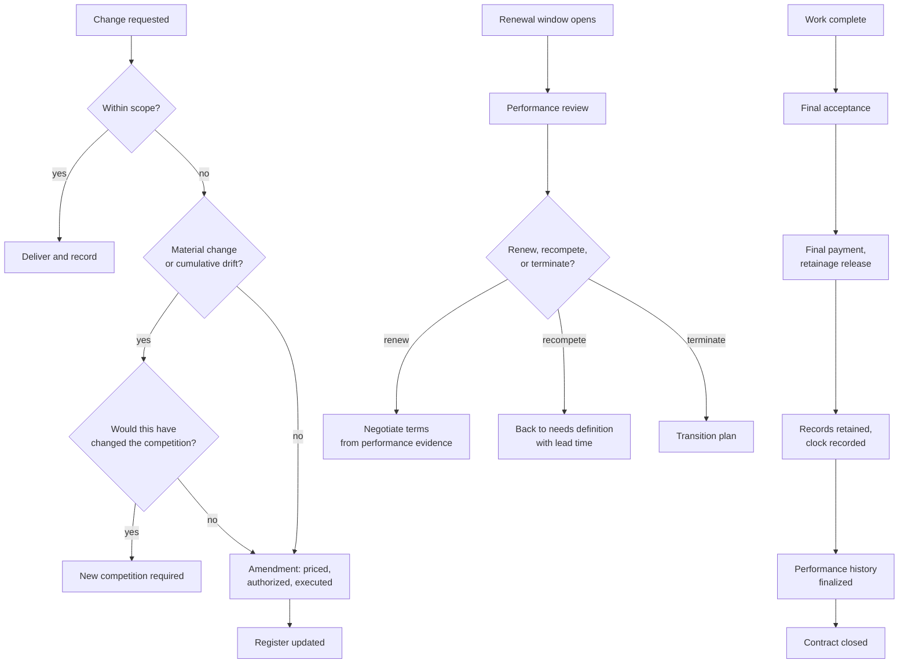

## Trigger and outcome

**Trigger:** a change request, an approaching renewal or expiry, or completion of the work.

**Ends when:** the change is authorized and priced, the renewal decision is made with time to act
on it, or the contract is closed and its records retained.

## Two failures with the same cause

**Scope drift** and **auto-renewal by inattention** both come from the same place: nothing is
watching the contract, so change happens by accumulation and renewal happens by default.

A series of small unpriced favours, none of which would have been approved as a single amendment.
A renewal date that passes unnoticed, extending the term and removing the option to renegotiate or
recompete for another cycle. Both are entirely preventable by a date in a queue and a person who
owns it.

## Current state: how this typically runs today

A department asks the supplier for something slightly outside scope. The supplier obliges,
because the relationship matters and the request is small. This repeats. Eighteen months later the
service being delivered differs materially from the one that was competed, and nobody can point
to the moment it changed.

Renewal arrives as a notification from the supplier, or as a discovery when someone checks. There
is not enough time to run a competition, so the contract is extended — which is a rational
decision made from a position that should never have been reached.

Closeout, where the work has an end, means the invoices stop. Final acceptance, retainage release,
records retention, and lessons captured happen inconsistently or not at all.

Observable symptoms:

- Delivered service materially different from the competed one, with no amendment trail
- Renewals extended because there was no time to compete
- Amendments processed after the work has already been done
- Contracts still "active" in the system years after work ended
- Nothing recorded about how the supplier actually performed

### Why it works that way

- **Small changes are individually reasonable.** Refusing a minor request damages a working
  relationship for little benefit. The cost only appears cumulatively.
- **Amendments are slow.** If the formal route takes six weeks, informal accommodation is what
  actually happens.
- **Renewal lead time is not tracked**, so nobody knows a decision is due until it is overdue.
- **Closeout is the last task of a finished thing**, competing with the first task of a live one.

## Process flow

The gate that matters most is **"would this have changed the competition?"** — the test that
separates a legitimate amendment from a change that should have been re-competed. It is the
question an auditor will ask, and answering it contemporaneously is far easier than
reconstructing it.

## Business rules

- Changes authorized and priced **before** work is performed.
- Cumulative change assessed against the original award, not evaluated one request at a time.
- A change that would have altered the competition requires a new competition.
- Renewal decision made within a defined lead time, sufficient to compete if needed.
- Renewal informed by recorded performance, not by impression.
- Closeout initiated automatically at end of term or completion.
- Retention clock recorded at closeout.

## Where time and rework are lost

- **Retrospective amendments** — paperwork constructed after the fact to authorize work already
  delivered, which is both slow and an audit finding.
- **Extensions negotiated from no leverage**, because there is no time to compete.
- **Closeout backlog**, obscuring true committed position and consuming effort later at higher cost.
- **Lessons lost.** The next competition repeats the same specification error.

## Recommended future state

**Cumulative change tracked against the original award value**, with a threshold that triggers
review. Individual requests are always defensible; the aggregate is where the problem lives, and
it is invisible unless something is adding it up.

**Renewal decision dated from required lead time**, not from the expiry date — measured by
[renewal lead time](/kpis/renewal-lead-time/). If a competition takes four months, the decision
point is five months before expiry, and that is the date that goes in the queue.

**Performance evidence assembled automatically** for the renewal decision from the record
maintained during
[performance monitoring](/processes/contract-handover-and-performance/).

**Automatic closeout initiation** at end of term, with escalation if it stalls — the same
mechanism as
[grant closeout](/processes/drawdown-reporting-and-closeout/), and missing for the same reason.

**Lessons captured as a required closeout step**, routed to whoever will write the next
specification in that category.

## Level variance

- **Federal.** Formal modification procedures with defined authority; scope-change rules with
  established interpretation and a protest forum that tests them.
- **State.** Amendment authority delegated within thresholds; renewal options usually structured
  into the original award.
- **County / municipal.** Amendments above a threshold frequently require a vote in public
  session, which adds real lead time — making the renewal-lead-time discipline more important,
  and making retrospective amendment considerably more embarrassing.
