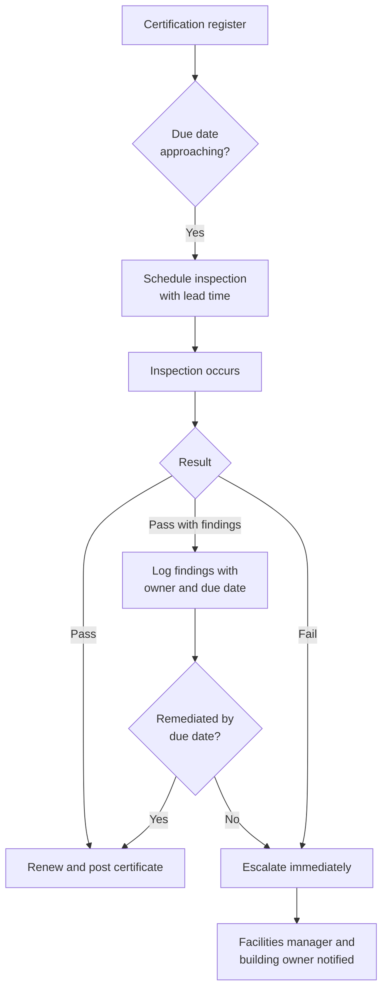

## Trigger and outcome

**Trigger.** A recurring inspection reaches its due date — fire suppression, elevator, backflow
prevention, accessibility — or a change to the building (new tenant, renovation, incident) creates
an obligation for a fresh one.

**Outcome.** The inspection happens on schedule, by someone qualified to perform it, and findings
are either closed out or tracked to a remediation date that someone actually owns. The certificate
or record that proves it happened is current and findable.

## Current state: how this typically runs today

Each certification type lives in its own head, spreadsheet, or paper file, kept by whoever has
historically kept it. There is no single view of everything due this month across every building
the organization runs.

An inspection gets scheduled when someone remembers, or when a vendor's own reminder system
prompts them to call. Findings from the inspection — a fire door that won't latch, an accessible
counter someone's been using for storage — go into a report that's filed and, in practice, rarely
looked at again unless something goes wrong.

The certification lapsing is usually discovered one of two ways: an inspector notices the old one
during the *next* scheduled visit, or an incident happens and someone asks to see the current
certificate, and it turns out there isn't one.

### Why it works that way

- **Different regulatory regimes, different owners.** Fire, elevator, and accessibility often sit
  with different people or even different departments, so there's no single place any of them
  would naturally converge.
- **The consequence of missing one is invisible until it isn't.** A lapsed certificate causes no
  problem on the day it lapses — only if there's an incident or an audit before it's renewed.
- **Findings and certifications are treated as separate paperwork**, rather than as one obligation
  with a start date, a due date, and an owner — see
  [obligation tracking](/patterns/obligation-tracking/) for the same failure in other domains.
- **Nobody's job is "the calendar."** It's an add-on to a facilities manager's actual job, and it's
  the first thing dropped when something more urgent comes in — which, in this domain, is
  constantly.

## Steps

1. **Maintain a register of every certification requirement**, by building, by regulatory regime,
   with its renewal interval.
2. **Schedule the inspection** ahead of the due date, with enough lead time to reschedule if a
   qualified inspector isn't available.
3. **Confirm the inspection happened** and capture the result — pass, pass with findings, or fail.
4. **Record findings against the register**, each with an owner and a remediation due date, not
   just as prose in a filed report.
5. **Track remediation to closure**, or escalate when a finding passes its own due date
   unaddressed.
6. **Renew and post the certificate** where required, and confirm it's the current one anyone
   would find if they went looking.

## Process flow

## Business rules

- Every certification requirement has one register entry, one renewal interval, and one named
  owner — never held only in an individual's memory or a personal file.
- Inspections are scheduled with enough lead time to reschedule around a missed vendor slot
  without lapsing the certificate.
- A finding is not closed by the inspection report being filed; it's closed when the remediation
  is verified and recorded.
- A finding without a remediation date attached at the time it's logged is treated as overdue
  immediately, not eventually.
- The current certificate for a building is always findable in one place, not wherever it happened
  to be filed at the time.

## Where time and rework are lost

- **Discovering a lapse during an incident**, rather than before one — the single largest cost of
  this process running informally.
- **Findings filed and forgotten**, so the same defect gets rediscovered at the next inspection
  cycle, sometimes worse.
- **Rescheduling under pressure** because a vendor slot was booked too close to the due date to
  allow for a miss.
- **No cross-building view**, so a facilities team managing several sites cannot say, without
  checking each one individually, what's coming due this quarter.

## Recommended future state

**One register, every building, every regime.** Fire, elevator, backflow, and accessibility side
by side, with due dates visible together rather than siloed by who happens to track each one.

**Findings are obligations, not paperwork.** Every finding gets an owner and a due date the moment
it's logged, and it's tracked the same way a contract obligation or a grant condition would be —
see [obligation tracking](/patterns/obligation-tracking/).

**Schedule with slack, not against the due date itself.** Booking the inspection with real lead
time turns a missed appointment into a minor rescheduling problem instead of a lapsed
certification.

**Make "what's due this month" a standing question with an answer**, not a question that sends
someone searching through several people's files.

## Level variance

- **Federal.** Formal space allocation and security-level designations often come with their own
  mandated inspection regimes layered on top of the general set.
- **State.** Specialized estates — laboratories, hospitals, corrections facilities — carry
  additional certification regimes specific to their use, on top of the general building set.
- **County / municipal.** **The most exposed level.** Older, more heterogeneous building stock,
  fewer staff to cover more regulatory regimes, and historic-status buildings where the cheapest
  compliance fix is often the one the building's designation won't allow.

## AI integration

- **Facilities manager:** flag any certification or finding in the register with no owner or due
  date — the same check built for [licensing conditions](/ai-integrations/unmonitored-authorization-conditions/),
  applied to fire, elevator, and accessibility findings instead.
- **Facilities manager:** send the first inspection-due reminder automatically, and route anything
  closer to an actual lapse to a person.
  [More detail](/ai-integrations/renewal-reminder-auto-send/)
- **Facilities manager:** draft the remediation notice to a contractor or vendor in plain language,
  from your own notes on the finding.
- **Facilities manager:** predict which certifications are likely to slip past their due date,
  based on how past findings at that building were actually remediated.
- **Facilities manager, across a multi-building portfolio:** see which buildings account for most
  of the compliance risk, instead of treating every building as an equal draw on attention.
