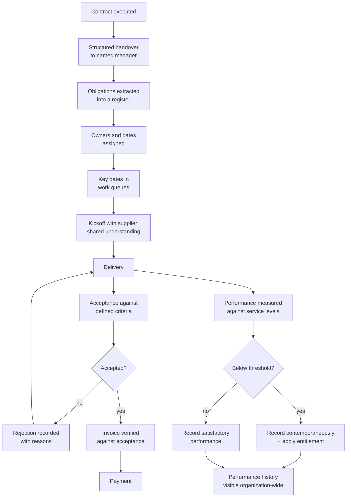

## Trigger and outcome

**Trigger:** an executed contract.

**Ends when:** the term ends and the contract moves to
[change, renewal or closeout](/processes/change-renewal-and-closeout/).

## The handover that does not happen

Procurement closes the file at award. The department that requested the purchase inherits a
contract, and frequently nobody walks them through what was agreed.

**The obligations then exist only inside a PDF that nobody re-reads until something goes wrong.**
Service levels, reporting requirements, review meetings, price adjustment mechanisms, and
termination rights are all in there, and none of them are in anyone's calendar or work queue.

This is the root cause of most of what follows in this process, and it is fixable in an afternoon
per contract.

## Current state: how this typically runs today

The contract is signed and filed. The department begins receiving the service. Invoices arrive
monthly and are approved by whoever holds the budget code — usually by confirming the amount looks
right, not by confirming delivery occurred.

Performance is assessed impressionistically. If the service is broadly working, nothing is
recorded. When it is not, frustration accumulates informally for months before anyone raises it
formally, at which point there is no contemporaneous record to rely on.

Service credits written into the agreement are triggered and never claimed, because nobody is
tracking the triggers.

Observable symptoms:

- Nobody can state the contract's service levels without opening the document
- Invoices approved without reference to deliverables or acceptance
- No performance record until a relationship has already deteriorated
- Contractual entitlements — credits, reports, review meetings — unexercised
- The contract manager discovering an obligation when the supplier cites it

### Why it works that way

- **Contract administration is unrecognized work.** Not in an objective, not resourced, on top of
  a full role.
- **Reading a contract is genuinely hard.** Obligations are distributed across a main document,
  schedules, and amendments, in language written for a dispute rather than for daily use.
- **Approving an invoice is a two-minute task; verifying delivery is not.** Under load, the
  two-minute version wins.
- **Documenting poor performance feels adversarial** while the relationship is still workable.

## Process flow

**Recording satisfactory performance matters as much as recording failure.** A history containing
only complaints is not a performance record; it is a grievance file, and it is useless at renewal.

## Steps

1. **Structured handover** — procurement briefs the named contract manager on what was agreed,
   what was negotiated away, and where the risks sit.
2. **Extract obligations into a register** — every service level, reporting requirement, review
   meeting, price mechanism, notice period, and termination right. See
   [obligation tracking](/patterns/obligation-tracking/).
3. **Assign owners and dates**, and put key dates in a queue that will surface them.
4. **Kickoff with the supplier**, confirming shared understanding of expectations and escalation.
5. **Accept deliverables against defined criteria**, recording acceptance or rejection with reasons.
6. **Verify invoices against acceptance** before payment.
7. **Measure performance against service levels**, recording both satisfactory and unsatisfactory.
8. **Apply entitlements when triggered** — credits, remedies, escalation.
9. **Maintain a performance record** visible beyond the department.

## Business rules

- No contract goes live without a named manager and a completed handover.
- Payment follows acceptance; acceptance follows defined criteria.
- Performance recorded contemporaneously, both satisfactory and not.
- Contractual entitlements applied when triggered, or a decision not to apply them recorded.
- Performance history visible to other departments and to future evaluations.
- Changes handled through [change control](/processes/change-renewal-and-closeout/), never informally.

## Where time and rework are lost

- **Re-reading the contract** every time a question arises, because nothing was extracted.
- **Disputes without a record.** Litigating from memory against a supplier with better records.
- **Unclaimed entitlements** — real money, contractually owed, never invoked. Measured by
  [service credit realization](/kpis/service-credit-realization/).
- **Repeating a supplier's failure** in another department, because performance history is not shared.

## Recommended future state

**Handover as a gate, not a courtesy.** A contract does not become active until a named manager has
been briefed and the obligation register exists.

**Obligations extracted at handover into a tracked register** with owners and dates — the single
highest-value change in this process. See
[obligation extraction](/ai-integrations/obligation-extraction/); it is a strong AI fit because
the output is verifiable against a document that remains available.

**Acceptance before payment, enforced by the workflow** rather than by policy — see
[invoice-deliverable matching](/ai-integrations/invoice-deliverable-matching/).

**Periodic performance recording on a schedule**, so a record exists before it is needed.

**Supplier performance visible across the organization**, which requires supplier identity
resolved as master data — see [Supplier](/data-entities/supplier/).

## Level variance

- **Federal.** Formally designated contracting officer's representative with defined duties,
  required training, and delegated authority limits stated in writing.
- **State.** Contract management delegated to the program with varying central oversight and
  varying formality of designation.
- **County / municipal.** Frequently no named manager at all. The requesting department inherits
  administration without training, capacity, or recognition — which is why the handover gate
  matters most at exactly the level least likely to have it.
