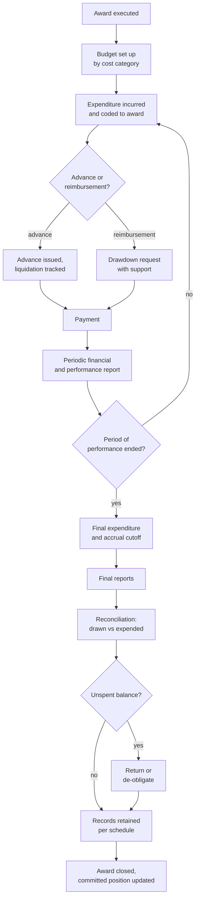

## Trigger and outcome

**Trigger:** an executed award with a period of performance underway.

**Ends when:** the award is closed — final report accepted, final payment reconciled, unspent
funds resolved, records retained per schedule, and the award removed from the committed position.

## The two things this process decides

**For the recipient: whether they can make payroll.** Reimbursement-based funding requires
fronting money. For a small non-profit this is the difference between being able to accept an
award and not — and it is a design choice by the funder, not a law of nature.

**For the funder: what is actually committed.** Awards that never close obscure the true unspent
balance. An organization that cannot state its committed position cannot plan the next cycle.

## Current state: how this typically runs today

The recipient spends, then requests reimbursement, then waits — commonly thirty to sixty days,
sometimes longer if the request is queried. Requests are supported by whatever documentation the
funder specified, assembled by hand from an accounting system that does not categorize by grant
budget line.

Reports are prepared separately for each funder, from the same underlying activity, using each
funder's period, categories, and definitions. The same number appears differently in two reports,
and nobody reconciles them until an auditor does.

Closeout is initiated when someone notices. Awards sit open past their period of performance for
months or years. Final reconciliation identifies unspent balances that must be returned or
de-obligated, which nobody wants to be the one to raise.

Observable symptoms:

- Recipients using lines of credit to bridge reimbursement cycles
- Reports assembled manually, with figures that do not tie between funders
- Drawdown patterns that are flat, then a large request at period end
- Awards open years past their period
- Unspent balances discovered at audit rather than at closeout

### Why it works that way

- **Reimbursement protects the funder** against advance-and-misuse risk. It transfers a real cost
  to the recipient, and that transfer is usually invisible in the program design.
- **Categories differ because funders differ.** No two funders agreed a common chart of accounts,
  so the recipient reconciles.
- **Closeout has no deadline anyone feels.** It is the last task of a finished thing, competing
  with the first task of a live thing.

## Process flow

## Business rules

- Expenditure coded to the award and cost category at the point it is incurred, not reconstructed later.
- Drawdowns supported by expenditure already incurred, unless the award permits advance.
- Advances liquidated within the period specified.
- Reports produced from the accounting record, not from a parallel spreadsheet.
- Closeout initiated automatically at end of period of performance, not on request.
- Retention period runs from closeout, and the clock is recorded.

## Where time and rework are lost

- **Manual report assembly**, repeated per funder per period, from data that already exists.
- **Queried drawdowns.** Insufficient support, so the request is returned and the cycle restarts —
  which for a small recipient can mean missing payroll.
- **Reconciliation at the end.** Drawn versus expended not tracked continuously, so the variance
  is discovered when it is hardest to fix.
- **Closeout backlog.** Awards accumulating open past their period, obscuring the real position
  and consuming effort later at higher cost.

## Recommended future state

**Code once, report many.** Expenditure captured against award and cost category at source, with
each funder's report a different view of the same underlying record rather than a separate
assembly. This is the change that removes most of the manual effort in this process — and see
[cross-report consistency](/ai-opportunities/cross-report-consistency/) for catching what slips
through.

**Advance or milestone payment where the recipient cannot carry cash**, with liquidation tracking
rather than blanket reimbursement. This is a program design decision that materially widens who
can accept an award.

**Continuous drawn-versus-expended visibility** for both parties, so variance surfaces during the
period.

**Automatic closeout initiation** at end of period of performance, with escalation if it stalls.

**Retention clock recorded at closeout**, attached to the award record — otherwise the obligation
is lost the next time systems change. See
[records management](/capabilities/records-and-information-management/).

## Level variance

- **Federal.** Central payment systems with defined drawdown mechanics; formal closeout
  requirements and reporting on the closeout backlog itself.
- **State.** Both drawing down from federal and paying subrecipients, frequently on mismatched
  cycles — which is precisely where recipient cash-flow pressure is created.
- **County / municipal.** Most exposed to reimbursement lag, least able to carry it, and least
  likely to have grant-aware coding in the general ledger.
