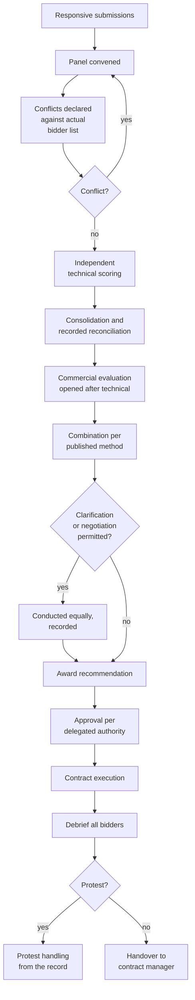

## Trigger and outcome

**Trigger:** a set of responsive submissions.

**Ends when:** a contract is executed, unsuccessful bidders are debriefed, and the record is
sufficient to defend the decision against a protest.

## The same shape as merit review, with one addition

This process is structurally almost identical to
[grant merit review](/processes/merit-review-and-award-decision/): published criteria,
independent scoring, conflict management, a recorded rationale for anything that departs from the
scores. Everything said there about integrity applies here.

**The addition is price**, and it changes the failure modes. Technical and commercial scores have
to be combined, the combination method is itself a design decision that determines outcomes, and
the presence of a number makes the whole thing look more objective than it is.

## Current state: how this typically runs today

A panel is convened — the requesting department, procurement, sometimes a technical specialist.
Conflict declarations are signed, usually generically and often before anyone has seen the bidder
list.

Technical scoring happens against the published criteria, in a spreadsheet, sometimes
collaboratively in a room where the most senior voice anchors the discussion. Prices are opened —
occasionally before technical scoring is complete, which contaminates it. The combination formula
is applied, and a preferred bidder emerges.

Then negotiation, contract drafting, legal review, and execution — a stretch that routinely takes
as long as everything preceding it and is measured by nobody.

Observable symptoms:

- Technical scores clustered tightly, so price decides everything
- Scoring conducted in a room rather than independently first
- Weightings that do not reflect what the panel actually cares about
- Debriefs that recite scores without explaining them
- Weeks lost between "preferred bidder" and "executed contract"

### Why it works that way

- **Scoring together is faster** than scoring independently and reconciling, and the anchoring
  cost is invisible.
- **Differentiating technical quality is hard**, so scores compress toward the middle and price
  becomes the discriminator by default.
- **Nobody owns the post-award stretch.** Procurement considers the award made; legal has a queue;
  the department is waiting. The measured process ends at the decision.

## Process flow

The final step is the one most commonly missing entirely — see
[contract handover and performance monitoring](/processes/contract-handover-and-performance/).

## Business rules

- Conflicts declared against the actual bidder list, before scoring.
- Technical scoring completed and recorded before commercial submissions are opened.
- Only published criteria scored, at published weightings.
- Combination method as published; not selected after seeing the scores.
- Clarifications sought equally and recorded; clarification is not negotiation.
- Award approved within delegated authority.
- All bidders debriefed with substantive reasons.
- Complete record retained — it is the protest defence.

## What to get right

- **Keep prices sealed until technical scoring is complete.** Once a panel knows the prices,
  technical scoring is no longer independent, whatever anyone intends.
- **Test whether the weighting survives contact with real scores.** Technical scores within a
  few points compress a weighting nominally 70/30 into 5/95 in practice. Worth testing on past
  competitions; the result is usually uncomfortable.
- **Collect conflict declarations after the bidder list is known**, not before.
- **Keep clarification separate from negotiation.** Blurring them is both a fairness problem and
  a protest exposure.
- **Debrief on substance, not just scores.** A supplier who learns nothing bids the same way next
  time and concludes the process was decided in advance.
- **Measure award-to-execution.** Leaving that stretch unmeasured lets weeks disappear where
  nobody is accountable.

## AI boundary

Identical to [merit review integrity](/governance/merit-review-integrity/), for the same reason:
this decides who receives public money, and systematic bias would be applied uniformly and
invisibly.

**Appropriate** — normalizing structured pricing schedules for comparison; checking arithmetic;
verifying that recorded scores are consistent with the published criteria; surfacing a bidder's
past performance and any debarment status; assembling a debrief from an evaluator's own recorded
comments.

**Not appropriate** — generating or recommending a technical score, ranking bidders, or judging
whether a response meets a qualitative requirement.

## Recommended future state

**Structured scoring captured at entry**, independently, before consolidation and before
commercial opening — enforced by the tool rather than by discipline.

**Weighting sensitivity tested before publication.** Model how the published method behaves under
realistic score distributions. A 70/30 weighting that operates as price-only is a design defect
discoverable in advance.

**Conflict declaration against the real list**, re-triggered when it changes.

**Measure award-to-execution**, not just close-to-award — see
[procurement cycle time](/kpis/procurement-cycle-time/). It is usually the largest unowned stage.

**Debrief assembled from evaluator comments**, making a substantive debrief a byproduct rather
than an additional task nobody has time for.

## Level variance

- **Federal.** Formal source selection procedures, documented rationale requirements, and an
  established protest forum with real consequences.
- **State.** Own protest procedures with varying formality; evaluation panels usually internal.
- **County / municipal.** Small panels, sometimes including people who know the bidders; award
  frequently requires a vote in public session, which adds a stage and makes the record public
  by default.
