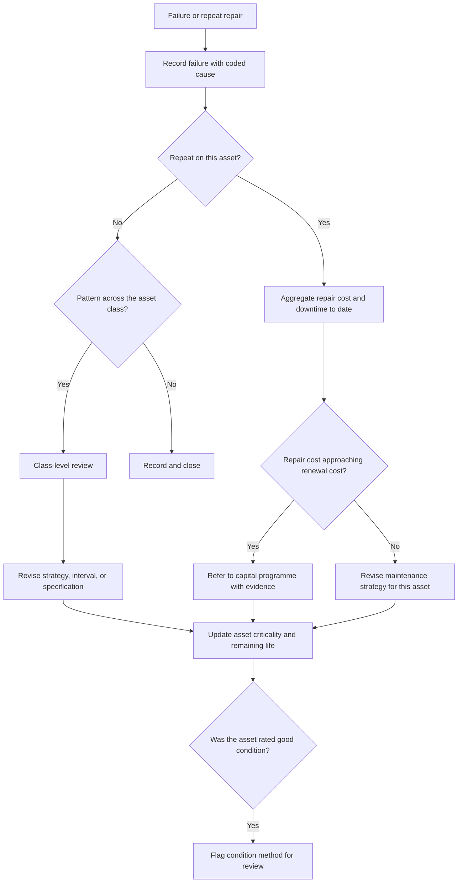

## Trigger and outcome

**Trigger.** A significant failure, a repeat repair on the same asset, a cluster of failures across
an asset class, or a scheduled reliability review.

**Outcome.** A recorded cause, a change to the maintenance strategy or the criticality tier where
warranted, and — where repair is no longer the right answer — a referral into the
[capital programme](/capabilities/capital-planning-and-programming/) with evidence behind it.

## Why this process exists

**It is the only loop that connects operations back to capital**, and it is the one almost nobody
closes. Without it, the same pump is repaired four times, the same main breaks every winter, and
the renewal case is never made — because the evidence for it is sitting in four unconnected work
orders that nobody aggregated.

It is also what validates everything upstream. Failures on assets rated in good condition are the
evidence that the
[condition method](/processes/asset-inventory-and-condition-assessment/) is not predictive.
Failures on assets under preventive maintenance are the evidence that the
[interval or strategy](/processes/preventive-maintenance-planning/) is wrong. Those comparisons are
the only validation either process ever gets.

## Current state: how this typically runs today

Failures are repaired. The work order closes. Nobody asks why.

Where a failure is large enough to be visible — a main break that floods a street, a generator that
did not start during an outage — there is a conversation, sometimes a note, occasionally a report.
Nothing is coded in a way that would let the same cause be counted across incidents.

Repeat repairs are known anecdotally by the crews. "That one again" is institutional knowledge held
by the people who keep going back, and it does not reach the person building the capital programme.

Renewal referrals happen when an asset fails badly enough to force the question, which is the most
expensive moment to ask it.

### Why it works that way

- **Completion is recorded as a status**, so there is no cause field to populate and no history to
  aggregate.
- **Analysis is nobody's assigned task** and produces no completed work order, so it loses every
  time to the queue.
- **Renewal has to compete with new construction**, and without evidence the case is unwinnable —
  which teaches people not to build it.
- **The crews who know are not in the room** where the capital programme is assembled.

## Process flow

## Business rules

- Every failure is recorded with a coded cause, not only a repair description.
- Repeat repairs on one asset aggregate automatically — cost, downtime, and count.
- A defined threshold of cumulative repair cost against replacement cost triggers a renewal referral.
- Failures on assets under a preventive strategy trigger review of that strategy.
- **Failures on assets rated in good condition are reported to the condition assessment process** —
  they are the only test of whether ratings predict anything.
- Class-level patterns trigger review of specification and procurement, not just of maintenance.
- Renewal referrals carry the evidence: failure history, cost to date, consequence, and criticality.

## Where time and rework are lost

- Repairing the same asset repeatedly with no aggregation of what it has cost
- Rebuilding the renewal case from scratch each budget cycle
- Buying the same failing specification again because procurement never heard
- Crews re-diagnosing a known recurring fault because the prior findings were not recorded

## Recommended future state

**Code the cause, not just the fix.** A cause taxonomy of even a dozen values — corrosion, fatigue,
overload, installation defect, third-party damage, age, specification — makes patterns countable.
Without it every failure is a singleton.

**Automate the repeat-repair flag.** The threshold is arithmetic: cumulative repair cost against
replacement cost, with a count of visits. It requires the completion data from
[field execution](/processes/field-execution-and-completion/) and nothing else.

**Feed procurement, not just maintenance.** Class-level failure patterns are evidence about the
specification. A valve type that fails everywhere is a
[needs definition](/capabilities/needs-definition-and-acquisition-planning/) problem, and the
finding never gets there.

**Close the loop to condition ratings.** This is the cheapest validation available and it is
essentially never performed: compare failures against the condition rating the asset held. If assets
rated good keep failing, the method is decorative and every plan built on it is unreliable.

**Give the crews a route in.** They know which assets are failing. Where their observations are
recorded as findings against the asset rather than as remarks, that knowledge becomes evidence.

## Level variance

- **Federal / state.** Formal reliability engineering functions on large plant and highway assets, with failure coding established practice.
- **County.** Bridge and pavement failure data feeds federally mandated reporting, so at least part of the loop exists — and rarely extends to water, buildings, or fleet.
- **Municipal.** **Almost never performed as a process**, while being the level with the least renewal funding and therefore the strongest need for evidence. The buried infrastructure case is entirely built from failure history, because condition cannot be observed.
