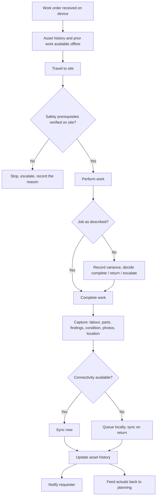

## Trigger and outcome

**Trigger.** A released work order reaching a crew, or an emergency dispatch bypassing planning
entirely.

**Outcome.** Work performed safely, and a completion record carrying actual labour, parts,
findings, condition observed, and location — attached to the asset.

## Why this process exists

**This is the last chance to capture what happened.** Everything the crew does not record is lost:
the parts consumed, the condition found, the reason it took twice as long, the observation that the
adjacent asset is about to fail. Every measure, plan, cost figure, and renewal forecast downstream
inherits whatever gap is left here.

It is also where the safety obligations actually bind. A locate that was requested during planning
has to be verified as present and current at the moment of excavation, by the person about to dig.

## Current state: how this typically runs today

The crew receives the day's jobs on paper or reads them off a screen at the yard. Asset history is
not included; the crew finds out what is there when they arrive.

Safety prerequisites are checked by habit and experience rather than by a recorded step. Where a
locate is missing or expired, a good crew stops; under schedule pressure, sometimes it does not.

Work is performed. Notes are written on paper, or in a mobile app that requires connectivity the
site does not have, so the crew writes on paper anyway. At the end of the shift someone keys the
day's work into the system — condensed, from memory, with parts estimated and duration rounded.

Completion is recorded as a status. Findings, actual labour, and the condition observed are not
captured, because there is no field for them or no time to fill it.

The requester is not notified.

### Why it works that way

- **Connectivity genuinely fails** in basements, vaults, rural stretches, and during the outages
  the crew is there to fix.
- **Recording competes with doing.** At the end of a physical shift, in weather, with cold hands, a
  status field is what gets filled.
- **Nothing downstream visibly consumes the detail**, so the crew reasonably concludes it does not
  matter.
- **A device per system** means a crew working across water and streets carries two, and uses
  neither properly.

## Process flow

## Business rules

- Safety prerequisites verified **on site, by the crew, at the time of work** — planning arranging
  them is not verification. See
  [work authorization and safety prerequisites](/governance/work-authorization-and-safety-prerequisites/).
- Work stops where a prerequisite is absent or expired, and the stop is recorded as an outcome.
- Location captured as a coordinate or asset identifier, never as free text.
- Completion requires actual labour, parts consumed, and findings — a status alone is not a
  completion.
- Condition observed is recorded even when unchanged, because absence of change is also evidence.
- Capture works with no connectivity and reconciles on return.
- Requester notification is generated from the completion record, not raised separately.
- Repeat repairs on the same asset flag automatically for
  [failure analysis](/processes/failure-analysis-and-renewal-referral/).

## Where time and rework are lost

- Return visits for parts or information the crew could have had before leaving
- Transcription at the depot — productive field time spent on data entry
- Re-keying the same job into a second department's system
- Work that cannot be located afterwards because the location was free text
- Diagnosis repeated because the previous crew's findings were never recorded

## Recommended future state

**Offline-first, not offline-tolerant.** The device holds the work order, the asset history, and
the forms, and it functions with no connection at all — see
[offline-first field capture](/patterns/offline-first-field-capture/). Anything requiring a live
connection fails exactly where the work is.

**Capture at the point of work, not at the depot.** The single change that most improves data
quality across the whole domain, and it depends entirely on the capture burden being small enough
to bear on site — voice notes, photographs, pre-populated findings by work type.

**Make the record pay the crew back.** Asset history in the field is the reason a crew stops
regarding capture as an administrative tax: what they record on Tuesday is what saves them a second
visit in March. Organizations that push capture without ever returning the data get compliance,
briefly.

**Notify from completion automatically.** Closes the loop with the requester at zero marginal
effort, and removes the "what happened to my report" contacts that currently land on
[constituent service](/capabilities/constituent-service-management/).

## Level variance

- **Federal / state.** Larger crews, more specialization, and long linear geographies where travel dominates and connectivity is worst.
- **County.** Rural coverage with genuine connectivity dead zones and long distances between jobs — offline capability is not a refinement here.
- **Municipal.** **Crews working across services** — water in the morning, streets in the afternoon — which makes a single work order model across departments the difference between one device and three.
