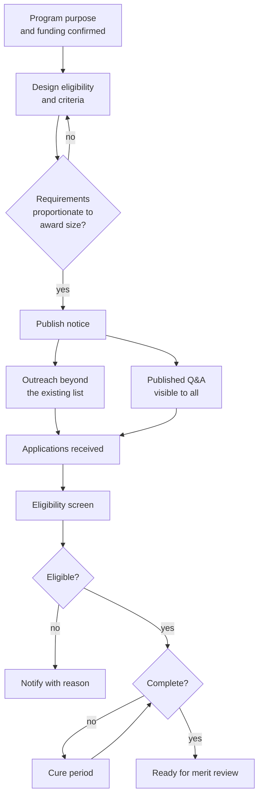

## Trigger and outcome

**Trigger:** a program with funding authority and a defined purpose is ready to compete.

**Ends when:** the submission deadline has passed and a set of eligible, complete applications is
ready for [merit review](/processes/merit-review-and-award-decision/).

## The decision that shapes everything

The notice defines who can apply, what they must produce to apply, and what will be judged.
**It therefore selects the applicant pool before a single application arrives.** A notice
requiring a detailed evaluation plan, three years of audited financials, and letters of
commitment does not select for the best deliverer — it selects for organizations that already
have grants staff.

This is not an argument against rigour. It is an argument for asking, deliberately, what each
requirement excludes and whether that exclusion is intended.

## Current state: how this typically runs today

The notice is adapted from last cycle's, which was adapted from the one before. Nobody currently
involved knows why several requirements exist. It publishes on the organization's website and a
funding portal, and reaches the mailing list of organizations that were funded before.

Questions arrive by email to a named officer, who answers individually — which is both a fairness
problem and a workload problem. Applications arrive as email attachments or through a portal that
does not validate, so completeness is established by a person opening documents one at a time.

Observable symptoms:

- The same organizations apply every cycle, and are funded every cycle
- A significant share of applications are screened out for completeness, not merit
- Questions answered inconsistently, because there is no published Q&A
- Deadline-day submission failures that consume staff time and generate appeals
- No idea who looked at the notice and decided not to apply

### Why it works that way

- **Requirements accrete.** Each one was added after something went wrong once. None are ever
  removed, because removing a control requires someone to accept the risk it was added for.
- **Outreach is unfunded.** Reaching organizations not already on the list is real work with no
  budget line, so the list stays the list.
- **Individual answers feel responsive.** Publishing a Q&A feels bureaucratic; answering directly
  feels helpful. It is also how two applicants get different information.

## Process flow

The **cure period** is the highest-value and most commonly omitted step. Screening out an
otherwise strong application because a form was missing serves nobody, and it falls hardest on
first-time and small applicants.

## Steps

1. **Confirm purpose, authority, and funding available.** Including whether it is one-time.
2. **Design eligibility criteria**, and separately, evaluation criteria. Conflating them is common
   and causes eligible-but-weak applications to be rejected on the wrong basis.
3. **Test the burden against the award size.** A $25,000 award should not require a $10,000
   application effort.
4. **Publish the notice** with criteria, weightings, timeline, and required attachments stated.
5. **Conduct outreach** to organizations not already known, in the languages of the communities served.
6. **Run a published Q&A** — every question and answer visible to every applicant, with a cutoff.
7. **Receive applications** with validation at submission rather than after.
8. **Screen eligibility** against published criteria only.
9. **Screen completeness** and offer a cure period for administrative defects.

## Business rules

- Evaluation criteria and weightings published before submission open; not changed after.
- Answers to applicant questions published to all applicants, not given individually.
- Eligibility determined solely against published criteria.
- Administrative defects curable; substantive deficiencies are not.
- Late submissions rejected, with a documented exception standard for platform failure.

## Where time and rework are lost

- **Completeness screening by hand.** Days of staff effort opening documents to check attachments.
- **Individual Q&A.** The same question answered fifteen times, inconsistently.
- **Rejections for curable defects**, which generate appeals and lose good applicants.
- **Requirements nobody uses.** Information collected at application and never referenced again.

## Recommended future state

**Validate at submission, not after.** Required attachments, formats, and arithmetic checked
before the applicant can submit — which removes most completeness screening entirely and shifts
staff effort to merit.

**Publish a structured Q&A** with a cutoff date, visible to all.

**Ask once.** Applicant organizational information — registration, financials, prior awards —
held once per organization and reused across opportunities, rather than re-submitted per application.

**Screen completeness automatically, with a cure period.** See
[application completeness screening](/ai-opportunities/application-completeness-screening/) —
an appropriate use because it identifies missing items rather than judging merit.

**Measure who does not apply.** Notice views against applications started against applications
submitted, to see where the funnel loses people.

## Level variance

- **Federal.** Standardized notice structure and a central publication portal; applicant
  registration is a prerequisite and is itself a barrier for first-time applicants.
- **State.** Own portals, frequently one per agency, so a recipient applying to three state
  agencies registers three times.
- **County.** Often a locally published notice with a much shorter timeline and applicants who
  are already known to the program officer — which makes deliberate outreach more important, not less.
