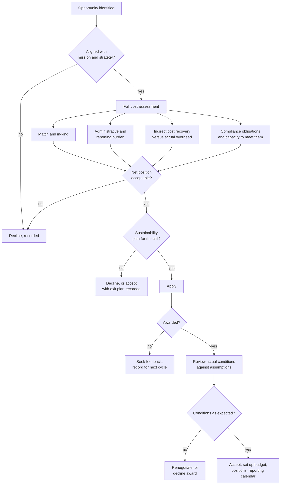

## Trigger and outcome

**Trigger:** a funding opportunity is identified, or arrives unsolicited.

**Ends when:** the organization has decided not to pursue, has applied and been unsuccessful, or
has accepted an award with its obligations understood and resourced.

## The decision nobody makes properly

Grant funding is treated as free money. **It is not free, and sometimes it is not even net
positive.** The award covers the program. It does not automatically cover the reporting, the audit,
the procurement constraints, the match, the indirect costs the funder disallows, or the general
fund liability created when the funding ends and the service does not.

The go/no-go is the highest-leverage step in the entire inbound capability, and in most
organizations it is not a step at all — someone finds an opportunity, someone else says "apply,"
and the consequences are discovered later.

## Current state: how this typically runs today

An opportunity is spotted by a program manager, a consultant, or an elected official who read
about it. It has a deadline three weeks away. Someone writes the application in evenings.

The match requirement is noticed during drafting and satisfied with "in-kind staff time," which is
real but unbudgeted. Indirect cost recovery is capped below actual overhead and the difference is
absorbed silently. Nobody computes the administrative burden. Acceptance is a formality once the
award arrives, because declining money is politically difficult regardless of the arithmetic.

Observable symptoms:

- Applications written under deadline pressure with no prior go/no-go
- Match satisfied by in-kind contributions that were never budgeted
- Awards accepted whose reporting requirements exceed available capacity
- Programs that end abruptly at the funding cliff, or absorb into the base unplanned
- Grant-funded staff on rolling temporary appointments for years

### Why it works that way

- **Declining money looks like failure.** Explaining that an award was refused because it cost
  more than it delivered is a hard conversation with a governing body.
- **Deadlines are short and unpredictable.** Opportunities appear with weeks of notice, which
  makes deliberate assessment structurally difficult.
- **Nobody owns the total cost.** The program sees the funding; finance sees the match; HR sees
  the temporary posts. No single view exists.

## Process flow

Note the second decision point after award. **The conditions in the executed agreement are
frequently not the conditions assumed at application.** Reviewing them before acceptance — and
being willing to decline at that point — is rare and occasionally saves an organization from
an obligation it cannot meet.

## Business rules

- Pursuit decision recorded, including declines and their reason.
- Full cost assessment completed before application, not after award.
- Match commitments identified and budgeted, including in-kind.
- Administrative burden estimated in staff hours, not asserted as absorbable.
- Sustainability position stated: sustain, sunset, or absorb — decided, not deferred.
- Award conditions reviewed against application assumptions before acceptance.

## Where it goes wrong

- **The cliff, discovered at year four.** A service exists, staff exist, the funding does not.
  Either the general fund absorbs an unplanned recurring cost or the community loses the service.
- **Match by in-kind that was never free.** Staff time counted as match is staff time not spent
  on something else.
- **Indirect recovery below actual overhead**, so every award quietly subsidizes the funder.
- **Chasing money away from mission.** Availability driving strategy, so the organization delivers
  the funder's priorities.
- **Conditions accepted unread.** Procurement restrictions, reporting frequency, or data-sharing
  obligations discovered mid-performance.

## Recommended future state

**A published go/no-go with a full cost template.** Match, in-kind, administrative hours, indirect
gap, and compliance capacity, assessed against a threshold that triggers executive decision. The
template matters more than the rigour — it makes the cost visible where it currently is not.

**A required sustainability position** on every application: sustain from base, sunset at end, or
absorb — with the general fund implication stated up front, in writing, to the body that will
later have to decide.

**Record declines.** An organization that cannot say what it turned down and why has no evidence
it is choosing at all.

**Reuse organizational information.** Registrations, financials, policies, and prior performance
assembled once and reused, so application effort goes into the programmatic case.

## Level variance

- **State.** Substantial dedicated capacity and formal review; typically pursues large formula and
  competitive federal awards where the go/no-go is genuinely strategic.
- **County.** Mixed capacity; frequently accepts state pass-through with little discretion, and
  competes for discretionary federal funds with limited support.
- **Municipal.** Least equipped and most exposed. Small jurisdictions routinely decline funding
  they qualify for because they cannot carry the administration — which is a rational decision that
  looks like a failure, and is worth recording as such.
