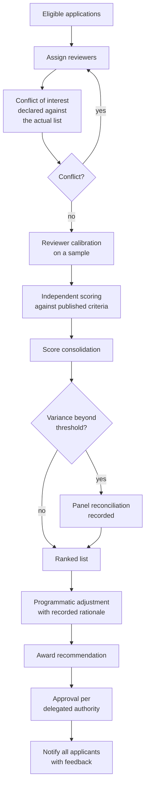

## Trigger and outcome

**Trigger:** a set of eligible, complete applications.

**Ends when:** awards are announced, unsuccessful applicants are notified with feedback, and the
record is sufficient to defend every decision.

## What this process actually produces

A **defensible allocation of public money**. Like [procurement](/capabilities/sourcing-and-solicitation/),
the decision quality matters and the defensibility is not optional. An award that cannot be
explained by reference to published criteria is a finding, an appeal, or a story.

## Current state: how this typically runs today

Reviewers — a mix of internal staff and external subject-matter experts — are sent applications
and a scoring sheet, usually as documents by email. They score independently, often at night,
against criteria whose weightings they read once. Scores come back in a spreadsheet. A panel
meets to discuss, outliers are debated, and a ranked list emerges.

Then the ranked list meets reality: geographic distribution, prior relationships, a programmatic
judgement about portfolio balance, and occasionally a preference expressed from above. The final
list differs from the ranked list, and the rationale for the difference is frequently not written
down anywhere.

Observable symptoms:

- Wide score variance between reviewers on the same application, resolved by discussion rather
  than by calibration
- Comments that justify the score rather than explain it
- A gap between the scored rank and the funded list, with no recorded basis
- Unsuccessful applicants given a score and no usable feedback
- Conflict declarations collected once, at the start, and not revisited when the applicant list is known

### Why it works that way

- **Reviewers are unpaid or nominally paid**, doing this alongside their real job. Depth of review
  is constrained by what can be asked of a volunteer.
- **Criteria cannot capture everything the program needs.** Geographic coverage, portfolio balance,
  and capacity building are real considerations that the scoring rubric usually does not include —
  so they get applied afterwards, informally.
- **Writing down the deviation feels risky.** It is in fact the only thing that makes the deviation
  defensible.

## Process flow

Two steps carry the integrity of the whole process: **conflict declaration against the actual
applicant list** — not a generic declaration signed in advance — and **recorded rationale for any
deviation from the ranked order.**

## Business rules

- Reviewers declare conflicts after seeing the applicant list, before scoring.
- Scoring is independent before it is discussed; consolidation does not precede individual scores.
- Criteria and weightings are those published; nothing else may be scored.
- Deviation from ranked order requires a recorded, program-relevant basis.
- Award approval follows delegated authority thresholds.
- Every applicant receives the outcome and substantive feedback.

## Where it goes wrong

- **No calibration.** Reviewers interpret a five-point scale differently; the resulting variance
  is noise that discussion cannot fully remove.
- **Conflicts declared generically.** "I have no conflicts" signed before anyone knows who applied.
- **Unrecorded adjustment.** The most common audit finding in this process — a funded list that
  differs from the scored list with no documented reason.
- **Feedback that is a score.** Unsuccessful applicants learn they got 68 out of 100 and nothing
  they can act on, which guarantees the same application next cycle.
- **Review burden that limits the pool.** Only large applications get real scrutiny because
  reviewer capacity is finite, so small awards are decided thinly.

## AI in this process: a hard boundary

Merit scoring is a **decision about who receives public money.** It is exactly the class of
decision where automated recommendation carries the most risk: it is consequential, it is
contestable, and any systematic bias is applied uniformly at scale and is invisible in aggregate
outcomes.

The boundary this library draws — see
[Merit Review Integrity](/governance/merit-review-integrity/):

| Appropriate | Not appropriate |
|---|---|
| Completeness and eligibility screening before review | Generating or recommending a merit score |
| Summarizing an application for a reviewer who then reads it | Ranking applicants |
| Surfacing prior findings or performance for the same applicant | Substituting for a reviewer |
| Checking scores against published criteria for consistency | Deciding portfolio balance |
| Drafting feedback from a reviewer's own comments | Writing feedback the reviewer did not form |

The distinction is not model capability. It is that a human must hold and be able to explain the
judgement, because the applicant has a right to a reasoned decision.

## Recommended future state

Structured scoring captured at entry rather than in spreadsheets. Calibration on a common sample
before live scoring. Conflict declaration against the real list, re-triggered when it changes.
Variance thresholds that route to reconciliation automatically. **Deviation rationale as a
required field** — the single highest-value change in this process. And feedback assembled from
reviewer comments, which makes it a byproduct rather than an extra task.

## Level variance

- **Federal.** Formal peer review panels with published procedures, defined conflict rules, and
  reviewers frequently drawn from outside government.
- **State.** Varies by program; often internal panels with less formal conflict management.
- **County.** Small panels, frequently including people who know the applicants personally — which
  makes explicit conflict handling more important, not less.
