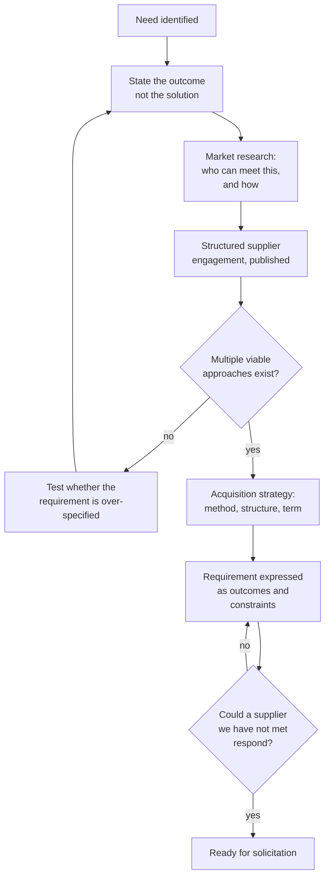

## Trigger and outcome

**Trigger:** an identified need with prospective funding.

**Ends when:** a documented requirement exists, the market that can meet it is understood, and an
acquisition strategy has been chosen.

## Why this is the most consequential process in the domain

**Everything downstream inherits what happens here.** A specification written around a product
produces a competition with one real bidder. A requirement written without market understanding
produces either no responsive bids or bids nobody can compare.

The most expensive procurement failures are not award failures. They are requirement failures,
discovered in year two, at which point the contract is the constraint.

## Current state: how this typically runs today

A department has a problem. Somebody attends a conference, sees a demonstration, and forms a view
about the solution. A vendor is helpful — providing a sample specification, a business case
template, and sometimes a draft scope of work.

That document, or something closely derived from it, arrives at procurement as "the requirement,"
with a deadline attached and a budget already approved on the strength of the demonstration.
Market research, where it happens at all, consists of confirming that the identified product exists.

Observable symptoms:

- Specifications naming a product, a version, or a feature set only one supplier has
- Requirements arriving with a fixed deadline and a pre-formed business case
- One responsive bid, or several where only one is credible
- "Market research" documented as a web search conducted after the specification was written
- Suppliers declining to bid without saying why

### Why it works that way

- **Pre-market engagement is restricted**, so the only information about what is possible comes
  from suppliers who sought the department out.
- **Nobody is funded to research a market.** It is real analytical work with no budget line and no
  owner, competing against delivering the current service.
- **Solution-shaped thinking is natural.** People experience needs as "we need X," not as an
  outcome specification. Translating one into the other is a skill most departments do not have.
- **The demonstration was genuinely persuasive.** A vendor showing a working product answers
  questions a requirements document cannot.

## Process flow

The two test gates are the substance of this process. **"Do multiple viable approaches exist?"**
and **"Could a supplier we have not met respond?"** are the questions that catch a foreclosed
competition while it is still cheap to fix.

## Steps

1. **State the outcome.** What must be true afterwards that is not true now — in terms a supplier
   who has never met the organization could understand.
2. **Separate must-have from nice-to-have** explicitly. Unranked requirements are how a
   competition narrows without anyone deciding to narrow it.
3. **Research the market.** Who supplies this, at what scale, with what commercial models. Include
   suppliers who have not approached the organization.
4. **Engage suppliers transparently** — published notice, equal access, recorded interactions.
5. **Test for over-specification.** For each requirement, ask which suppliers it excludes and
   whether that exclusion is intended.
6. **Choose an acquisition strategy** — method, contract structure, term, and whether a
   cooperative vehicle already exists.
7. **Write the requirement as outcomes and constraints**, with the "unknown supplier" test applied.

## Business rules

- Requirements expressed as outcomes and constraints, not as products or brand names.
- Where a brand reference is unavoidable, "or equivalent" with the equivalence criteria stated.
- Supplier engagement conducted transparently, with substance published to all.
- Market research documented before the specification is finalized, not after.
- Mandatory requirements justified individually; each one excludes someone.

## Where time and rework are lost

- **Rewriting a foreclosed specification** after procurement rejects it, with the deadline unchanged.
- **Failed competitions.** No responsive bids, so the whole cycle repeats with a revised requirement.
- **Requirements that cannot be evaluated.** Written so that responses are incomparable, which
  pushes the difficulty into evaluation.
- **Discovering an existing contract vehicle late**, after months spent preparing a competition
  that was never needed.

## Recommended future state

**Outcome-based requirement templates** that make "state the need, not the solution" the default
rather than an instruction people are given after they have written a specification.

**Structured, transparent pre-market engagement** — a published request for information, an open
industry day, or a market-sounding notice. The constraint is not that suppliers may not be
consulted; it is that consultation must be equal and recorded. Many organizations avoid engagement
entirely because they have confused the two.

**A requirement review gate** before publication: could a supplier we have never met respond to
this? See
[specification competition review](/ai-opportunities/specification-competition-review/) for
assisted detection of restrictive language, which is a good fit precisely because it flags for a
human rather than deciding.

**A searchable register of existing vehicles**, checked before any new competition is planned.

## Level variance

- **Federal.** Formal market research obligations with documentation requirements; established
  mechanisms for industry engagement.
- **State.** Own procurement codes with varying engagement rules; frequently operates cooperative
  vehicles that make research a question of what already exists.
- **County / municipal.** Rarely a dedicated acquisition professional, so the person defining the
  need also runs the competition — which makes the over-specification test hard to apply to
  oneself, and makes cooperative vehicles disproportionately valuable.
