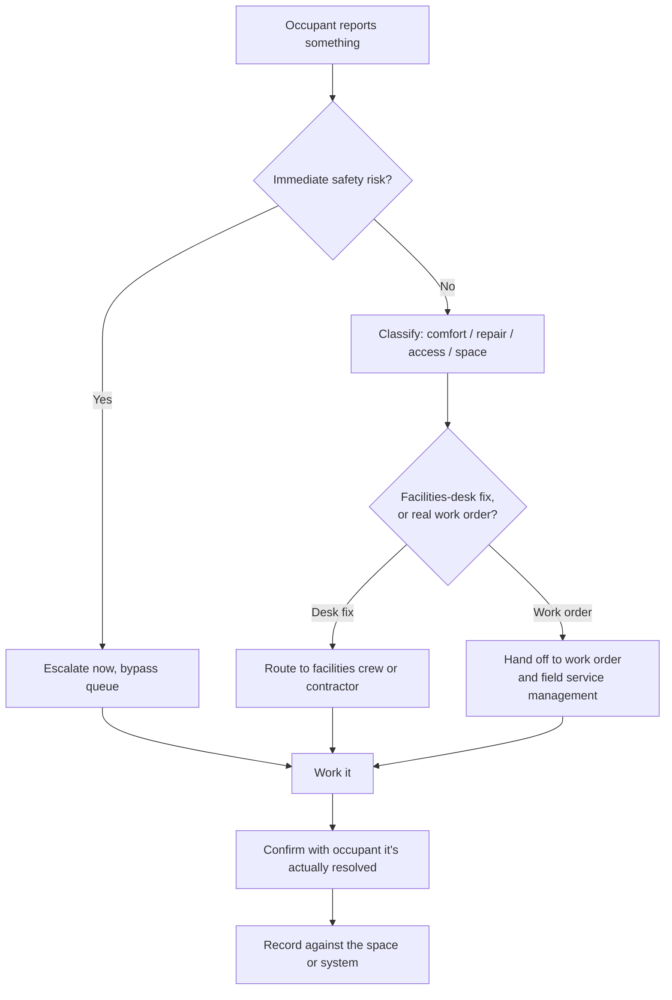

## Trigger and outcome

**Trigger.** An occupant reports something wrong with the building, or requests a change — a
repair, a temperature complaint, a lock, furniture, an access badge, a room booking.

**Outcome.** The request is classified, routed to whoever can act on it, worked, and closed with
the occupant told what happened — or it becomes a work order in a different system entirely,
because it turned out to be a real building-systems repair rather than a facilities-desk fix.

## Current state: how this typically runs today

The request arrives however the occupant happens to know to send it: an email to a name, a phone
call, a message left with whoever's at the front desk that day, or a hallway conversation with the
facilities manager directly. None of these create a record anyone else can see.

Whoever receives it decides, informally, how urgent it is and whether it's theirs to handle. A
temperature complaint and a report of a gas smell can arrive through the identical channel and get
weighed by the same person's judgment in the moment, with nothing written down about why one moved
faster than the other.

If the fix is bigger than "swap a lightbulb" — an HVAC repair, an elevator fault, a structural
concern — it eventually has to become a work order in whatever system
[work order and field service management](/capabilities/work-order-and-field-service-management/)
runs. That handoff is usually informal too: a second conversation, sometimes with details lost
between the first report and the second.

### Why it works that way

- **There is no single intake channel**, so there is nothing to route consistently *from*. Building
  a queue is pointless without first deciding where requests are allowed to arrive.
- **Facilities is usually understaffed relative to the size of the estate**, so triage is done by
  whoever is free, not by anyone trained to distinguish urgency from familiarity.
- **The person who receives the request usually can't tell, from the words alone, whether it's a
  five-minute fix or a work order** — that distinction often requires a look, which takes time
  nobody has budgeted for triage.
- **Relationships fill the gap a system should.** Where there's no visible queue, the fastest path
  to getting something fixed is knowing the right person, which is not a design anyone chose.

## Steps

1. **Capture the request**, whatever channel it arrived through, with what the occupant actually
   said — not yet translated into a category.
2. **Screen for immediate safety.** Gas, water intrusion, an unsecured door, anything with a
   plausible immediate risk gets pulled out of the general queue before anything else happens.
3. **Classify what kind of request it is** — comfort, repair, access, space, or safety — and
   whether it looks like a facilities-desk fix or something that needs a real work order.
4. **Route it** to the facilities crew, a contractor, security, or
   [work order and field service management](/capabilities/work-order-and-field-service-management/)
   if it's building-systems work.
5. **Work it**, whoever it landed with.
6. **Confirm with the occupant** that what was done actually resolved what they reported — not
   just that a ticket was marked complete.
7. **Record the resolution** against the space or system involved, so the next report about the
   same office or the same unit isn't starting from zero.

## Process flow

## Business rules

- Safety-relevant reports are pulled out and escalated before classification, on suspicion, not on
  confidence — the asymmetry favours a false alarm over a missed one.
- Every request gets a status the occupant can check without calling anyone, regardless of which
  channel it arrived through.
- Resolution is confirmed with the occupant, not inferred from a ticket being marked complete.
- Anything that turns into building-systems repair work hands off to
  [work order and field service management](/capabilities/work-order-and-field-service-management/)
  with the original report attached, not restated from memory.
- A repeat report about the same space or system is linked to the prior one, not logged as
  unrelated.

## Where time and rework are lost

- **Requests with no record**, so a second report about the same problem looks like a first one.
- **Safety and comfort competing for the same attention**, because nothing separates them on
  arrival.
- **The handoff to a real work order restated from memory**, losing detail the occupant already
  gave once.
- **No confirmation loop**, so a request marked "done" that didn't actually fix anything surfaces
  only when the occupant complains a second time, angrier.

## Recommended future state

**One channel, whatever the request.** Not a new phone number to remember — one route that every
existing channel (email, phone, a QR code at the door) feeds into, so nothing depends on knowing
who to ask.

**Safety classified on arrival, automatically or by rule**, before urgency is assessed by
judgment. A report that mentions gas, smoke, or an unsecured entrance should never wait behind a
temperature complaint because it happened to arrive first.

**A record that survives the handoff.** When a request becomes a work order, the original report —
what was said, by whom, when — travels with it rather than being re-typed by a second person.

**History attached to the space, not just the ticket.** Three reports about the same office in two
months is a pattern a facilities manager should see without having to remember it themselves.

## Level variance

- **Federal.** Larger buildings usually have a staffed help desk and a formal request system;
  the gap is more often in the handoff to specialized security or building-systems contractors
  than in intake itself.
- **State.** Mixed — large agency office buildings resemble federal; specialized estates like
  labs or hospitals add safety and access requirements the general process has to route around
  rather than absorb.
- **County / municipal.** Most often no dedicated intake at all — the facilities manager's phone
  *is* the intake system, across every building the jurisdiction owns.

## AI integration

- **Facilities manager:** classify a report by type, resolve it to a space, and link it to any
  open report about the same space, instead of logging three tickets for one leaking ceiling.
  [More detail](/ai-integrations/work-request-triage-and-duplicate-detection/)
- **Facilities manager:** flag anything that reads like gas, smoke, water, or an unsecured entrance
  before it's triaged by hand, on suspicion rather than confidence.
- **Facilities manager:** draft the occupant-facing status update in plain language, so "route to
  contractor, parts on order" becomes something an occupant would actually understand.
  [More detail](/ai-integrations/plain-language-rewrite/)
- **Maintenance planner:** when a request becomes a work order, draft the work order description
  from the occupant's original report, instead of it being retyped from memory a second time.
- **Building occupant:** describe the problem in your own words and have it sorted into the right
  category automatically, instead of guessing which form or which name to call.
