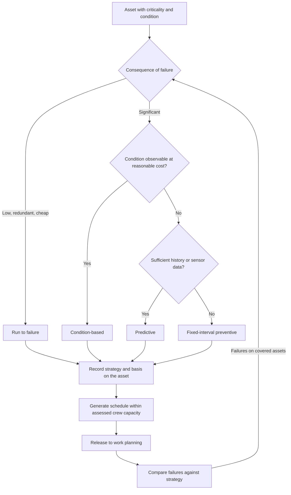

## Trigger and outcome

**Trigger.** A new asset entering service, an annual programme review, a change in criticality, or
a failure pattern that the current interval clearly did not prevent.

**Outcome.** A maintenance programme in which every asset has a stated strategy — run to failure,
fixed-interval preventive, condition-based, or predictive — with the basis recorded, and a schedule
the organization can actually resource.

## Why this process exists

**Reactive work crowds out preventive work, and the ratio is self-reinforcing.** Every deferred
preventive task raises the probability of a failure that consumes the capacity that would have
performed the next one. Organizations enter this spiral gradually and cannot exit it without
temporarily funding both.

Planning is the only thing that resists it, because a programme with a documented basis is harder
to defer than a list of intentions.

## The decision that comes first

**Not every asset should receive preventive maintenance.** Run-to-failure is a legitimate strategy
for assets that are cheap, redundant, and inconsequential when they fail, and applying preventive
intervals to them wastes capacity that critical assets need.

| Strategy | Appropriate when | Cost of getting it wrong |
|---|---|---|
| Run to failure | Low consequence, low cost, redundant or easily substituted | Minor, if the consequence assessment was right |
| Fixed-interval preventive | Predictable wear, consequence justifies the cost, condition not observable | Over-maintenance, or intervals unrelated to actual wear |
| Condition-based | Condition observable at reasonable cost | Assessment cost exceeds the failures avoided |
| Predictive | Sensor or work history data sufficient to model | Confident wrong answers over an untrustworthy register |

The strategy is a decision per asset class, made from criticality and observability — not a default
applied to everything.

## Current state: how this typically runs today

Preventive intervals came with the system, or from the manufacturer's recommendation, or from what
the previous supervisor did. They are uniform: most assets on an annual cycle regardless of
criticality or observed failure behaviour.

The programme is generated each period and issued to crews. Whenever reactive demand rises —
weather, a main break, a run of failures — preventive work is the release valve, because it has no
complainant. Nobody records that it was deferred; the work orders simply age.

Compliance-driven maintenance — elevators, backflow, generators, fire systems — happens, because
an inspection is attached. Everything else is negotiable.

### Why it works that way

- **Preventive work has no complainant.** Deferring it produces no call, no report, and no visible
  consequence until much later.
- **Criticality has usually not been assessed**, so there is no basis for treating assets
  differently and uniform intervals are the defensible default.
- **Failure history is not usable.** Completion recorded as a status rather than as findings means
  there is no evidence to set intervals from.
- **Deferral is individually rational every single time.**

## Process flow

## Business rules

- Every asset class has a recorded maintenance strategy and the basis for it.
- Preventive intervals derive from criticality and observed failure behaviour, not from a uniform default.
- The generated programme is sized against assessed crew capacity; a programme exceeding capacity is a plan to defer.
- Compliance-driven maintenance is scheduled separately and is not available for deferral.
- **Deferral of preventive work is recorded as a decision with a reason**, not absorbed as aging backlog.
- Failures on assets under a preventive strategy trigger review of that strategy.
- Strategy reviewed when criticality changes, not only on the annual cycle.

## Where time and rework are lost

- Preventive tasks generated for assets that no longer exist
- Intervals so conservative that crews skip them informally, which destroys the record's meaning
- Duplicate tasks on the same asset from overlapping programmes
- Compliance and non-compliance maintenance in separate systems, dispatched separately to the same site

## Recommended future state

**Record deferral as a decision.** This single change is the highest-leverage item in the process.
Preventive work that is silently absorbed into backlog is invisible; preventive work deferred with
a recorded reason is a number the
[preventive-to-reactive ratio](/kpis/preventive-to-reactive-ratio/) can expose and a director can
take to a budget conversation.

**Size the programme to real capacity.** A programme that requires 130% of available crew hours is
not a programme; it is a mechanism for producing arbitrary deferral decisions at seven in the
morning.

**Tier by criticality and stop pretending otherwise.** Most organizations already ration preventive
maintenance — they just do it implicitly, under pressure, without a basis. Doing it explicitly
produces the same rationing with a defensible rationale.

## Level variance

- **Federal / state.** Large facility and highway portfolios, frequently with maintenance delivered under performance-based contracts where the interval is contractual rather than chosen.
- **County / municipal.** **The broadest asset mix per crew** — roads, water, sewer, buildings, parks, fleet, signals — often maintained by the same small workforce, which makes capacity the binding constraint on any programme and makes explicit tiering unavoidable in practice and rare on paper.
