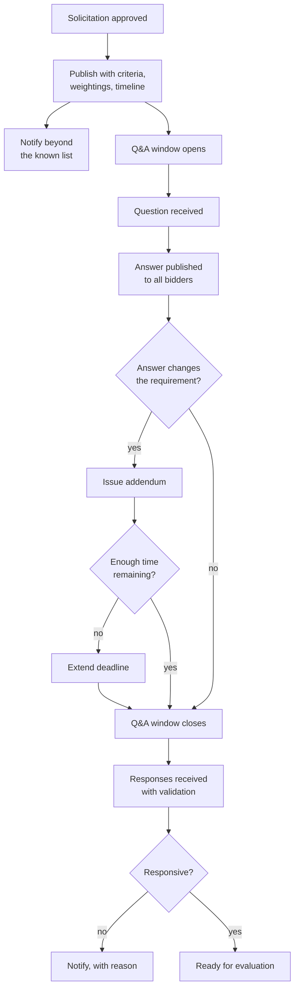

## Trigger and outcome

**Trigger:** an approved requirement and acquisition strategy.

**Ends when:** the response deadline has passed and a set of responsive submissions is ready for
[evaluation](/processes/evaluation-and-award/).

## The obligation that shapes this process

**Every prospective supplier gets the same information at the same time.** Not as a courtesy — as
the condition that makes the eventual award defensible. Almost every awkward feature of this
process follows from it, including the ones suppliers find least helpful.

## Current state: how this typically runs today

The solicitation publishes on the organization's website and whatever portal is in use. Notice
reaches suppliers already on a list; others find it if they happen to look.

Questions arrive by email to a named buyer, who answers individually because it is faster and
feels responsive. Some answers are later published as an addendum; some are not. Suppliers who
asked get information suppliers who did not ask never receive.

Responses arrive by email or portal upload near the deadline. A late submission arrives because
of a portal problem, and someone has to decide. Responses come in different structures, which
makes comparison a manual reconciliation exercise before evaluation can start.

Observable symptoms:

- The same small set of suppliers responds to everything
- Q&A answered inconsistently, some of it never published
- Addenda issued close to the deadline without extending it
- Deadline-day submission failures and the arguments that follow
- Responses so differently structured that a comparison spreadsheet has to be built by hand

### Why it works that way

- **Individual answers feel like good service.** Publishing everything feels bureaucratic, and the
  fairness cost of answering privately is invisible to the person answering.
- **Outreach beyond the list is unfunded**, so the list is the market.
- **Free-form responses feel supplier-friendly.** They are, right up until evaluation, when
  incomparability becomes a scoring problem.
- **Extending a deadline has a cost** — schedule pressure is real, and the addendum arrives late
  because the answer took time to clear.

## Process flow

## Steps

1. **Publish** with evaluation criteria, weightings, timeline, submission requirements, and
   response format stated.
2. **Notify beyond the known list** — category-relevant suppliers, small and local business
   registers, and any diverse supplier programme.
3. **Run a Q&A window** with a defined cutoff. Every question and answer published to all.
4. **Issue addenda** where an answer changes the requirement, and extend the deadline where an
   addendum arrives too late for suppliers to respond to it.
5. **Receive responses** with validation at submission — required sections, formats, arithmetic.
6. **Determine responsiveness** against stated mandatory requirements only.
7. **Record the complete process** — every question, answer, addendum, and submission timestamp.

## Business rules

- All substantive communication published to all prospective bidders.
- No supplier receives information not available to others, at any point.
- Criteria and weightings as published; unchanged after publication.
- Addenda that change the requirement trigger a deadline extension assessment.
- Responsiveness determined against stated mandatory requirements only.
- Late submissions rejected, with a documented standard for platform failure.
- Complete record retained per schedule — this is the protest defence.

## Where time and rework are lost

- **Repeated individual answers** to the same question, inconsistently.
- **Manual normalization of responses** before evaluation can begin.
- **Failed competitions** requiring a full re-run.
- **Deadline disputes** consuming days of staff and legal time.

## Recommended future state

**Structured response templates** with validation at submission — required sections and priced
schedules captured as data rather than prose. This is the change that makes evaluation
comparable and removes most pre-evaluation effort.

**Q&A published by default**, with the cutoff enforced by the platform rather than by a person.

**Automatic addendum-to-deadline logic**: an addendum inside a defined window triggers an
extension assessment that must be actively declined rather than silently skipped.

**Deliberate outreach as a measured activity.** Track notice reach against responses against
responsive responses, so a falling
[competition rate](/kpis/competition-rate/) is visible before it becomes normal.

**Supplier information held once** — registration, financials, certifications reused across
solicitations rather than resubmitted, which is the same *ask once* principle as
[grant application intake](/processes/funding-notice-and-application-intake/).

## Level variance

- **Federal.** Central publication with standardized structures and formal rules on communication
  during an open solicitation.
- **State.** Agency or statewide portals; cooperative vehicles frequently remove the need for a
  competition entirely.
- **County / municipal.** Local publication with shorter timelines and a supplier pool that is
  often already known — which makes the equal-information obligation harder to honour informally
  and more important to honour explicitly.
