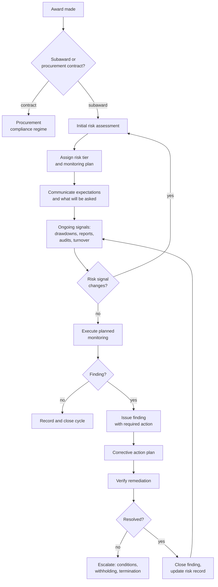

## Trigger and outcome

**Trigger:** an award or subaward has been made.

**Ends when:** the period of performance closes with monitoring complete, findings resolved, and
a risk record that informs the next award.

## Why this process exists

A pass-through entity remains accountable for federal funds it did not spend. **That is the whole
problem.** A state that subawards to forty counties is answerable for how those counties spent
the money, without managing them and usually without visiting most of them.

Monitoring is the mechanism, and it is a genuine trade: too little and non-compliance goes
undetected until an audit; too much and small recipients are crushed by oversight that costs more
than the risk it addresses.

## The determination that comes first

Before any of this: **is the relationship a subaward or a procurement contract?** The distinction
turns on substance, not on what the document is called — whether the organization is carrying out
a portion of the program with decision-making responsibility, or providing goods and services in a
competitive market.

Get it wrong and either an entire compliance regime is applied to a vendor, or a subrecipient
goes unmonitored. It is decided early, often casually, and it is the single most consequential
judgement in the capability.

## Current state: how this typically runs today

Risk assessment, where it exists, is a form completed once at award — prior experience, audit
history, staff turnover, dollar amount — producing a low/medium/high rating that determines a
monitoring plan on paper.

In practice, monitoring is **uniform and calendar-driven**: everyone gets the same desk review at
the same point in the year, because that is what capacity allows. High-risk recipients get the
same treatment as low-risk ones. Site visits go to whoever is geographically convenient or whoever
raised a flag loudly enough.

Findings are issued by letter, a corrective action plan is requested, the plan arrives, and the
file is closed. Whether the corrective action actually happened is often not verified.

Observable symptoms:

- Risk ratings assigned at award and never revisited despite events during the period
- The same finding recurring at the same recipient across years
- Monitoring concentrated at period-end, when nothing can be corrected
- Small recipients spending a meaningful share of their award on compliance
- No view of a recipient's history across other programs in the same organization

### Why it works that way

- **Risk data does not exist.** Proper risk-based monitoring needs prior-award performance across
  programs. Most organizations cannot see their own history, because each program holds its own.
- **Uniform is defensible.** "We treated everyone the same" survives a challenge; "we monitored
  them less because we assessed them as low risk" requires the assessment to be documented and
  sound.
- **Monitoring capacity is fixed and portfolios grow.** Uniform-but-shallow is the equilibrium
  that fixed capacity produces.

## Process flow

The loop back from **risk signal changes** to reassessment is what makes this risk-based rather
than calendar-based, and it is the part that is almost always missing.

## Business rules

- Subaward-versus-contract determination made on substance and documented.
- Risk assessed before monitoring is planned, and reassessed on defined trigger events.
- Monitoring intensity proportionate to assessed risk, with the assessment documented.
- Findings issued in writing with the requirement, the condition found, the cause, and the
  required action.
- Corrective action **verified**, not merely received.
- Recipient risk history visible across programs within the organization.
- Escalation path defined before it is needed.

## Where time and rework are lost

- **Reassembling recipient history per cycle**, because it lives in program silos.
- **Findings resolved on paper.** Plans accepted without verification, so the same finding
  recurs — the metric that exposes this is [repeat finding rate](/kpis/repeat-finding-rate/).
- **End-loaded monitoring.** Problems found after the money is spent, when the only remedy is
  repayment.
- **Uniform document requests.** Asking every recipient for everything, then reading a fraction of it.

## Recommended future state

**A single recipient risk record across programs.** One organization, one history, visible to
every program officer. This is the foundational change and it is a data problem, not a monitoring
problem — see [data governance](/capabilities/data-governance-and-stewardship/).

**Continuous signals rather than periodic assessment.** Drawdown irregularity, late reports,
audit findings, key staff departure, and prior findings as inputs that update risk between
scheduled reviews. See [risk-based monitoring](/patterns/risk-based-monitoring/).

**Monitoring that starts as help.** Early contact framed as support, escalating only where the
signal warrants. Recipients who experience the first contact as assistance disclose problems while
they are still fixable.

**Verification as a required step**, with the finding not closable until remediation is evidenced.

**Proportionality made explicit.** A published monitoring matrix so recipients know what tier they
are in and why — which also disciplines the assessor.

## Level variance

- **Federal.** Sets the framework and monitors states as pass-through entities; relies heavily on
  the single audit as the primary assurance mechanism.
- **State.** The hardest position — monitored by federal while monitoring counties and non-profits,
  flowing down conditions it must also comply with itself.
- **County.** Monitors local non-profit providers, often with one person, and is simultaneously
  monitored by the state.

The **single audit** is a shared assurance mechanism across all three: recipients expending above
a threshold obtain an independent audit whose findings pass-through entities must follow up on.
The threshold has changed in recent years — verify the current figure and effective date rather
than relying on a remembered number.
