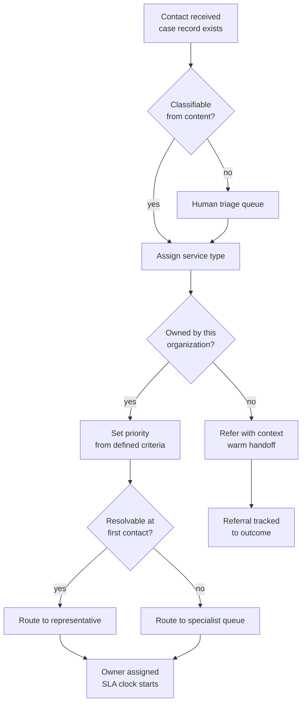

Triage is where most of the damage is done. A request classified wrongly at minute one will
consume days of downstream effort, and a person who is routed to the wrong place usually
does not get transferred — they get told to call a different number.

## Trigger and outcome

**Trigger:** a contact has been received and a case record exists (see intake).

**Ends when:** the case has a service type, a priority, and an owner or queue — or has been
identified as belonging to another organization and referred.

## Current state: how this typically runs today

At level 2, triage is done by the constituent, badly, and then redone by staff.

The person picks from an IVR menu or a web form dropdown that was designed around the
organization's structure rather than around problems people have. They guess. The request
lands in a departmental queue. A representative opens it, reads it, discovers it is not
theirs, and closes it with a note telling the person to contact someone else — or, in the
better organizations, forwards the email and hopes.

Typical observable symptoms:

- A "General enquiry" or "Other" category that receives 30–50% of all volume.
- Requests re-classified two or three times before landing.
- Transfers that arrive with no context, so the person re-explains from the beginning.
- Priority set by whoever shouted loudest, not by defined criteria.

### Why it works that way

Worth saying plainly, because the current state usually has reasons:

- **The taxonomy mirrors the org chart** because that is who was in the room when it was
  built, and because budget lines follow departments.
- **Nobody owns misroutes.** A misrouted case is a cost to the receiving department and a
  saving to the sending one. The incentive runs the wrong way.
- **Closing beats referring** when the metric is queue depth. Staff are behaving rationally
  against the measures they are given.

Fixing triage without fixing the incentive and the taxonomy just moves the problem.

## Process flow

## Steps

1. **Extract what is being asked.** From the contact content, not from the category the
   person selected. The selected category is a hint, not an answer.
2. **Assign a service type** from the service catalogue. This is the single most consequential
   field on the case.
3. **Check ownership.** Does this organization actually own the outcome? If not, refer —
   do not close.
4. **Set priority** against published criteria: statutory deadline, safety implication,
   vulnerability of the person, elapsed time already spent.
5. **Determine resolution tier.** Can a generalist resolve this now, or does it need a specialist?
6. **Assign** to a person or a skill-based queue, starting the service-level clock.

## Decision points

| Decision | Criteria | Who decides |
|---|---|---|
| Service type | Service catalogue definitions | System, or representative if ambiguous |
| Ours or theirs | Published ownership matrix | Representative; supervisor if disputed |
| Priority | Statutory deadline, safety, vulnerability, age | System from rules |
| Tier | Service type's defined resolution tier | System |

## Where time and rework are lost

- **Re-classification.** Each pass adds a full handling cycle.
- **The "Other" bucket.** Requires a human read of every item, and is where aging cases hide.
- **Referral as dead end.** The person restarts elsewhere, so the organization pays for the
  same request two or three times across the public sector without ever seeing that it did.
- **Priority inflation.** When everything is urgent, sequencing reverts to arrival order and
  the statutory deadlines are the ones that get missed.

## Recommended future state, by maturity level

**To reach level 3** — the case record spans channels, so a transfer carries context rather
than restarting. Routing runs on published rules with a named owner. Misroutes are tracked
as a metric with an owner, which is what actually changes the behaviour. Referral becomes a
tracked outcome rather than a closure code.

**To reach level 4** — classification happens automatically at intake with a confidence
threshold; anything below the threshold goes to a human triage queue rather than being
guessed at. Priority is set from case attributes rather than self-report. The human queue
shrinks to genuinely ambiguous cases, which is where the human judgment was always worth
spending.

Note the ordering. Automated classification on top of a taxonomy that mirrors the org chart
automates the misroute. The taxonomy work is level-3 work and cannot be skipped.

## Level variance

- **Federal.** Service types often map to statutory programs, which makes the taxonomy more
  stable but the ownership matrix more complex — programs are frequently administered by
  states, so a large share of correctly classified requests are still someone else's to resolve.
- **State.** The most referral-heavy position: receiving from local, escalating to federal,
  and administering programs on behalf of both.
- **County / municipal.** The taxonomy is usually service-based rather than program-based and
  maps reasonably well onto Open311 service definitions for the request types it covers.
  Ownership disputes are more often intra-organizational than cross-government.

## Governance requirements

- Referral to another organization discloses what information is passed, and to whom.
- Priority criteria are published, so that "urgent" is defensible rather than discretionary.
- Where classification is automated, the human review point sits at the confidence threshold
  and the threshold is a governed setting, not a tuning knob.
