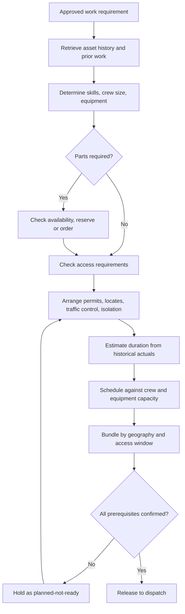

## Trigger and outcome

**Trigger.** A triaged work request, a released preventive task, or an emergency requiring
follow-up work.

**Outcome.** A scheduled job with a named crew, reserved parts, arranged access and permits,
verified safety prerequisites, and a duration derived from what similar work actually took.

## Why this process exists

**This is the step that separates organizations where preventive maintenance happens from those
where it does not.** Planning is what makes a job executable on the day; without it crews
self-dispatch, discover missing parts on site, and return for a second visit — which consumes the
capacity that would have done the next planned job.

It is also the step most often absent. Where there is no
[maintenance planner](/personas/maintenance-planner/), planning happens badly at seven in the
morning while crews wait.

## Current state: how this typically runs today

A supervisor prints or reads out the day's jobs at the start of the shift. Crews load what they
think they will need. Parts availability is checked by walking to the store, or discovered on site.

Durations are not estimated; jobs are assigned until the day looks full. By mid-morning an
emergency has displaced a third of the schedule, and what was displaced becomes backlog with no
record that it was ever scheduled.

Access — a locked facility, a tenant, a traffic control requirement, a locate ticket for
excavation — is discovered by the crew on arrival. Where a permit or a locate is required and
absent, the crew leaves and the job is rescheduled.

Jobs are assigned by department and by who is free, not by geography, so crews cross the
jurisdiction more than once a day.

### Why it works that way

- **Planning is invisible work.** It produces no completed job and is the easiest post to leave
  unfilled or absorb into a supervisor's day.
- **There is no history to plan from.** Completion recorded as a status means no actual durations,
  parts, or findings exist to estimate against.
- **Parts reservation is not enforced** by most systems, so reserving is not reliable and planners
  stop bothering.
- **Emergencies genuinely do displace the schedule**, and re-planning what was displaced takes time
  the planner does not have.

## Process flow

## Business rules

- A job is not scheduled until parts, access, and safety prerequisites are confirmed — otherwise it is planned-not-ready.
- Parts reservations are enforced; a reservation another job can consume is not a reservation.
- Durations estimated from historical actuals for the work type, and the estimate is compared with the actual afterwards.
- Schedule sized to assessed crew and equipment capacity, with an explicit allowance for reactive demand.
- **Work displaced by emergency is re-planned, not silently returned to backlog.**
- Jobs bundled by geography and access window where the work types allow.
- Locate tickets requested with lead time and verified current at dispatch — see
  [work authorization and safety prerequisites](/governance/work-authorization-and-safety-prerequisites/).

## Where time and rework are lost

- Second visits caused by missing parts or missing information — the largest single loss
- Crews standing down on site for an absent or expired locate
- Travel time from geography-blind assignment
- Re-planning the same displaced job repeatedly because it was never formally rescheduled
- Estimating from scratch because no actuals were ever captured

## Recommended future state

**Reserve capacity for reactive demand explicitly.** Every organization loses part of the schedule
to emergencies; the ones that plan to 100% of capacity lose planned work instead of slack. Planning
to a realistic share — and holding the remainder — makes the preventive programme survivable.

**Planned-not-ready as a real state.** A job with unconfirmed prerequisites should be visible as
blocked rather than scheduled and failed. The count of planned-not-ready jobs is a direct read on
whether parts, permits, and access are working.

**Estimate from actuals, and check.** Capturing actual duration is a
[field execution](/processes/field-execution-and-completion/) obligation, and comparing it against
the estimate is what makes the next estimate better. Without the loop, durations are permanently
optimistic by a margin everyone privately corrects for.

**Bundle by geography.** Straightforward, unglamorous, and among the largest recoverable losses in
the domain — travel is frequently a third of crew time.

## Level variance

- **Federal / state.** Larger crews and more specialization, with planning a defined role and contracted maintenance planned by the contractor against a service level.
- **County.** Long travel distances make geographic bundling the dominant scheduling constraint rather than a refinement.
- **Municipal.** **Planning is most often absent as a role** and most needed, because the same small crew covers water, streets, parks, and facilities — so every assignment decision is also a trade-off between services.
