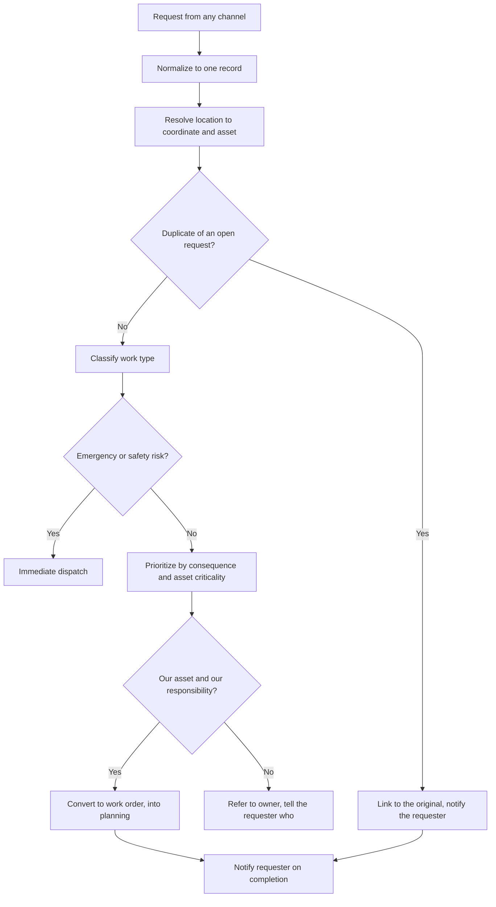

## Trigger and outcome

**Trigger.** A resident report, a staff observation, an inspection finding, a sensor alarm, a
preventive schedule release, or an emergency.

**Outcome.** A work request classified, located against an asset, de-duplicated, prioritized by
consequence, and either converted to a work order or closed with a reason the requester can see.

## Why this process exists

Intake determines everything downstream and is the least designed part of the domain. A request
that arrives without a location cannot be routed; without an asset it accumulates no history;
without de-duplication it becomes three work orders for one pothole.

**Public reporting channels changed the shape of this process and most organizations have not
adjusted.** An app that makes reporting effortless multiplies request volume without multiplying
crew capacity, and the result is a longer backlog with a more visible queue — which reads to the
public as declining service.

## Current state: how this typically runs today

Requests arrive through six channels — phone to the contact centre, a public app, email to a
department, a councillor's office, staff radio, and paper. Three of them create a record in the
work management system; the others create an email or a note.

Location is captured as free text. The same pothole is reported eleven times and becomes eleven
requests, or is manually merged by whoever notices. No asset is attached, so nothing accumulates
against the asset's history.

Priority is set by the intake channel and by pressure. A report accompanied by a photograph on
social media outranks a valve identified as failing during an inspection, because one has a
complainant and the other does not.

Requesters are told the request was received. They hear nothing else.

### Why it works that way

- **Channels were added over time**, each by a different department solving its own problem.
- **Free-text location is what a caller can give**, and resolving it to an asset requires
  authoritative address and network data most organizations have not connected.
- **Triage by pressure is rational for the individual** doing it, because the consequence of
  ignoring a visible complaint is immediate and the consequence of ignoring a valve is not.
- **Closing the loop requires knowing when the work finished**, which requires field completion
  data most organizations do not reliably capture.

## Process flow

## Business rules

- Every channel writes to one work request record; no channel creates a parallel queue.
- Location resolved to a coordinate and, where one exists, to an asset identifier before triage.
- Duplicate detection runs before a work order is created, and links rather than discards.
- Priority derives from consequence and asset criticality, not from the channel or the requester.
- Requests for assets owned by another party are referred with the owner named, not closed.
- Every request reaches a terminal state with a reason visible to the requester.
- Emergency and safety-risk requests bypass planning entirely.

## Where time and rework are lost

- Manually merging duplicate reports of the same defect
- Crews dispatched to free-text locations they cannot find
- Work performed on another authority's asset because ownership was not checked
- Requesters calling to ask for a status, generating contact volume counted against
  [constituent service](/capabilities/constituent-service-management/) rather than against the
  service that failed to close the loop

## Recommended future state

**One record per defect, not per report.** De-duplication at intake with linked reports means
eleven residents each get a notification when the pothole is filled, from one work order. Without
it, the same fix appears as eleven unresolved requests.

**Resolve to an asset, not just to a place.** An asset identifier is what lets the work accumulate
into history, which is what makes
[failure analysis](/processes/failure-analysis-and-renewal-referral/) possible later.

**Prioritize on consequence, and publish the basis.** The defence against triage-by-visibility is a
published priority scheme — a resident who understands that a gas leak outranks their pothole is
far less aggrieved than one who thinks they were ignored.

**Close the loop automatically from field completion.** The notification is a by-product of the
completion record, not a separate task somebody has to remember.

## Level variance

- **State.** Highway maintenance requests through traveller information channels and district offices, with high volume and long linear geography.
- **County.** Requests spanning unincorporated areas where residents frequently do not know which authority owns the road, the ditch, or the streetlight — making the referral rule load-bearing.
- **Municipal.** **The heaviest public reporting volume**, with app and phone channels feeding directly into an operation whose capacity did not change when the channel was added.
